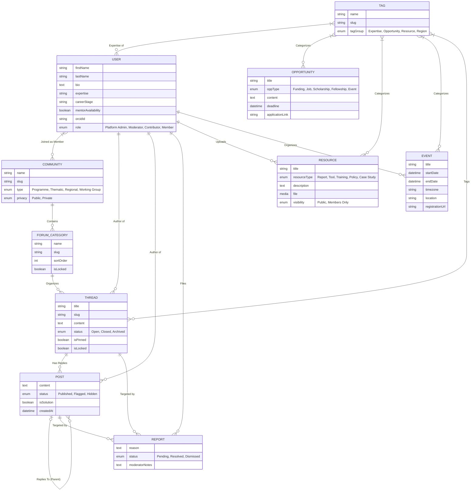

# System Architecture & Data Model
**Project**: Science for Africa - External Platform
**Phase**: Architect (v2 - Google Docs Update)

## 1. System Overview
The backend is powered by **Strapi v5**, acting as a headless CMS and community backend API. The architecture leverages Strapi's built-in `users-permissions` heavily extended to allow robust community engagement. It relies heavily on hierarchical collections (`Community` -> `Category` -> `Thread` -> `Post`) and a comprehensive reporting system for peer moderation.

## 2. Data Model ERD (Entity-Relationship Diagram)

This Mermaid ER maps the refined Collections and Relations outlined in the Google Docs.

## 3. Data Model Explanation

### Community and Forum Hierarchy
*   **COMMUNITY**: The top-level grouping (e.g., "Western Africa Genomics"). Can be public or private, dictating Guest/Member access.
*   **FORUM_CATEGORY**: Organizes discussions within a Community (e.g., "Funding Advice", "General Chat").
*   **THREAD & POST**: The core engagement entities. Thread owns posts. Posts can have a recursive Parent-Child relationship to support nested UI replies. Threads have specific moderation boolean flags (`isPinned`, `isLocked`).

### Unified Tag System
A single `TAG` collection groups all taxonomy data (Expertise, Regions, Opportunity Types). It sits at the center of the application, linked via Many-to-Many relations to Users, Resources, Threads, and Opportunities.

### Moderation via Reports
Instead of users deleting others' content, users create a `REPORT`. The report holds relations to the reporter (`USER`) and the target (either a `POST` or `THREAD`). Moderators view this queue to make decisions, eventually updating the status of the Report and potentially `Hiding` the offending post.

### Resources, Opportunities, Events
These are standard Content Types subject to Strapi's Draft/Publish lifecycle. `Contributors` write drafts, and `Moderators` publish them. They are accessible publicly or restricted to Members via the `visibility` enum.
