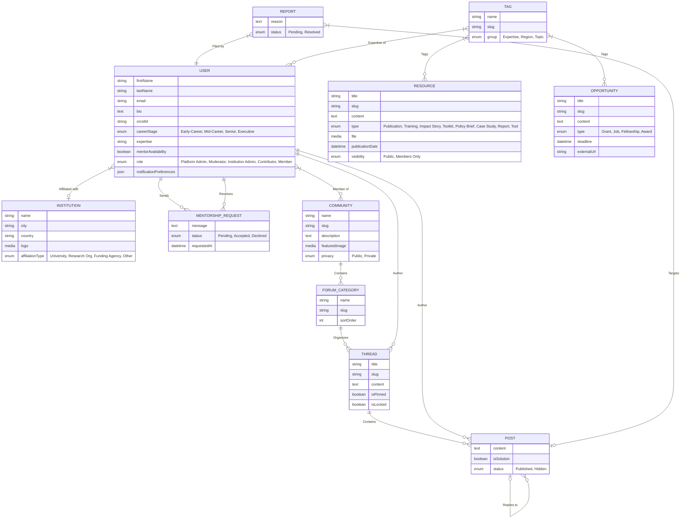

# System Architecture & Data Model
**Project**: Science for Africa - External Platform
**Phase**: Architect (v4 - Clean Slate Refresh)

> [!NOTE]
> This version (v4) represents a "Clean Slate" data model built primarily from Figma user flows, as advised by the manager. The previous LLD-merged approach has been deprecated to remove legacy debt.

## 1. System Overview
The backend is powered by **Strapi v5**, acting as a headless CMS and community backend API. The architecture follows the "Clean Slate" approach, focusing on three core pillars: **Identity**, **Community**, and **Knowledge Base**.

## 2. Clean Slate Data Model ERD

## 3. Data Model Explanation

### 3.1 Identity & Access
*   **Two-Tier User Architecture**: The system distinguishes between system administrators (`admin_users`) and platform users (`up_users`). Detailed in the [RBAC & User Architecture](file:///Users/galihpratama/Sites/science-for-africa/agent_docs/features/RBAC-User-Architecture.md) specification.
*   **USER**: Central social identity for the platform (`up_users`). Roles are derived from the Figma access matrices (Guest, Member, Expert, etc.). ORCID validation is a critical onboarding step.

### 3.2 Community Engine
*   **Hierarchical Structure**: Following the Figma user journey: Community -> Category -> Thread -> Post.
*   **Moderation**: Simple `REPORT` and `post.status` system for peer reporting and admin moderation.

### 3.3 Knowledge Base (Resources & Opportunities)
*   **Unified Content**: Resources and Opportunities share a similar metadata structure but serve different user needs (knowledge vs career growth).
*   **Taxonomy**: The `TAG` entity provides a unified cross-linking mechanism for expertise and topics.

## 4. Implementation Priorities (Figma Aligned)
1. **Onboarding & Auth**: Institutional affiliation workflow.
2. **Community Foundation**: Basic forum hierarchy and posting.
3. **Expert Directory**: Discovery via tags and mentorship requests.
4. **Knowledge Base**: Moderated resource submission.

## 5. Security & Access Control
API authentication and Role-Based Access Control (RBAC) are documented in detail in the [API Authentication & RBAC Mapping](file:///Users/galihpratama/Sites/science-for-africa/agent_docs/features/api-auth-rbac.md) specification.
