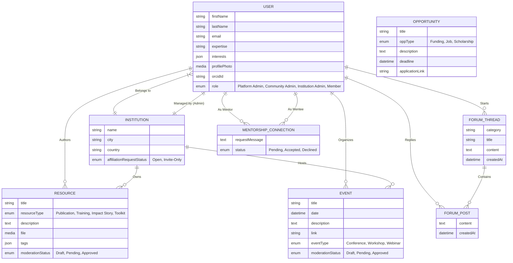

# System Architecture & Data Model
**Project**: Science for Africa - External Platform
**Phase**: Architect (v1)

## 1. System Overview
The backend is powered by **Strapi v5**, acting as a headless CMS. The architecture leverages Strapi's built-in `users-permissions` plugin heavily extended to handle custom roles and relationships, coupled with several custom Collection Types to govern platform content.

## 2. Data Model ERD (Entity-Relationship Diagram)

We define the data model using Mermaid ER syntax. This maps directly to how the Strapi collections and relations will be built.

## 3. Data Model Explanation

### Users and Permissions Plugin Extension (`plugin::users-permissions.user`)
The default Strapi User model must be extended via schema adjustments to include `Expertise`, `Interests`, and `ORCID`. Crucially, it must define a Many-to-One relationship to the `Institution` collection, representing a user's affiliation.

### Institutions
Represents organizations. It requires a One-to-One ownership link to a `User` entity to designate the **Institution Admin**. This admin user manages affiliation approvals for other users claiming membership.

### User-Generated Content (Resources, Events)
These entities utilize Strapi's native **Draft/Publish** system to implement the Moderation Pipeline.
- A standard user submits a `Resource`, which is saved as a Draft (`Pending`).
- Only Admin roles have the permission to transition the state to Published (`Approved`).
- Resources maintain relations to both their Author (`User`) and the `Institution` (if the author publishes on behalf of their affiliation).

### Administrator Access Control (Limited Admin UI)
Strapi's Role-Based Access Control (RBAC) governs the Admin UI:
1. **Platform Admin**: Superadmin flag equals true. Access to everything.
2. **Community Admin**: Given CRUD permissions to `Forum_Thread`, `Opportunity`, and Publish privileges for `Resources/Events`. Cannot access User management.
3. **Institution Admin**: Through custom Condition-based rules (if Enterprise) or Custom Controllers, they can only view and update `Users` and `Resources` where the `Institution` relation matches their own assigned institution. Field-level permissions prevent them from modifying system settings or global roles.
