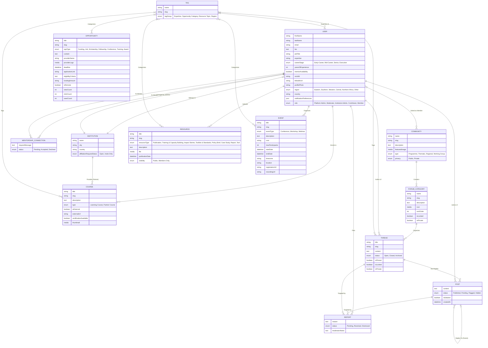
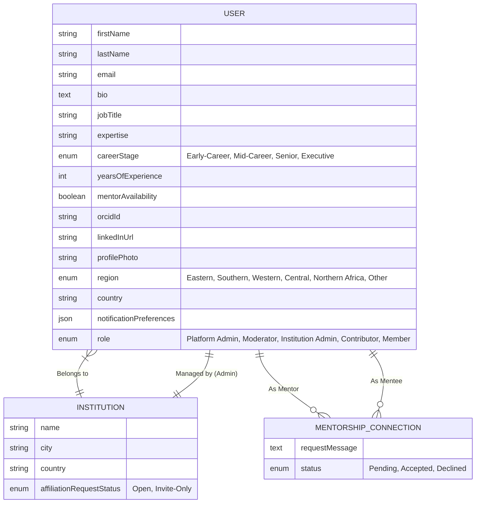
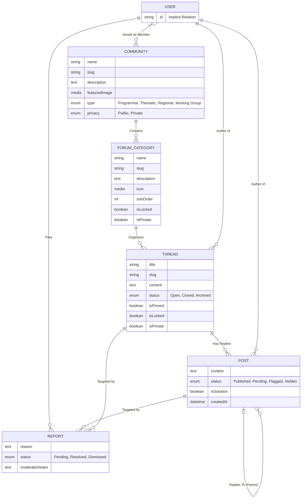
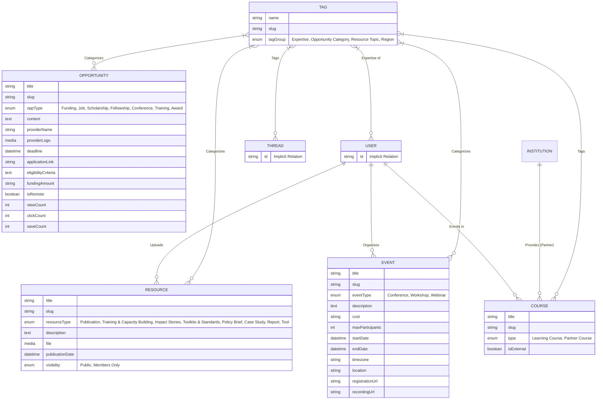

# System Architecture & Data Model
**Project**: Science for Africa - External Platform
**Phase**: Architect (v3 - Figma & Google Docs Alignment)

## 1. System Overview
The backend is powered by **Strapi v5**, acting as a headless CMS and community backend API. The architecture leverages Strapi's built-in `users-permissions` heavily extended to allow robust community engagement. It relies heavily on hierarchical collections (`Community` -> `Category` -> `Thread` -> `Post`) and a comprehensive reporting system for peer moderation. For detailed technical mapping of this ERD to Strapi v5 features, see the [Strapi v5 Architectural Mapping](research-findings/strapi-v5-mapping.md).

## 2. Data Model ERD (Entity-Relationship Diagram)

### 2.1 Top-Level Data Model ERD
This monolithic diagram provides a bird's-eye view of all collections and relations in the Strapi backend.

### 2.2 Core Identity & Access Control
This module anchors users to institutions and manages mentor-mentee connections.

### 2.3 Community & Forums
This module governs the hierarchical structure of discussions and peer moderation reporting.

### 2.4 Content, Opportunities & Taxonomy
This module handles draft/publish content pipelines and the unified tagging system.

## 3. Data Model Explanation

### Institutions & Mentorship (Primary Engine)
*   **INSTITUTION**: Anchors users to physical organizations. A user requests affiliation which is approved by the assigned `Institution Admin`.
*   **MENTORSHIP_CONNECTION**: A direct join table between two `User` models (Mentor and Mentee) handling the request message and workflow status. Requires the Mentor to have `mentorAvailability` set to true.

### Community and Forum Hierarchy
*   **COMMUNITY**: The top-level grouping (e.g., "Western Africa Genomics"). Can be public or private, dictating Guest/Member access.
*   **FORUM_CATEGORY**: Organizes discussions within a Community (e.g., "Funding Advice", "General Chat").
*   **THREAD & POST**: The core engagement entities. Thread owns posts. Posts can have a recursive Parent-Child relationship to support nested UI replies. Threads have specific moderation boolean flags (`isPinned`, `isLocked`, `isPrivate`).

### Unified Tag System
A single `TAG` collection groups all taxonomy data (Expertise, Regions, Opportunity Types). It sits at the center of the application, linked via Many-to-Many relations to Users, Resources, Threads, and Opportunities.

### Moderation via Reports
Instead of users deleting others' content, users create a `REPORT`. The report holds relations to the reporter (`USER`) and the target (either a `POST` or `THREAD`). Moderators view this queue to make decisions, eventually updating the status of the Report and potentially `Hiding` the offending post.

### Learning & Courses
*   **COURSE**: Represents professional development content. Can be internal "Learning Courses" or "Partner Courses" that redirect externally. Linked to `USER` via enrollment and `INSTITUTION` for partner accreditation.
