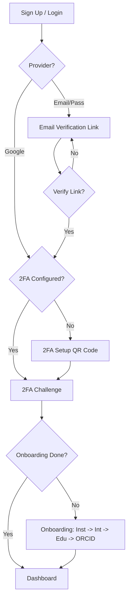

# Authentication & Onboarding — Implementation Specification

## 📊 Overview

### Purpose
To provide a secure, seamless, and professional entry point for researchers and stakeholders into the Science for Africa platform. This system ensures data integrity through verified emails and institutional approvals while maintaining high security via mandatory 2FA.

### Key Principle
**Security-First Onboarding**: No user can access protected platform features without a verified email and an active 2FA configuration.

### User Experience
1. **Registration**: User signs up via Email/Password OR Google OAuth.
2. **Verification**:
    - **Email/Pass**: User must verify via a link sent to their inbox.
    - **Google**: Bypasses email verification.
3. **2FA Setup (Mandatory)**: Upon first successful login/verification, user setup TOTP via QR Code.
4. **Onboarding Journey**:
    - **Step 1: Institutional Affiliation**: Choose between "Individual" or "Institutional" tabs. Select Role Type and search for Institution. (Can be skipped).
    - **Step 2: Expertise & Interests**: Select up to 5 interests from categories (Popular, Education, etc.).
    - **Step 3: Education & Career**: Select Education level and enter Institution type. (Can be skipped).
    - **Step 4: ORCID Integration**: Link 16-digit ORCID iD. (Can be skipped).
5. **Completion**: User is automatically logged in and redirected to the homepage.

---

## 🎯 Design Principles
- **Progressive Disclosure**: Only ask for information when needed (e.g., 2FA after email verification).
- **Institutional Integrity**: Direct mapping to a curated list of institutions with manual fallback.
- **Frictionless Security**: Modern UI for 2FA setup (QR codes, clear instructions).

---

## 📐 Architecture Design

### Data Flow / Logic Flow

### Database Schema / Data Structure
**User (Strapi `users-permissions`) Extensions:**
- `firstName`: String (Required)
- `lastName`: String (Required)
- `fullName`: String (Generated/Computed)
- `interests`: JSON/Component (Array of strings, max 5)
- `educationTopic`: String
- `educationLevel`: String
- `institution`: Relation (to Institution Collection)
- `affiliationStatus`: Enumeration (Pending, Approved, Rejected) - Default: Pending
- `orcidId`: String (Optional, 16-digit format)
- `onboardingComplete`: Boolean (Default: false)
- `twoFactorSecret`: String (Private)
- `twoFactorEnabled`: Boolean (Default: false)

---

## 🔧 Implementation Details

### Phase 1: Foundation & Backend
- [x] Extend Strapi User schema with custom fields.
- [x] Implement case-insensitive uniqueness for name/email.
- [x] Configure Nodemailer for verification links.
- [x] Create 2FA TOTP service in Strapi.

### Phase 2: Frontend Scaffolding
- [x] Setup shadcn/ui and Tailwind 4 tokens.
- [x] Build reusable Auth Layout (Logo, Sidebar/Illustration).
- [x] Implement Form validation (Zod + React Hook Form).

### Phase 3: Auth & Core Validation
- [x] **Sign Up/Login**: Email/Password + Google OAuth.
- [x] **Validation**: 8+ chars password, special char/number requirement, duplicate email check.
- [x] **Email Verification**: Handler for unique links + success redirect to Login.
- [ ] **2FA Setup**: QR Code generation + TOTP verification.

### Phase 4: Onboarding Journey (Step-by-Step)
- [ ] **Institutional Affiliation**: Tabs for Individual/Institutional, searchable dropdown, "Skip" logic.
- [ ] **Expertise & Interests**: Category-based selection, visual highlights, max 5 limit check.
- [ ] **Education & Career**: Education level dropdown, institution type field, "Skip" logic.
- [ ] **ORCID Integration**: 16-digit regex validation, "Skip" logic.

### Phase 5: Password Recovery
- [ ] **Request**: Forgot password link -> 6-digit OTP sent to email.
- [ ] **Verify**: 30s resend timer + OTP validation.
- [ ] **Reset**: Password reuse prevention + mismatch validation.

---

## 📡 API Reference

### Auth Sign-up
- **Method**: `POST`
- **Path**: `/api/auth/local/register` (Strapi default, extended)

### 2FA Setup
- **Method**: `GET`
- **Path**: `/api/auth/2fa/setup`
- **Response**: `{ qrCodeData: "...", secret: "..." }`

### 2FA Verify
- **Method**: `POST`
- **Path**: `/api/auth/2fa/verify`
- **Request Body**: `{ code: "123456" }`

---

## ✅ Implementation Checklist
- [ ] Unit tests for 2FA TOTP logic.
- [ ] Email templates verified in multiple clients.
- [ ] Zod schemas match Strapi constraints.
- [ ] No secrets leaked in frontend bundles.

---

## 📊 Example Scenarios

### Scenario 1: New Researcher Registration
1. Researcher clicks "Join".
2. Enters `jane.doe@university.edu`.
3. Receives email, clicks verify.
4. Logs in, scans QR code with Google Authenticator.
5. Completes onboarding, selects "University of Nairobi".
6. Status: `affiliationStatus: Pending`, `onboardingComplete: true`.

---

## 🛡️ Edge Cases & Security

### Registration & Login
| Scenario | Behavior |
| :--- | :--- |
| **Weak Password** | < 8 chars or no special/number -> "Password must be at least 8 characters with one special character." |
| **Duplicate Email** | "Email already exists" with a link to the Login page. |
| **Interests Limit** | Prevent 6th selection + tooltip: "Maximum 5 interests allowed." |
| **Invalid ORCID** | Non-16-digit -> "Please enter a valid 16-digit ORCID iD". |
| **Brute Force** | 5 failed attempts -> 15 min lockout. |
| **Unverified Email** | Redirect to "Confirm email" screen + trigger new code. |
| **SQL Injection** | Input sanitization -> return standard "Invalid credentials" error. |

### Password Recovery
| Scenario | Behavior |
| :--- | :--- |
| **Expired Code** | After 60 mins -> "Code expired. Please request a new code." |
| **Password Reuse** | "New password cannot be the same as your old password." |
| **Email Spamming** | 5 clicks/min -> Disable link for 60 seconds. |
| **Mismatched Fields** | Disable "Reset password" button + "Passwords do not match." |

## 🏗️ Architectural Decisions (ADRs)

### ADR-001: Mandatory 2FA via TOTP
- **Status**: Accepted
- **Context**: High security requirements for researcher data.
- **Decision**: Use industry-standard TOTP (Time-based One-Time Password) using the `otplib` library.
- **Consequences**: Users must have a TOTP-compatible app (Google Authenticator, Authy). Increases login friction but significantly improves security.

### ADR-002: Partial JWT Flow for Multi-Step Auth
- **Status**: Accepted
- **Context**: Strapi's default JWT grants full access immediately upon password verification.
- **Decision**: Implement a custom "partial" JWT for users who have 2FA enabled but haven't provided the code. The `two-factor-lock` middleware will reject Partial JWTs on all non-auth routes.
- **Alternatives Considered**: Session-based state (rejected for stateless scalability).
- **Consequences**: Requires custom JWT validation logic and frontend handling for two-step authentication.

---

## 🔮 Future Enhancements
- Automated institutional verification via email domain.
- Multi-institutional profiles.
