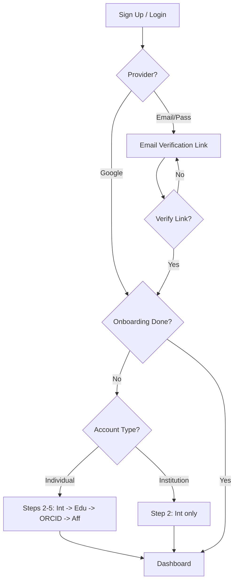

# Authentication & Onboarding — Implementation Specification

## 📊 Overview

### Purpose
To provide a secure, seamless, and professional entry point for researchers and stakeholders into the Science for Africa platform. This system ensures data integrity through verified emails and institutional approvals.

### Key Principle
**Security-First Onboarding**: No user can access protected platform features without a verified email and completing the onboarding process.

### User Experience
1. **Registration**: User signs up via Email/Password OR Google OAuth.
2. **Verification**:
    - **Email/Pass**: User must verify via a link sent to their inbox.
    - **Google**: Bypasses email verification.
3. **Onboarding Journey**:
    - **Step 1: Account Type**: Choose between "Individual" or "Institutional" tabs. Select Role Type and search for Institution.
    - **Path A: Individual** (5 Steps):
        - Step 2: Interests (Select up to 5)
        - Step 3: Career (Position & Education level)
        - Step 4: ORCID Integration
        - Step 5: Affiliation (Final institutional link)
    - **Path B: Institutional** (2 Steps):
        - Step 1: Search and select Institution immediately.
        - Step 2: Interests (Select up to 5)
        - Step 6: Completion (Skips Steps 3, 4, 5).
4. **Completion**: User is automatically logged in and redirected to the homepage.

---

## 🎯 Design Principles
- **Progressive Disclosure**: Only ask for information when needed (e.g., interests after account verification).
- **Institutional Integrity**: Direct mapping to a curated list of institutions with manual fallback.
- **Frictionless Security**: Modern UI for email verification and onboarding steps.

---

## 📐 Architecture Design

### Data Flow / Logic Flow

### Database Schema / Data Structure
**User (Strapi `users-permissions`) Extensions:**
- `firstName`: String (Required)
- `lastName`: String (Required)
- `fullName`: String (Generated/Computed)
- `interests`: JSON/Component (Array of strings, max 5)
- `educationTopic`: String
- `educationLevel`: String
- `institution`: Relation (to Institution Collection)
- `affiliationStatus`: Enumeration (Pending, Approved, Rejected) - Default: Pending
- `orcidId`: String (Optional, 16-digit format)
- `onboardingComplete`: Boolean (Default: false)

---

## 🔧 Implementation Details

### Phase 1: Foundation & Backend
- [x] Extend Strapi User schema with custom fields.
- [x] Implement case-insensitive uniqueness for name/email.
- [x] Configure Nodemailer for verification links.

### Phase 2: Frontend Scaffolding
- [x] Setup shadcn/ui and Tailwind 4 tokens.
- [x] Build reusable Auth Layout (Logo, Sidebar/Illustration).
- [x] Implement Form validation (Zod + React Hook Form).

### Phase 3: Auth & Core Validation
- [x] **Sign Up/Login**: Email/Password + Google OAuth.
- [x] **Validation**: 8+ chars password, special char/number requirement, duplicate email check.
- [x] **Email Verification**: Handler for unique links + success redirect to Login.

### Phase 4: Onboarding Journey (Step-by-Step) [SHIPPED]
- [x] **Account Type & Institution**: Branching logic for Individual/Institutional, searchable dropdown.
- [x] **Expertise & Interests**: Category-based selection, visual highlights, max 5 limit check.
- [x] **Education & Career**: Education level dropdown, institution type field, "Skip" logic (Individual only).
- [x] **ORCID Integration**: 16-digit regex validation, "Skip" logic (Individual only).
- [x] **Affiliation**: Search and select institution manually (Individual only).

### Phase 5: Password Recovery
- [ ] **Request**: Forgot password link -> 6-digit OTP sent to email.
- [ ] **Verify**: 30s resend timer + OTP validation.
- [ ] **Reset**: Standard Strapi reset flow with mismatch validation.

---

## 📡 API Reference

### Auth Sign-up
- **Method**: `POST`
- **Path**: `/api/auth/local/register` (Strapi default, extended)

### 2FA Setup
---

---

## ✅ Implementation Checklist
- [ ] Email templates verified in multiple clients.
- [ ] Zod schemas match Strapi constraints.
- [ ] No secrets leaked in frontend bundles.

---

## 📊 Example Scenarios

### Scenario 1: New Researcher Registration
1. Researcher clicks "Join".
2. Enters `jane.doe@university.edu`.
3. Receives email, clicks verify.
4. Completes onboarding, selects "University of Nairobi".
5. Status: `affiliationStatus: Pending`, `onboardingComplete: true`.

---

## 🛡️ Edge Cases & Security

### Registration & Login
| Scenario | Behavior |
| :--- | :--- |
| **Weak Password** | < 8 chars or no special/number -> "Password must be at least 8 characters with one special character." |
| **Duplicate Email** | "Email already exists" with a link to the Login page. |
| **Interests Limit** | Prevent 6th selection + tooltip: "Maximum 5 interests allowed." |
| **Invalid ORCID** | Non-16-digit -> "Please enter a valid 16-digit ORCID iD". |
| **Brute Force** | 5 failed attempts -> 15 min lockout. |
| **Unverified Email** | Redirect to "Confirm email" screen + trigger new code. |
| **SQL Injection** | Input sanitization -> return standard "Invalid credentials" error. |

### Password Recovery
| Scenario | Behavior |
| :--- | :--- |
| **Expired Code** | After 60 mins -> "Code expired. Please request a new code." |
| **Password Reuse** | Handled by standard Strapi (No default reuse prevention). |
| **Email Spamming** | 5 clicks/min -> Disable link for 60 seconds. |
| **Mismatched Fields** | Disable "Reset password" button + "Passwords do not match." |

## 🏗️ Architectural Decisions (ADRs)

### ADR-003: Environment-Driven Sign-Up Redirection
- **Status**: Accepted
- **Context**: Signup redirection failed when email confirmation was enabled because the JWT was null. Additionally, the confirmation URL was hardcoded, causing 404s in some environments.
- **Decision**:
    1. Update frontend to treat `result.user` as a success signal for redirection.
    2. Use `PUBLIC_URL` from the environment to dynamically construct `EMAIL_CONFIRMATION_URL`.
    3. Configure Strapi's `email_confirmation_redirection` in the `bootstrap` lifecycle to ensure consistency with the frontend host.
- **Consequences**: Ensures portability across environments (local, staging, prod) and fixes the "stuck on signup" bug.

---

## 🔮 Future Enhancements
- Automated institutional verification via email domain.
- Multi-institutional profiles.

