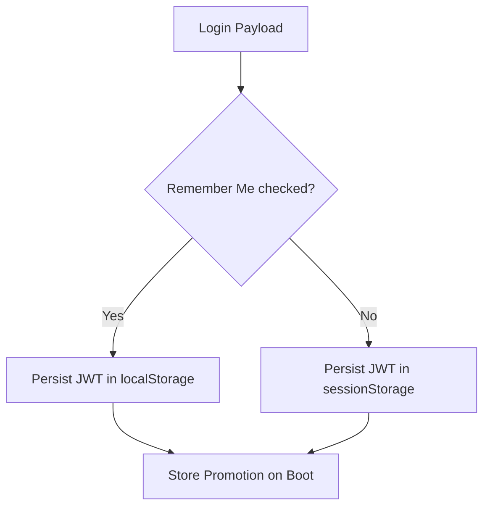

# Authentication Persistence & "Remember Me" — Implementation Specification

## 📊 Overview

### Purpose
To handle user sessions and "Remember Me" functionality securely while balancing the strict security requirements for institutional accounts with the convenience expected by individual researchers.

### Key Principle
**Context-Aware Session Persistence**: Dynamically target either `sessionStorage` or `localStorage` based on the user's explicit preference during login.

### User Experience
- If "Remember Me" is selected, the login persists for 30 days across browser restarts.
- If not selected, the session expires upon closing the tab/window, requiring re-authentication.

---

## 🎯 Design Principles
- **Data Hygiene**: Mitigate PII leaks by actively purging sensitive onboarding stores.
- **Convenience vs Risk Management**: Use appropriate persistence layers intelligently based on user behavior.

---

## 📐 Architecture Design

### Data Flow / Logic Flow

### Database Schema / Data Structure
- **Storage Mediums**: Zustand storage dynamically swaps between `window.sessionStorage` and `window.localStorage`.

---

## 🔧 Implementation Details

### Phase 1: Login Flow & Storage
- [ ] `LoginForm` captures `rememberMe` boolean flag.
- [ ] Flag passed via `useAuthStore.setAuth(user, jwt, rememberMe)`.

### Phase 2: Bootstrapping & Lifecycle
- [ ] On app load, check both locations to "promote" JWT to the active session.
- [ ] Logout functionality correctly clears both storage endpoints.

---

## 📡 API Reference

### Storage Layer (Client-Side)
- No explicit backend API endpoints are managed by this persistence layer.

---

## ✅ Implementation Checklist
- [ ] Setup unified session validation checking at load.
- [ ] Implement explicit onboarding cleanup to strip PII.
- [ ] Ensure the logout button targets and wipes `sessionStorage` and `localStorage` simultaneously.

---

## 📊 Example Scenarios

### Scenario 1: Standard Session Protection
1. User logs in from a library computer without checking "Remember Me".
2. JWT saved into `sessionStorage`.
3. User closes browser. JWT is destroyed, ensuring institutional data is safe.

### Scenario 2: Remember Me Flow
1. User logs in from personal laptop, checks "Remember Me".
2. JWT saved to `localStorage`.
3. User closes and reopens browser over the next 29 days and remains logged into their dashboard seamlessly.

---

## 🔮 Future Enhancements
- **HttpOnly Cookies**: Moving the "Remember Me" token to a server-side cookie to eliminate XSS-based token theft (Planned for Phase 2).
- **Short-lived Access Tokens**: Reducing the JWT lifespan from 30 days to 24 hours (Planned for Sprint 6).
- **Refresh Token Rotation**: Implementing a rotation policy to invalidate old persistent sessions automatically.
