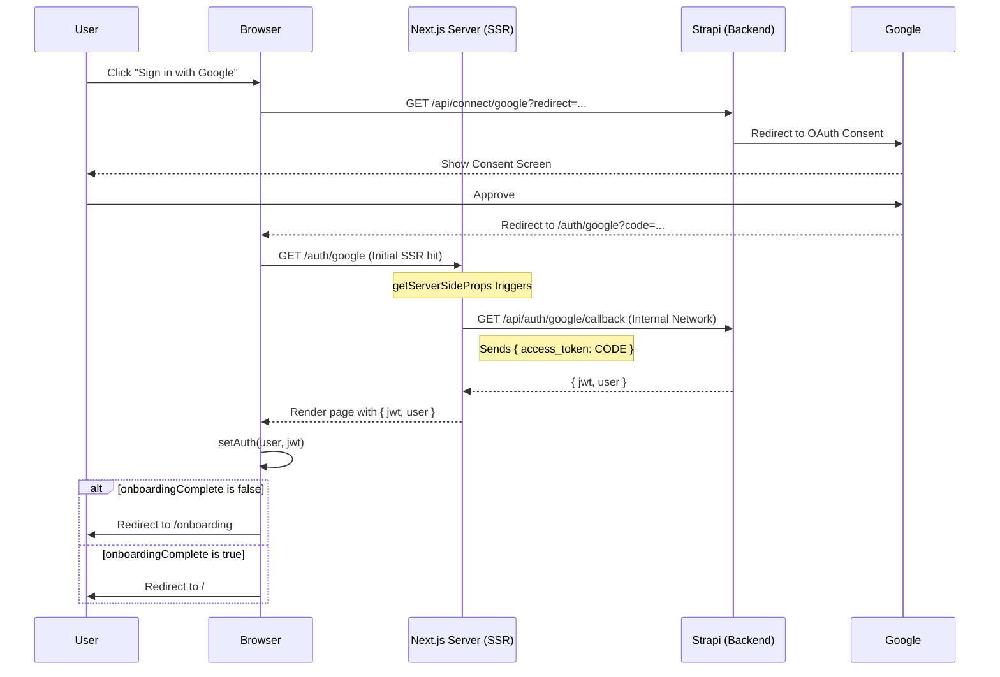

# Google OAuth — Implementation Specification

## 📊 Overview

### Purpose
Provide a seamless, one-click authentication experience for users using their Google accounts. This reduces barrier to entry and leverages Google's security for user identity.

### Key Principle
**Dynamic Adaptability**: The OAuth flow must automatically adapt to local, test, and production environments for both callback redirects and backend connectivity.

### User Experience
1. User lands on the Login page and clicks "Sign in with Google".
2. User is redirected to the Google Consent screen.
3. Upon approval, Google redirects the user back to the platform.
4. The platform verifies the token and checks the user's profile status.
5. **New Users**: Redirected to `/onboarding` to complete their profile.
6. **Existing Users**: Redirected directly to the Dashboard or Home page.

### 📖 Official Reference
This implementation follows the **[Strapi Users & Permissions Provider](https://docs.strapi.io/cms/configurations/users-and-permissions-providers/google)** documentation.

> [!NOTE]
> **Provider Differentiation**: We use the *Users & Permissions* provider (for frontend platform users) rather than the *SSO Provider* (which is for Strapi Admin Panel administrators). This ensures that researchers and external users can authenticate without requiring administrative access to the CMS.

---

## 🎯 Design Principles
- **Stateless Integration**: Leverage Strapi's built-in `users-permissions` providers to keep the integration standard and maintainable.
- **Environment Agnostic**: All callback URLs and secrets must be driven by environment variables.
- **Branding Compliance**: The "Sign in with Google" button must strictly follow [Google's Branding Guidelines](https://developers.google.com/identity/branding-guidelines) regarding logo, colors, and typography.
- **Session Persistence**: Automated 30-day persistence is handled via the [Authentication Persistence](AUTHENTICATION_PERSISTENCE.md) logic.

---

## 📐 Architecture Design

### Data Flow / Logic Flow (SSR Handshake)

### Database Schema / Data Structure
- **User Entity (Existing)**:
    - `onboardingComplete` (Boolean): Flag to determine redirect logic.
    - `email` (String, UK): Used for matching Google account to existing local accounts.
    - `provider` (String): Will be set to "google" for users created via this flow.

---

## ✅ Acceptance Criteria

### User Acceptance Criteria (User AC)
- [ ] User can click the "Sign in with Google" button on the Login page and be redirected to the Google Consent screen.
- [ ] If the user is logging in for the first time via Google (Sign up), they are redirected to the `/onboarding` flow to complete their profile setup.
- [ ] If the user has already completed onboarding (Sign in), they are bypassed directly to the `/dashboard` or home page.

### Technical Acceptance Criteria (Tech AC)
- [ ] Strapi `users-permissions` plugin is configured to handle Google OAuth via `GOOGLE_CLIENT_ID` and `GOOGLE_CLIENT_SECRET`.
- [ ] Redirect URIs are dynamically constructed based on `NEXT_PUBLIC_FRONTEND_URL` and `BACKEND_URL`.
- [ ] Google Sign-In button adheres to official branding (Logo, White background with `#dadce0` border, "Sign in with Google" text).
- [ ] Frontend handles the `id_token` or `access_token` exchange securely.

---

## 🔧 Implementation Details

### Phase 0: Google Cloud Console Setup
- [ ] Create a project in the [Google Cloud Console](https://console.cloud.google.com/).
- [ ] Configure the **OAuth Consent Screen** (User type: External, App name: Science for Africa).
- [ ] Create **OAuth 2.0 Client IDs** (Web application).
- [ ] Add Authorized Redirect URIs:
    - **Development**: `http://localhost:1337/api/connect/google/callback`
    - **Staging/Prod**: `https://api.yourdomain.com/api/connect/google/callback`
- [ ] Obtain `CLIENT_ID` and `CLIENT_SECRET`.

### Phase 1: Backend Setup
- [ ] Enable Google Provider in Strapi admin or via `config-sync`.
- [ ] Add `GOOGLE_CLIENT_ID` and `GOOGLE_CLIENT_SECRET` to `.env`.

### Phase 2: Frontend Integration
- [ ] Update `SocialAuth` component to link to Strapi OAuth endpoint.
- [ ] Create `/auth/google` callback page.
- [ ] Implement redirect logic based on `onboardingComplete` status.

---

## 📡 API Reference

### Connect with Google
- **Method**: `GET`
- **Path**: `/api/connect/google`
- **Description**: Redirects the user to Google OAuth.

### Auth Exchange (Internal)
- **Method**: `GET`
- **Path**: `/api/auth/google/callback`
- **Description**: Endpoint called by the **Next.js Server** during `getServerSideProps` to exchange the Google token for a Strapi session.
- **Param**: `access_token` (string)

---

## 🛠️ Troubleshooting & Networking

### Docker Internal Handshake
When running in Docker Compose, the Next.js server (SSR) uses a "Smart Swap" logic to reach the backend:
- **Variable**: `NEXT_PUBLIC_BACKEND_URL`
- **Logic**: If the URL uses `localhost`, the server automatically swaps it to `backend` (the internal service name).
- **Manual Override**: If you need to hit a specific IP, ensure your environment provides a reachable URL for both browser and server.

### Common Errors
- **401 Unauthorized**: Usually means the `access_token` expired or the backend cannot reach Google's servers to verify.
- **ECONNREFUSED**: Usually means the backend service is down or unreachable from the frontend container.

---

### Environment Agnostic & Portable
The frontend uses **Dynamic Backend Discovery (DBD)** to ensure Docker images are portable across environments:
- **Build-time Fallback**: `NEXT_PUBLIC_BACKEND_URL` is used as the initial reference.
- **Runtime Discovery**: If the browser detects it's running on a domain other than `localhost`, it automatically derivations the API URL from `window.location.origin` (e.g., `https://domain.com/cms/api`).

---

## ✅ Implementation Checklist
- [x] SSR Handshake implemented in `google.js`.
- [x] Internal networking verified via container IP.
- [x] Verified user persistence in `up_users` table.
- [x] Environment-agnostic URL discovery implemented in `url-helpers.js`.

---

## 🔮 Future Enhancements
- One-Tap Sign-In integration.
- Link account functionality for existing local users.
