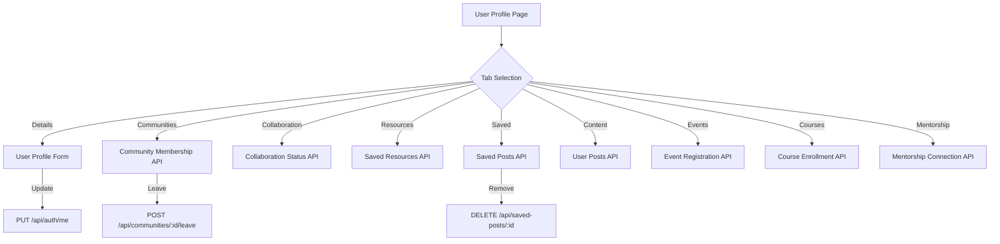

# Individual Profile — Implementation Specification

## 📊 Overview

### Purpose
Provide a centralized hub for registered individual users to manage their professional identity, track platform interactions (communities, collaborations, content), and access their saved resources. This feature enhances user engagement and professional visibility within the Science for Africa community.

### Key Principle
**Professional Identity & Privacy**: Users should have full control over their public profile and privacy settings, ensuring their professional presence is accurate and secure.

### User Experience
Users access their profile via the user dropdown in the Navbar. The profile is organized into logical tabs based on the [Figma Design](https://www.figma.com/design/9pJSajNx54DrJ1rafYOr6e/Science-for-Africa):
- **Details**: Identity management and core professional info. ([Design](https://www.figma.com/design/9pJSajNx54DrJ1rafYOr6e/Science-for-Africa?node-id=130-5796&m=dev), [Edit](https://www.figma.com/design/9pJSajNx54DrJ1rafYOr6e/Science-for-Africa?node-id=179-12861&m=dev))
- [x] **Communities Tab**: Displays a grid of joined communities and sub-communities with title, description, and subscribers.
- [x] **Community Actions**: Ability to "Leave" a community with a shadcn-based confirmation modal.
- [x] **Badges**: Show "Joined" status badges (pills) matching the design spec.
- [x] **Resources Tab**: Access to saved and uploaded documents with status tracking.

---

## 🎯 Design Principles
- **Clarity & Transparency**: High visibility into account status and community involvement.
- **Ease of Management**: Simple toggles/buttons for leaving communities or removing saved items.
- **Empty States**: Professional and helpful guidance when content is missing.
- **Visual Consistency**: Adopts the platform's standardized grid and navigation patterns.

---

## 📐 Architecture Design

### Data Flow / Logic Flow

### Database Schema / Data Structure
- **User Entity**: Extension of current schema to include:
    - `fullName` (string)
    - `displayName` (string)

    - `profilePhoto` (Media Relation)
    - `pageCover` (Media Relation)
    - `languagePreferences` (Enum: en, fr)
    - `biography` (Text, 275 char limit)
    - `roleType` (Enum: professional roles)
    - `careerStage` (Enum: career stages)
    - `educationLevel` (string)
    - `highestEducationInstitution` (Relation to `Institution`)
    - `institutionMemberships` (Relation to `InstitutionMembership`)
    - `orcidId` (string)
    - `interests` (Component: user.interest, repeatable)
    - `onboardingComplete` (boolean)
    - `full_name` (Auto-synced from first/last name - legacy reference)

    - `memberships` (One-to-Many to `CommunityMembership`)
    - `collaborationInvites` (One-to-Many to `CollaborationInvite`)
- **Community**: (Branch 31 Merged)
    - `avatarUrl` (String)
    - `bannerUrl` (String)
    - `handle` (String)
    - `subscribers` / `posts` (Integers)
- **CommunityMembership**: Relation between User and Community with Role.
- **CollaborationInvite**: Relation between User and CollaborationCall with InviteStatus.

---

## ✅ Acceptance Criteria

### User Acceptance Criteria (UAC Baseline)
#### Core Profile
- [x] **Profile Customization**: Within "Details" tab, user can update display name, professional bio (character limited), profile photo, and page cover.
- [x] **View Details**: See Full Name, Email, Role, Education Level, Highest Educational Institution, Institutional Affiliation, language preferences, and unique ORCID identifier.
- [x] **Edit Mode**: "Edit" button transforms fields into validated inputs and searchable dropdowns for institutions.
- [x] **Institution Selection**: Standardized dropdown selection for both Affiliation and Education, with a "Request Institution" workflow for unlisted entries.
- [x] **Validation**: Real-time "characters left" counter for bio; file type/size validation for images.

#### Community Oversight
- [x] **Communities Tab**: Displays a grid of joined communities and sub-communities.
- [x] **Community Actions**: Ability to "View" a community or "Leave" it.
- [x] **Badges**: Show "Joined" status badges where appropriate.

#### Collaboration Tracking
- [x] **Collaboration Tab**: Monitor involvement in active and completed collaboration spaces.
- [x] **Project Details**: Display project objectives and relevant tags.
- [x] **Status Badges**: Clear "Active" (green) or "Completed" (red) indicators.
- [x] **Request Display**: The "Collaboration" tab lists all incoming requests/invitations.
- [x] **Acceptance Action**: Each request includes "Accept" and "Decline" buttons.
- [x] **Membership Status**: Accepting immediately grants "Member" status; doing nothing keeps the user as a "Visitor" (Pending).
- [x] **Mentor Details**: Displays the assigned mentor's name and institution (if available).
- [x] **No Mentor Fallback**: Displays "No mentor assigned" when a collaboration has no linked creator.
- [x] **Interaction Restrictions**: Posting/Commenting is disabled until "Accept" is clicked.
- [x] **Public Visibility**: Collaboration spaces remain publicly viewable regardless of membership status.

#### Resource & Activity
- [x] **Resources Tab**: Access and download technical documents or reports associated with the profile.
- [x] **Status Badges**: Visual feedback for Pending, Approved, and Declined resources.
- [x] **Deletion**: Users can remove their own resources with a confirmation modal.
- [x] **Empty States**: Display a professional empty state with a relevant CTA if no content is found in any tab.

---

## 🔮 Future Development (Post-MVP)
The following features were identified in the initial discovery but are not part of the current UAC baseline:

- **Saved Items**: Consolidated list of bookmarked posts with community context. Ability to remove directly.
- **My Content**: Chronological feed of own posts with interaction counts (bookmarks, comments, shares).
- **Event Attendance**: Management of upcoming and past attendances.
- **Courses & Certifications**: Educational progress and certifications.
*   **Mentorship**: Management of mentorship relationships.
- **Quick Join**: Join community directly from a saved post view.
- **Public Profiles**: Publicly accessible profile URLs.
- **Notification Preferences**: Granular control over platform alerts.

### Technical Acceptance Criteria (Tech AC)
- [x] **API Security**: Endpoints restricted to authenticated owner of the profile via custom Document Service controllers.
- [x] **Optimistic UI**: Joined/Leave/Saved status updates immediately on frontend with professional toast feedback.
- [ ] **Image Optimization**: Profile photos and covers are optimized/resized on upload.
- [x] **I18n**: Support for multi-language display (English/French) via dedicated `profile` namespace.

---

## 🔧 Implementation Details

### Phase 1: Foundation & Data Layer
- [x] Update Strapi User Schema with missing fields (`displayName`, `profilePhoto`, `pageCover`, etc.).
- [x] Implement/Harden `/api/auth/me` PUT endpoint.
- [x] Create basic Profile Layout in Next.js with Tab navigation.

### Phase 2: Core Tabs (MVP)
- [x] **Details Tab**: Implement View/Edit flows for identity management.
- [x] **Communities Tab**: Implement grid view, sub-community support, and "Leave" logic.
- [x] **Collaboration Tab**: Implement tracking for active/completed projects.
- [x] **Resources Tab**: Implement document access, download, and status tracking.
- [x] **Deletion Flow**: Enable users to remove their own resources.
- [x] **Empty States**: Implement for all implemented tabs.

### Phase 3: Collaboration Acceptance (Current Sprint)
- [x] **Backend: Profile Controller**: Include `Pending` invites in the `me` payload.
- [x] **Backend: Security**: Implement membership checks in `chat-message.create`.
- [x] **Backend: Decline Action**: Implement `POST /api/collaboration-invites/:id/decline`.
- [x] **Frontend: Dashboard**: Update `CollaborationTab` to render invitation actions.
- [x] **Frontend: Restrictions**: Disable chat composer for non-members in `[id].js`.

---

## 📡 API Reference

### Fetch Profile
- **Method**: `GET`
- **Path**: `/api/auth/me`
- **Response**: `200 OK` with deep population of `memberships`, `collaborationInvites`, and Media.

### Update Profile (Two-Step Process)
To update the profile photo or other media fields, follow the standard two-step upload pattern:

1.  **Step 1: Upload File**
    - **Method**: `POST`
    - **Path**: `/api/upload`
    - **Request Body**: `Multipart/form-data` (file)
    - **Response**: `200 OK` with file object containing `id`.

2.  **Step 2: Link to Profile**
    - **Method**: `PUT`
    - **Path**: `/api/auth/me`
    - **Request Body**: `application/json` including the media field as a numeric ID (e.g., `{ "profilePhoto": 123 }`).
    - **Response**: `200 OK` with updated user object.

### Automated Media Cleanup
The backend implements a `beforeUpdate` lifecycle hook on the `users-permissions.user` model to ensure that orphaned media files are automatically deleted from storage when:
- A profile photo is replaced by a new one.
- A profile photo is removed (set to `null`).

This prevents storage bloat and ensures data integrity.

### Next.js Image Proxying
To ensure reliable image rendering across different environments (Docker, staging), the frontend implements a transparent proxy for media files:
- **Rewrite**: `/uploads/:path*` is proxied to the backend origin.
- **Helper**: `getStrapiMedia` returns relative URLs, leveraging the rewrite to bypass domain-related security issues in the Next.js image optimizer.

### Leave Community
- **Method**: `POST`
- **Path**: `/api/communities/:id/leave`
- **Response**: `200 OK` with `{ success: true }`.
- **Action**: Permanent deletion of the `CommunityMembership` record for the current user and removal from the community's `members` relation.

---

## ✅ Implementation Checklist
- [x] Unit tests for profile updates and media handling.
- [x] Integration tests for collaboration acceptance and security gates.
- [x] Documentation updated in README and LLD.
- [x] Security audit: verify user cannot edit other users' profiles via API.

---

## 📊 Example Scenarios

### Scenario 1: User Edits Bio
- **Input**: User enters 300 characters in bio field.
- **Expected**: Counter shows "-25 characters left" (assuming 275 limit), Save button disabled.

### Scenario 2: Empty Community Tab
- **Input**: New user visits "Communities" tab.
- **Expected**: "You don’t have any communities yet" message and "Explore communities" button.

---

## 🔮 Future Enhancements
- Public profile vanity URLs.
- Profile completion percentage progress bar.
- Activity heatmap/graph.
