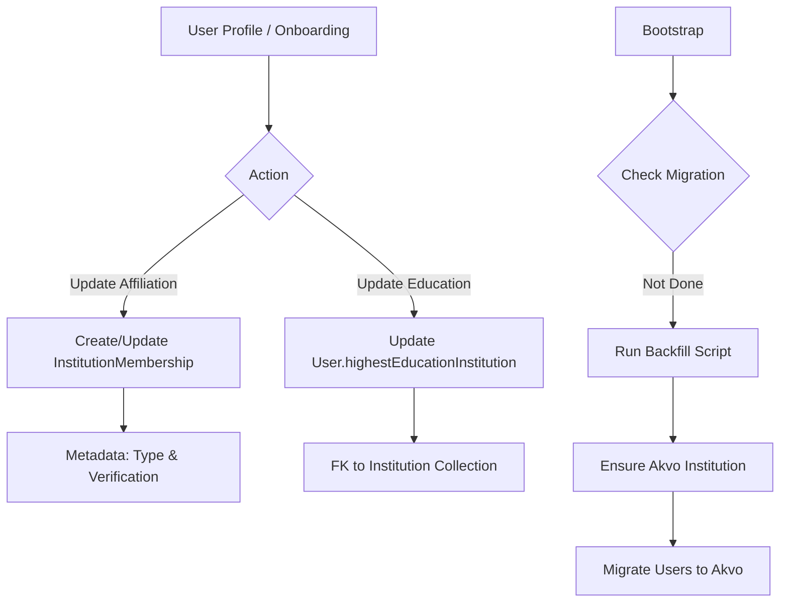

# Institution Membership & Education — Implementation Specification

## 📊 Overview

### Purpose
To modernize the relationship between users and institutions by transitioning from a rigid one-to-one link to a flexible join-table model. This enables multi-institutional affiliations and structured educational data, supporting long-term platform growth and data integrity.

### Key Principle
**Relational Integrity**: Every institutional link, whether for professional affiliation or educational background, must be backed by a verified entry in the Institution collection, rather than unstructured text.

### User Experience
1.  **Onboarding (Individual Path)**:
    - **Step 3 (Education)**: Instead of typing a school name, users search and select from the verified Institution list. If not found, they can create a new "pending" entry.
    - **Step 5 (Affiliation)**: Users select their primary institution. This creates an `InstitutionMembership` record with type `member`. Supports creation of new "pending" institutions.
2.  **Profile Management**:
    - Users can view and eventually manage multiple affiliations.
    - Educational background is displayed with high fidelity, linked to the institution's official record.

---

## 🎯 Design Principles
- **Flexibility**: The `InstitutionMembership` join table allows for future roles (e.g., "owner" for institution admins) and multiple affiliations without schema changes.
- **Data Quality**: Removing free-text fields for institution names prevents duplicates and ensures clean data for reporting and searching.
- **Search Experience**: Institution search is case-insensitive and supports fuzzy matching to ensure users can find existing entries regardless of casing.
- **Seamless Migration**: Existing users are automatically transitioned to the new model via a background backfill, ensuring no service interruption.

---

## 📐 Architecture Design

### Data Flow / Logic Flow


### Database Schema / Data Structure

#### 1. New Collection: `InstitutionMembership` (`api::institution-membership`)
| Field | Type | Description |
| :--- | :--- | :--- |
| `user` | Relation (manyToOne) | Link to `plugin::users-permissions.user` |
| `institution` | Relation (manyToOne) | Link to `api::institution.institution` |
| `type` | Enumeration | `["member", "owner"]` |
| `verificationStatus` | Boolean | Moved from User table. Default: `false`. |

#### 2. User Schema Extensions (`plugin::users-permissions.user`)
| Field | Action | Type |
| :--- | :--- | :--- |
| `highestEducationInstitution` | **New** | Relation (manyToOne) to `api::institution.institution` |
| `institution` | **Remove** | (Old relation) |
| `institutionName` | **Remove** | (Old string) |
| `educationInstitutionName` | **Remove** | (Old string) |
| `affiliationStatus` | **Remove** | (Old enum - logic moved to membership) |
| `verificationStatus` | **Remove** | (Old enum - logic moved to membership) |

---

## ✅ Acceptance Criteria

### User Acceptance Criteria (User AC)
- [ ] During onboarding, I can search and select my highest education institution from a list.
- [ ] My profile correctly displays my institution membership status.
- [ ] Existing users in staging are automatically associated with the "Akvo" institution.

### Technical Acceptance Criteria (Tech AC)
- [ ] **Join Table**: Membership metadata (type, verification) is stored in the `institution-membership` collection.
- [ ] **Backfill**: A one-time migration script runs during Strapi bootstrap to associate existing users with "Akvo".
- [ ] **Idempotency**: The backfill script must only run once and handle missing data gracefully.
- [ ] **API**: `/api/auth/me` and profile endpoints populate the new membership and education relations.

---

## 🔧 Implementation Details

### Phase 1: Foundation (Backend)
- [ ] Create `api::institution-membership` collection.
- [ ] Update `users-permissions.user` schema with new relation and remove deprecated fields.
- [ ] Update `Institution` schema to reflect the new `memberships` relation.

### Phase 2: Data Migration (Backfill)
- [ ] Implement `backend/src/bootstrap/migrations/backfill-institutions.js`.
- [ ] Implement a migration locking mechanism (e.g., `api::internal-config` or file-based).
- [ ] Logic:
    1. Find or create "Akvo" institution.
    2. For every user, create a `member` membership record with "Akvo".
    3. Set user `highestEducationInstitution` to "Akvo".

### Phase 3: Integration & Frontend
- [ ] Update Profile controller (`profile.js`) to populate `institutionMemberships` and `highestEducationInstitution`.
- [ ] Update Onboarding forms in Next.js to use searchable dropdowns for both education and affiliation.
- [ ] Update Profile view to display the new structured data.

---

## 📡 API Reference

### Get My Profile
- **Method**: `GET`
- **Path**: `/api/auth/me`
- **Response**:
```json
{
  "id": 1,
  "username": "jdoe",
  "highestEducationInstitution": { "id": 10, "name": "Akvo University" },
  "institutionMemberships": [
    {
      "id": 5,
      "type": "member",
      "verificationStatus": true,
      "institution": { "id": 10, "name": "Akvo University" }
    }
  ]
}
```

---

## ✅ Implementation Checklist
- [x] Migration script tested on local data.
- [x] Verification that `onboardingComplete: false` users can still complete the new flow.
- [x] Documentation updated in LLD and research logs.
- [ ] Security audit: ensure users cannot create memberships for other users.

### Technical Note: Document Service vs Database Layer
> [!IMPORTANT]
> The profile update controller (`profile.js`) transitioned from using the Database Layer (`strapi.db.query`) to the **Document Service Layer** (`strapi.documents().update()`).
>
> **Rationale**:
> 1. **Component Integrity**: Strapi v5's Database Layer does not handle nested component data (like `interests`) as reliably as the Document Service.
> 2. **ID Safety**: The Document Service uses `documentId` (string UUIDs), which is the standard identifier for lifecycles and draft/publish workflows in v5.
> 3. **Mixed IDs**: For relational checks (join tables), numeric `id`s are still used via `db.query` to ensure PostgreSQL type compatibility, but the final write always uses the Document Service with `documentId`.

---

## 📊 Example Scenarios

### Scenario 1: Staging Backfill
- **Input**: User `Alice` exists with `institutionName: "Old School"` and `verificationStatus: "verified"`.
- **Action**: Migration script runs.
- **Output**: `Alice` now has an `InstitutionMembership` with "Akvo", `type: "member"`, and `verificationStatus: true`. Her `highestEducationInstitution` is set to "Akvo".

---

## 🔮 Future Enhancements
- Support for multiple active affiliations.
- Institution "Owner" dashboard for verifying member affiliations.
- Automatic verification via email domain matching.
