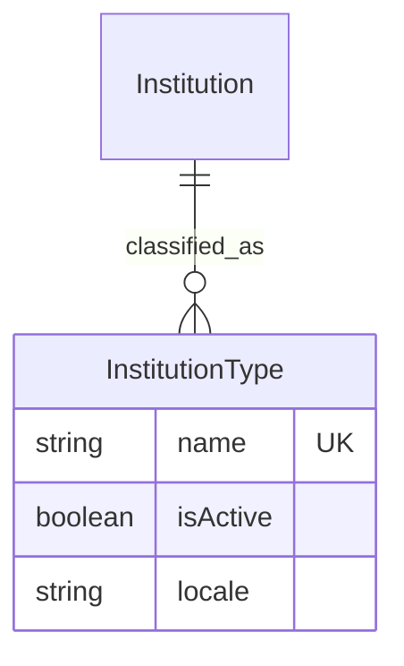

# Feature Specification: Secure Institution Type Management

## 📊 Overview

### Purpose
To transition the `Institution` type classification from a static enumeration to a secure, relational model. This ensures that institutional categories can be managed dynamically while preventing accidental data loss through hard-coded protection layers.

### Key Principle
**Two Layers of Protection**:
1.  **Intentional Deactivation**: An `isActive` flag allows admins to retire a type without deleting it, preserving historical data integrity.
2.  **Accident Prevention**: The `delete` permission is effectively removed by overriding the backend controller to block all deletion requests.

---

## 🎯 Design Principles
- **Data Safety**: Hard-coded overrides ensure that even with "delete" permissions granted in the Admin UI, the API will refuse the operation.
- **Backward Compatibility**: The seeder will handle the migration of existing "enumeration" values to the new relational entries.
- **UI Consistency**: The frontend will automatically filter for `isActive: true` when displaying selection dropdowns.

---

## 📐 Architecture Design

### Data Model

### Protection Layer Logic
- **Controller Override**: The `delete` method in the `InstitutionType` controller will be overwritten to return a `403 Forbidden` response.
- **Service Filter**: The `InstitutionType` service will default to returning only `isActive: true` records for public-facing queries.

---

## ✅ Acceptance Criteria

### Technical Acceptance Criteria (Tech AC)
- [ ] **Content Type**: `api::institution-type` created with fields: `name` (string, unique, localized), `isActive` (boolean, default: true).
- [ ] **Relationship**: `api::institution` updated to replace `type` (enum) with a many-to-one relation to `api::institution-type`.
- [ ] **Security**: `InstitutionType.delete` controller method returns `403 Forbidden`.
- [ ] **Migration**: Seeder logic updated to create `InstitutionType` records from existing enum values and link them to institutions.
- [ ] **API**: `/api/institution-types` only returns `isActive: true` by default for the `find` action.

---

## 📡 API Reference

### Get Institution Types
- **Method**: `GET`
- **Path**: `/api/institution-types`
- **Behavior**: Returns list of active institution types.

### Delete Institution Type (Blocked)
- **Method**: `DELETE`
- **Path**: `/api/institution-types/:id`
- **Response**: `403 Forbidden`
- **Payload**: `{ "error": "Institution types cannot be deleted. Use 'isActive' to deactivate." }`

---

## ✅ Implementation Checklist
- [ ] Define `InstitutionType` schema.
- [ ] Update `Institution` schema.
- [ ] Implement controller override for `delete`.
- [ ] Update `seeder.js` with relational logic.
- [ ] Verify with backend integration tests.
