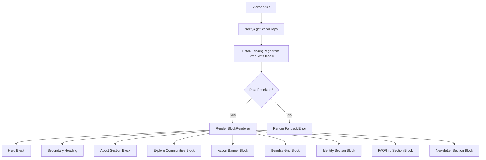

# Landing Page Implementation — Implementation Specification

## 📊 Overview

### Purpose
To provide a high-fidelity, modern landing page for the Science for Africa platform that effectively communicates the value proposition to researchers and institutions, following the "premium aesthetic" standards.

### Key Principle
**Dynamic & Localized Content**: All content must be editable via Strapi and support all 5 platform locales (EN, FR, AR, SW, PT) without requiring code changes for text updates.

### User Experience
The user arrives at the root URL (`/`) and is greeted by a clean, professional header followed by a multi-part Hero section. As they scroll, they experience a rhythmic layout alternating between informational text, community exploration, and visual storytelling.

---

## 🎯 Design Principles
- **Premium Aesthetics**: Use vibrant colors (SFA Teal/Green), modern typography (Inter/Outfit), and ample whitespace.
- **Visual Storytelling**: High-quality imagery with meaningful overlays and micro-animations.
- **Micro-interactions**: Subtle hover states on cards, smooth transitions for accordions, and lazy-loading animations.
- **Mobile First**: Ensure the complex 3-4 column grids collapse to single columns gracefully.

---

## 📐 Architecture Design

### Data Flow / Logic Flow

### Database Schema / Data Structure
- **Single Type**: `landing-page`
- **Dynamic Zone**: `blocks`
    - **Components**:
        - `hero`: { title: String, description: LongText, linkText: String, linkUrl: String, image: Media }
        - `secondary-heading`: { tagline: String, title: String }
        - `about-section`: { title: String, description: Text, checklist: [ { text: String } ], image: Media }
        - `explore-communities`: { title: String, description: Text, linkText: String, linkUrl: String }
        - `action-banner`: { image: Media }
        - `benefits-grid`: { title: String, items: [ { title: String, description: Text, linkText: String, linkUrl: String } ] }
        - `identity-section`: { image: Media, overlayText: String }
        - `info-accordion`: { title: String, items: [ { title: String, content: LongText } ] }
        - `newsletter-section`: { title: String, text: String, buttonText: String, inputPlaceholder: String }

---

## ✅ Acceptance Criteria

### User Acceptance Criteria (User AC)
- [ ] **Hero Section**: Title and description appear before/beside the large map image.
- [ ] **Community Cards**: Grid of communities with icons, member counts, and "Join" buttons.
- [ ] **Benefits Section**: 4-column grid (Collaborate, Access Opportunities, etc.) with "Explore" links.
- [ ] **Identity Section**: Full-width image with white centered text box.
- [ ] **FAQ/Info**: Functional accordion for "Who the Community Is For", etc.
- [ ] **Aesthetics**: Matches the provided design screenshot exactly (colors, spacing, shadows).

### Technical Acceptance Criteria (Tech AC)
- [ ] Uses Strapi v5 Document Service with deep population.
- [ ] Implements `BlockRenderer` for all new components.
- [ ] Responsive design verified: 4 cols (desktop) -> 2 cols (tablet) -> 1 col (mobile).
- [ ] All images optimized via `next/image`.
- [ ] 100% i18n parity across all components.

---

## 🔧 Implementation Details

### Phase 1: Content Model Update
- Update `backend/src/components/page` to include new fields and components.
- Update `landing-page` single type in Strapi.

### Phase 2: Seeder Refinement
- Update `syncLandingPage` in `seeder.js` to populate the new fields and components with design-compliant data.

### Phase 3: Frontend Component Development
- Refactor `Hero.js` to include text content.
- Create `SecondaryHeading.js`, `ActionBanner.js`, `IdentitySection.js`, and `InfoAccordion.js`.
- Refine `PeerSection.js` (About), `ExploreCommunities.js`, and `BenefitsSection.js`.

---

## 📡 API Reference

### Get Landing Page
- **Method**: `GET`
- **Path**: `/api/landing-page`
- **Params**: `locale`, `populate=blocks.checklist,blocks.items,blocks.image,blocks.backgroundImage`
- **Response**: `200 OK` with JSON object containing page content.

---

## ✅ Implementation Checklist
- [ ] Unit tests for new block components
- [ ] Design audit against screenshot
- [ ] Documentation updated
- [ ] Security audit (public access)

---

## 🔮 Future Enhancements
- **Dynamic Community Feed**: Show latest activity from specific communities.
- **Scroll Animations**: Trigger fade-ins as user scrolls through sections.
