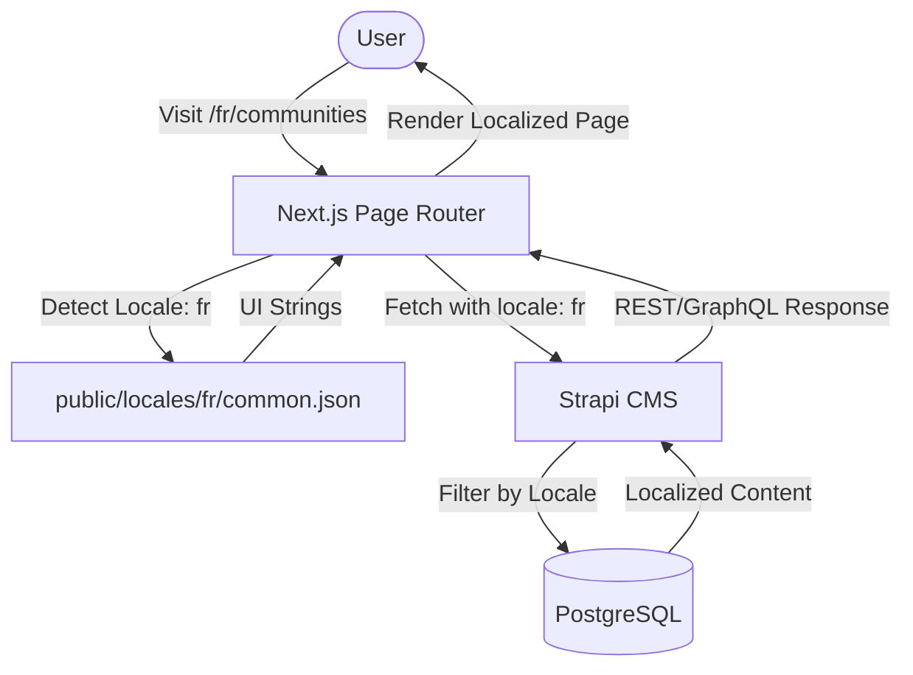

# Localization (i18n) — Implementation Specification

## 📊 Overview

### Purpose
To enable the Science for Africa platform to serve content and user interface in multiple languages, starting with English and French. This ensures accessibility for a diverse linguistic audience across Africa and international stakeholders.

### Key Principle
**SEO-Standard Subpath Routing**: Use URL subpaths (e.g., `/fr/communities`) for better indexing by search engines and a consistent user experience.

### User Experience
Users will land on the site in English by default. A language switcher in the navbar allows them to switch to French. Upon switching, the URL updates to include the `/fr` prefix, and both the UI strings (buttons, labels) and the content (community names, descriptions) refresh to show the French version.

---

## 🎯 Design Principles
- **Native Integration**: Leverage Strapi's built-in `i18n` plugin rather than a custom solution for content management.
- **App-Router Ready (Page Router implementation)**: Use `next-i18next` to manage Page Router i18n while keeping components ready for future migration.
- **Automatic Locale Detection**: Detect the user's browser language on first visit to provide a personalized experience.

---

## 📐 Architecture Design

### Data Flow / Logic Flow


### Database Schema / Data Structure
- **Strapi i18n**: No schema changes required on PostgreSQL. Strapi models handles translation entries internally using a `locale` field and `localizations` relation for documents.
- **Frontend Dictionaries**: JSON files in `public/locales/[locale]/common.json`.

---

## ✅ Acceptance Criteria

### User Acceptance Criteria (User AC)
- [ ] User can switch between English and French via a navbar dropdown.
- [ ] Switching language updates the URL subpath (e.g., from `/` to `/fr`).
- [ ] All primary UI elements (Navbar, Footer, Buttons) update to the selected language.
- [ ] Content from Strapi is displayed in the selected language if a translation exists.
- [ ] Site-wide search returns results relevant to the current locale.

### Content Strategy
All core content entities now include localization support:
- **Interests**: `name` and `category` localized (for expertise filtering).
- **Institutions**: `name` and `country` localized.

### UI Strategy
- **Navbar**: All links and login/signup flows translated.
- **Footer**: Company info and links translated.
- **Search**: Auto-filters based on current locale.

---

## Technical Appendix

### API Locale Injection
The `apiClient` automatically extracts the locale from the frontend subpath (e.g., `/fr`) and appends it to all Strapi requests:
```javascript
// Example: /fr/onboarding -> sends ?locale=fr
config.params = { ...config.params, locale: currentLocale };
```

### Technical Acceptance Criteria (Tech AC)
- [ ] Next.js handles routing for `/` and `/fr` prefixes automatically.
- [ ] API calls to Strapi include the `locale` query parameter.
- [ ] `next-i18next` configuration correctly loads JSON bundles from `public/locales`.
- [ ] `hreflang` tags are correctly generated in the `<head>` for SEO.
- [ ] Strapi `config-sync` successfully captures the enabled locales.

---

## 🔧 Implementation Details

### Phase 1: Backend Foundation
- [ ] Enable `@strapi/plugin-i18n` in `plugins.js`
- [ ] Add Locales: `English (en)`, `French (fr)` via Strapi Settings
- [ ] Enable localization in `schema.json` for: `Community`, `ForumCategory`, `Resource`, `Tag`
- [ ] Export configuration to `config/sync/`

### Phase 2: Frontend Foundation
- [ ] Install `next-i18next` and `i18next`
- [ ] Configure `next.config.mjs` with `i18n` settings
- [ ] Create directory structure for `public/locales/`
- [ ] Implement `appWithTranslation` in `_app.jsx`

### Phase 3: Premium UI Switcher
- [ ] Design `LocaleSwitcher` component using shadcn/ui and Radix.
- [ ] Integrate switcher into the main Navbar.
- [ ] Implement smooth transition/loading state during locale switch.

### Phase 4: Data Fetching Overhaul
- [ ] Update `axios` interceptor/wrapper to include `locale` query param.
- [ ] Update GraphQL queries to include `locale` variable.

---

## 📡 API Reference

### Localized Strapi Fetch
All content fetches should append the `locale` parameter.
- **Method**: `GET`
- **Path**: `/api/communities?locale=fr`
- **Response**: `200 OK` (returns entries in French)

---

## ✅ Implementation Checklist
- [ ] Subpath routing works for all pages (e.g., `/fr/reset-password`)
- [ ] UI strings correctly load from `common.json`
- [ ] Strapi content filters correctly by locale
- [ ] SEO tags (`hreflang`) are automatically injected by Next.js
- [ ] Verification email links preserve the user's selected locale

---

## 📊 Example Scenarios

### Scenario 1: User switches from English to French on a Community page
- **Input**: User clicks "Français" in the `LocaleSwitcher`.
- **Processing**: Next.js redirects to `/fr/communities/[slug]`. `useTranslation` hook reloads with French dictionary. API call to Strapi includes `locale=fr`.
- **Expected Output**: Page reloads with "Communautés" header and French community description.

---

## 🔮 Future Enhancements
- **Auto-Translation Integration**: Use AI to provide initial drafts of translations for user threads.
- **More Locales**: Add Swahili and Arabic support.
