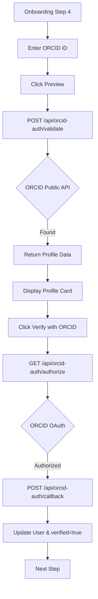

# ORCID Verification Flow — Implementation Specification

## 📊 Overview

### Purpose
To allow researchers to verify their professional identity by linking their ORCID iD. This enhances profile credibility and automatically imports biographical and professional data, reducing onboarding friction.

### Key Principle
**Data-Driven Credibility**: Verified ORCID links provide a foundation of trust for researchers on the Science for Africa platform.

### User Experience
1. **Discovery**: User enters their 16-digit ORCID iD in Onboarding Step 4 for public data preview.
2. **Preview**: User clicks "Verify". The system calls the backend to fetch public data from the ORCID registry.
3. **Feedback**:
    - **Success**: A "Profile Found" card appears showing the researcher's name, biography, and latest position.
    - **Failure**: An error message appears if the ID is invalid or not found.
4. **OAuth Verification**: User clicks "Sign in with ORCID" to verify ownership.
5. **Sync**: Successful OAuth handshake automatically populates and locks the user's profile fields (FirstName, LastName, Biography, Interests) with a `verified` status.
6. **Completion**: User proceeds to Step 5.

 ---

## 🔑 Environment Configuration

The following variables must be configured in the backend environment for both public validation and OAuth flows:

| Variable | Purpose |
|---|---|
| `ORCID_CLIENT_ID` | OAuth Client ID from ORCID developer dashboard |
| `ORCID_CLIENT_SECRET` | OAuth Client Secret from ORCID developer dashboard |
| `ORCID_OAUTH_URL` | Base URL (e.g., `https://sandbox.orcid.org` or `https://orcid.org`) |
| `ORCID_API_URL` | Base URL for Public API (e.g., `https://pub.orcid.org`) |
| `ORCID_REDIRECT_URI` | Explicit redirect URI override (optional) |

---

## 🎯 Design Principles
- **Instant Validation**: Real-time feedback when the user clicks verify.
- **Transparency**: Show the user exactly what data is being imported from ORCID.
- **Optionality**: Users can skip ORCID integration if they prefer.

---

## 📐 Architecture Design

### Data Flow / Logic Flow


### Database Schema / Data Structure
- **User (Extended)**:
    - `orcidId`: String (e.g., "0000-0002-1825-0097")
    - `verified`: Boolean (true after successful ORCID sync)
    - `firstName`, `lastName`, `fullName`, `biography`, `position`: Updated from ORCID.
    - `interests`: Array of `user.interest` components (Sync from ORCID keywords).

---

## ✅ Acceptance Criteria

### User Acceptance Criteria (User AC)
- [ ] User can input a 16-digit ORCID iD with automatic formatting (dashes).
- [ ] User sees a loading spinner while verification is in progress.
- [ ] User sees a summary of the found profile (Name, Bio, Institution) before proceeding.
- [ ] User can skip the ORCID step without verification.
- [ ] Error messages are clear if the ORCID iD is not found.

### Technical Acceptance Criteria (Tech AC)
- [ ] Backend validates ORCID iD format via regex.
- [ ] Backend fetches data from `pub.orcid.org/v3.0` (Public API).
- [ ] Backend updates the `verified` flag on the user record.
- [ ] Backend correctly maps ORCID keywords to Strapi `user.interest` components (max 5).
- [ ] Endpoint is secured to authenticated users only.

---

## 🔧 Implementation Details

### Phase 1: Backend Polish
- [ ] Add `interests` mapping to `orcid-auth` controller.
- [ ] Ensure `verified` field is correctly toggled.
- [ ] Configure `config/sync` permissions for `/api/orcid-auth/validate`.

### Phase 2: Frontend API & Store
- [ ] Create `lib/api/orcid.js` for API calls.
- [ ] Add `orcidProfile` to `useOnboardingStore` for preview state.

### Phase 3: UI Enhancement
- [ ] Implement `ProfilePreviewCard` component.
- [ ] Add validation logic to `OnboardingStep4.jsx`.
- [ ] Add localized strings for verification states.

---

## 📡 API Reference

### Validate ORCID
- **Method**: `POST`
- **Path**: `/api/orcid-auth/validate`
- **Request Body**:
```json
{
  "orcidId": "0000-0002-1825-0097"
}
```
- **Response (200 OK)**:
```json
{
  "data": {
    "orcidId": "0000-0002-1825-0097",
    "firstName": "Jane",
    "lastName": "Doe",
    "fullName": "Jane Doe",
    "biography": "Researcher at University of X...",
    "interests": ["Machine Learning", "Climate Science"],
    "verified": true
  }
}
```

---

## ✅ Implementation Checklist
- [ ] Backend unit tests for `isValidOrcidFormat`.
- [ ] Integration tests for the validation endpoint.
- [ ] Frontend unit tests for Step 4 validation.
- [ ] Documentation updated in LLD.

---

## 📊 Example Scenarios

### Scenario 1: Successful Verification
1. User enters `0000-0002-1825-0097`.
2. Backend finds "Jane Doe".
3. Frontend shows "Profile Found: Jane Doe".
4. User clicks "Confirm".
5. Profile fields are updated, and user moves to Step 5.

---

## 🔮 Future Enhancements
- Continuous sync (nightly) to keep profiles updated.
- Import of publication list/works into the user's Resources tab.
