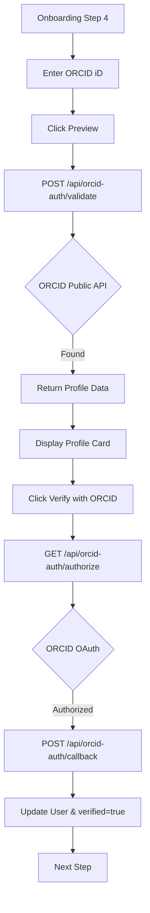

# ORCID Verification Flow — Implementation Specification

## 📊 Overview

### Purpose
To allow researchers to verify their professional identity by linking their ORCID account via OAuth. This enhances profile credibility and automatically imports biographical and professional data, reducing onboarding friction.

### Key Principle
**Data-Driven Credibility**: Verified ORCID links provide a foundation of trust for researchers on the Science for Africa platform.

### User Experience
1. **Discovery**: User enters their 16-digit ORCID iD in Onboarding Step 4 for public data preview.
2. **Preview**: User clicks "Verify". The system calls the backend to fetch public data from the ORCID registry.
3. **Feedback**:
    - **Success**: A "Profile Found" card appears showing the researcher's name, biography, and latest position.
    - **Failure**: An error message appears if the ID is invalid or not found.
4. **OAuth Verification**: User clicks "Sign in with ORCID" to verify ownership.
5. **Sync**: Successful OAuth handshake automatically populates and locks the user's profile fields (FirstName, LastName, Biography, Interests) with a `verified` status.
6. **Completion**: User proceeds to Step 5.

 ---

## 🔑 Environment Configuration

The following variables must be configured in the backend environment for both public validation and OAuth flows:

| Variable | Purpose |
|---|---|
| `ORCID_CLIENT_ID` | OAuth Client ID from ORCID developer dashboard |
| `ORCID_CLIENT_SECRET` | OAuth Client Secret from ORCID developer dashboard |
| `ORCID_OAUTH_URL` | Base URL (e.g., `https://sandbox.orcid.org` or `https://orcid.org`) |
| `ORCID_API_URL` | Base URL for Public API (e.g., `https://pub.orcid.org`) |
| `ORCID_REDIRECT_URI` | Explicit redirect URI override (optional) |

---

## 🎯 Design Principles
- **OAuth Security**: Use official ORCID OAuth 2.0 flow for secure verification.
- **Seamless Integration**: Automated redirect and callback handling.
- **Optionality**: Users can skip ORCID integration if they prefer.

---

## 📐 Architecture Design

### Data Flow / Logic Flow


### Database Schema / Data Structure
- **User (Extended)**:
    - `orcidId`: String (e.g., "0000-0002-1825-0097")
    - `verified`: Boolean (true after successful ORCID sync)
    - `firstName`, `lastName`, `fullName`, `biography`: Updated from ORCID.
    - `interests`: Array of `user.interest` components (Sync from ORCID keywords).

---

## ✅ Acceptance Criteria

### User Acceptance Criteria (User AC)
- [x] User can trigger verification via a "Verify ORCID" button.
- [x] User is redirected to ORCID.org securely.
- [x] User is returned to the platform after authorization.
- [x] User sees a success notification once verified.
- [x] User can skip the ORCID step without verification.

### Technical Acceptance Criteria (Tech AC)
- [x] Backend implements OAuth 2.0 flow (Authorize, Callback).
- [x] Backend fetches data from `pub.orcid.org/v3.0` (Public API).
- [x] Backend updates the `verified` flag on the user record.
- [x] Backend correctly maps ORCID keywords to Strapi `user.interest` components.
- [x] Secure environment variables for Client ID and Secret.

---

## 🔧 Implementation Details

### Phase 1: Backend Infrastructure
- [x] Implement `api/orcid-auth` endpoints for OAuth.
- [x] Configure permissions for `authorize` and `callback`.
- [x] Add environment variables to `compose.yml`.

### Phase 2: Frontend Integration
- [x] Implement `getOrcidAuthorizeUrl` helper.
- [x] Create `/auth/orcid/callback` page for handling the redirect.
- [x] Update `DetailsViewMode.js` and `OnboardingStep4.jsx` to use the OAuth button.

---

## 📡 API Reference

### Authorize
- **Method**: `GET`
- **Path**: `/api/orcid-auth/authorize`
- **Query Params**: `returnTo` (e.g., "profile", "onboarding")

### Callback (Code exchange handler)
- **Method**: `POST`
- **Path**: `/api/orcid-auth/callback`
- **Request Body**:
```json
{
  "code": "AUTHORIZATION_CODE",
  "state": "BASE64URL_ENCODED_STATE"
}
```

---

## ✅ Implementation Checklist
- [x] Backend integration tests for OAuth exchange.
- [x] Frontend handling of callback redirects.
- [x] Environment variables configured for all environments.

---

## 📊 Example Scenarios

### Scenario 1: Successful Verification
1. User clicks "Verify ORCID".
2. Authenticates on ORCID.org.
3. Returns to Science for Africa.
4. Profile is updated and `verified` badge appears.

---


## 🔮 Future Enhancements
- Continuous sync (nightly) to keep profiles updated.
- Import of publication list/works into the user's Resources tab.
