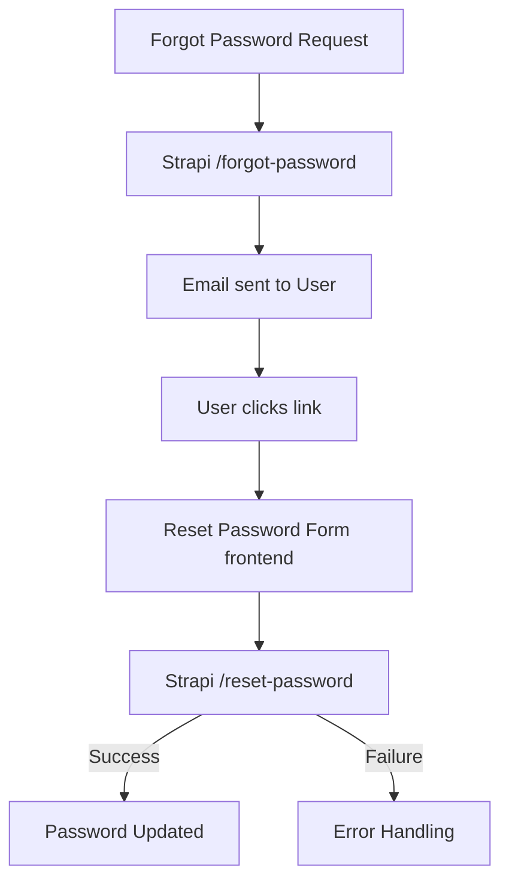

# Password Recovery — Implementation Specification

## 📊 Overview

### Purpose
Password recovery allows users to reset their forgotten passwords securely using an email-based flow, ensuring they can seamlessly regain access to their account.

### Key Principle
**Secure Standard Recovery**: This implementation relies on the well-tested, standard Strapi v5 authentication endpoints from the `users-permissions` plugin to ensure security and predictability.

### User Experience
1. User navigates to `/forgot-password` and submits their email.
2. User receives an email with a secure reset link.
3. User clicks the link, heading to `/reset-password?code=...`.
4. User enters a new password, validates it, and submits.
5. User logs in with newly established credentials.

---

## 🎯 Design Principles
- **Seamless Triage**: Provide immediate feedback if passwords do not match or lack strength.
- **Unified Standard**: Leverage pre-built `users-permissions` logic without custom overriding for reliability.

---

## 📐 Architecture Design

### Data Flow / Logic Flow

### Database Schema / Data Structure
No database schema changes required. Relies on standard Strapi user entity parameters.

---

## 🔧 Implementation Details

### Phase 1: Forgot Password Request
- [x] Create UI with email input field.
- [x] Protect form with Strapi-handled CSRF/Rate-limits.
- [x] Show success state: "If an account exists for this email, you will receive a reset link shortly."

### Phase 2: Reset Password Submission
- [x] Extract `code` URL parameter from the arriving link.
- [x] Create UI for New Password and Confirm Password inputs.
- [x] Validate password match and strength.

---

## 📡 API Reference

### Forgot Password
- **Method**: `POST`
- **Path**: `/api/auth/forgot-password`
- **Request Body**: `{"email": "user@example.com"}`
- **Response**: `200 OK`

### Reset Password
- **Method**: `POST`
- **Path**: `/api/auth/reset-password`
- **Request Body**: `{"code": "...", "password": "...", "passwordConfirmation": "..."}`
- **Response**: `200 OK`

---

## ✅ Implementation Checklist
- [x] Forms built with React Hook Form + Zod.
- [x] Uses `apiClient` (Axios) for all HTTP calls.
- [x] `strapi.js` updated with unified `/auth/` paths.
- [x] Full TDD coverage for the `strapi.js` library methods.

---

## 📊 Example Scenarios

### Scenario 1: Expired Code Recovery
1. User clicks link after 60 mins.
2. Submits new password.
3. Receives "Code expired. Please request a new code." error.

---

## 🔮 Future Enhancements
- Password reuse prevention logic.
- UI improvements for email spamming prevention (60s timer UX).
