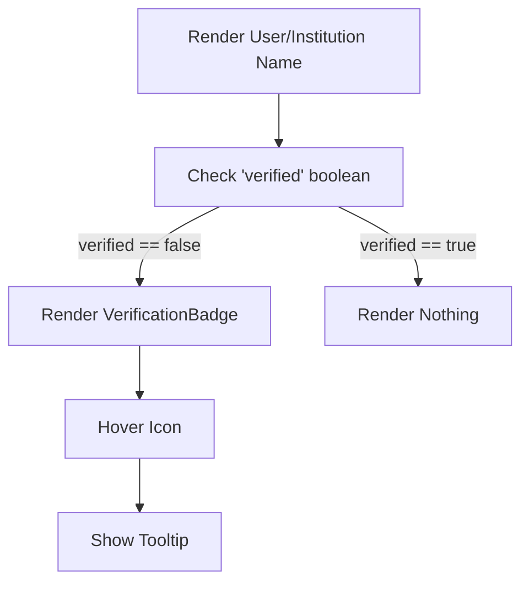

# Pending Confirmation Badge — Implementation Specification

## 📊 Overview

### Purpose
To clearly indicate the verification status of users and institutions across the platform. This provides transparency regarding whether account or institutional details have been officially confirmed.

### Key Principle
"Transparency through Visual Indicators" — Users should immediately know if an entity is confirmed without searching for status fields.

### User Experience
When a user or institution name is displayed, a subtle icon appears next to it if they are not verified. Hovering over the icon reveals a tooltip explaining the "pending confirmation" status.

---

## 🎯 Design Principles
- **DRY (Don't Repeat Yourself)**: A single reusable component for the badge to ensure consistency.
- **Subtle but Clear**: The badge should be visible but not distracting from the primary content (names).
- **Informative**: Tooltips provide context on what the badge means.

---

## 📐 Architecture Design

### Data Flow / Logic Flow

### Database Schema / Data Structure
- **Institution**: Existing `verified` boolean field (default: `false`).
- **User (users-permissions)**: Add a new `verified` boolean field (default: `false`).

---

## ✅ Acceptance Criteria

### User Acceptance Criteria (User AC)
- [x] Show an icon next to user names if `verified` is `false`.
- [x] Show an icon next to institution names if `verified` is `false`.
- [x] Mouseover user badge: Show "pending account details confirmation".
- [x] Mouseover institution badge: Show "pending institution details confirmation".
- [x] Badge disappears once the entity is marked as `verified: true` in the backend.

### Technical Acceptance Criteria (Tech AC)
- [x] Create a reusable `VerificationBadge` component in the frontend.
- [x] Add `verified` boolean field to the Strapi User model (default: `false`).
- [x] Ensure the component handles both user and institution types for different tooltip text.
- [x] Maintain consistent styling across all locations where names are displayed.

---

## 🔧 Implementation Details

### Phase 1: Backend Updates
- [x] Extend the `users-permissions` User model to include the `verified` field.
- [x] Added `verified` to `findUsers` controller fields.

### Phase 2: Frontend Component Creation
- [x] Created `VerificationBadge` component in `frontend/components/shared/VerificationBadge.jsx`.
- [x] Integrated `lucide-react` Clock icon.
- [x] Implemented tooltip via `title` attribute.

### Phase 3: Global Integration
- [x] Integrated into Navbar (Desktop & Mobile).
- [x] Integrated into Profile (Details view & Sidebar).
- [x] Integrated into Collaboration (Mentor selection).

---

## 📡 API Reference

### User/Institution Object
- **Field**: `verified`
- **Type**: `boolean`
- **Default**: `false`

---

## ✅ Implementation Checklist
- [x] Backend schema updated and migrated.
- [x] `VerificationBadge` component tested in isolation.
- [x] Badge integrated into Profile, Collaboration, and Onboarding views.
- [x] Tooltip content verified for both types.

---

## 📊 Example Scenarios

### Scenario 1: New User
- User registers. `verified` defaults to `false`.
- User's name in the header/profile shows the "pending" badge.

### Scenario 2: Verified Institution
- Admin verifies an institution in the Strapi dashboard (`verified: true`).
- The institution name in the profile no longer shows the badge.

---

## 🔮 Future Enhancements
- Integration with an actual approval workflow (email notifications, admin queues).
- Differentiated levels of verification (e.g., Bronze, Silver, Gold).
