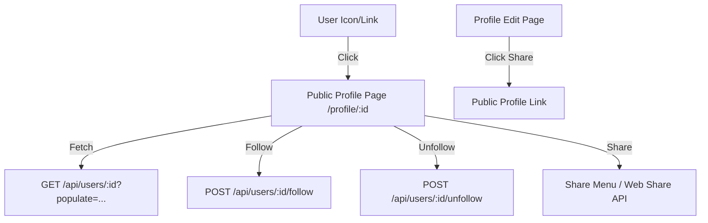

# Public Profile Page — Implementation Specification

## 📊 Overview

### Purpose
Enable users to view public professional identities of other community members, follow them to stay updated, and share profiles with external networks. This feature bridges the gap between individual account management and community networking.

### Key Principles
- **Professional Visibility**: Showcase expertise, contributions, and professional standing.
- **Networking**: Facilitate connections through the "Follow" mechanism.
- **Public Accessibility**: Profiles must be viewable without sensitive private information being exposed.

### User Experience
- **Follow/Unfollow**: High-visibility button with optimistic UI updates.
- **Subscriber Count**: Live count of followers.
- **Share Menu**: Dropdown providing easy sharing options.
- **Integrated Links**: All profile icons across the platform link to this public view.

---

## 🎯 Design Principles
- **Aesthetic Excellence**: Follow the vibrant and premium Science for Africa design system.
- **Optimistic Interactions**: Follow/Unfollow actions should feel instantaneous.
- **Contextual Navigation**: Clicking any user icon in the platform should lead here.

---

## 📐 Architecture Design

### Data Flow / Logic Flow

### Database Schema Updates
- **User (users-permissions.user)**:
    - `followers`: Many-to-Many relationship with `User`.
    - `following`: Many-to-Many relationship with `User`.
    - `subscriberCount`: Integer (Auto-updated via lifecycles).

---

## ✅ Acceptance Criteria

### User Acceptance Criteria (UAC)
#### 1. Public Profile View
- [ ] Accessible via `/profile/[id]`.
- [ ] Displays: Full Name, Bio, Profile Photo, Cover Image, Institution, Interests.
- [ ] **Empty State**: If no posts, text reads "Public posts will appear here".
- [ ] **Privacy**: NEVER displays private info like email, settings, or internal notes.

#### 2. Follow Mechanism
- [ ] "Follow" button visible on other users' profiles.
- [ ] Clicking "Follow" increases subscriber count and toggles button to "Unfollow".
- [ ] Clicking "Unfollow" decreases subscriber count and toggles button back to "Follow".
- [ ] Logic prevents self-following.

#### 3. Share Functionality
- [ ] **Profile Page**: Menu includes a "Share" button.
- [ ] **Profile Edit Page**: "Share" button links to the user's own public profile page.
- [ ] Copy-to-clipboard fallback if Web Share API is unavailable.

#### 4. Platform Integration
- [ ] All profile icons (e.g., resource uploaders, collaboration posters) link to the public profile page.

### Technical Acceptance Criteria (Tech AC)
- [ ] **Strapi Controller**: Custom endpoint for `follow` and `unfollow`.
- [ ] **Optimistic UI**: Use SWR or React state to update the count immediately before the API call completes.
- [ ] **SEO**: Proper meta tags for sharing (OG tags) on the public profile page.
- [ ] **Performance**: Ensure the `subscriberCount` is indexed or pre-calculated.

---

## 🔧 Implementation Plan

### Phase 1: Backend (Strapi)
- [ ] Add `followers` and `following` relations to User schema.
- [ ] Add `subscriberCount` field to User schema.
- [ ] Implement `follow` and `unfollow` controllers in `users-permissions` extension.
- [ ] Implement lifecycle hooks to sync `subscriberCount`.

### Phase 2: Frontend (Next.js)
- [ ] Create `pages/profile/[id].js`.
- [ ] Implement UI layout based on Figma.
- [ ] Implement Follow/Unfollow button with optimistic updates.
- [ ] Implement Share menu/dropdown.
- [ ] Add "Share" button to `pages/profile/index.js` (Edit view).

### Phase 3: Global Integration
- [ ] Update `Avatar` and profile name components to wrap with `<Link href={`/profile/${user.id}`}>`.
- [ ] Verify all instances (Resource, Collaboration, Chat, etc.).

---

## 📡 API Reference

### Follow User
- **Method**: `POST`
- **Path**: `/api/users/:documentId/follow`
- **Response**: `200 OK` with updated `subscriberCount`.

### Unfollow User
- **Method**: `POST`
- **Path**: `/api/users/:documentId/unfollow`
- **Response**: `200 OK` with updated `subscriberCount`.
