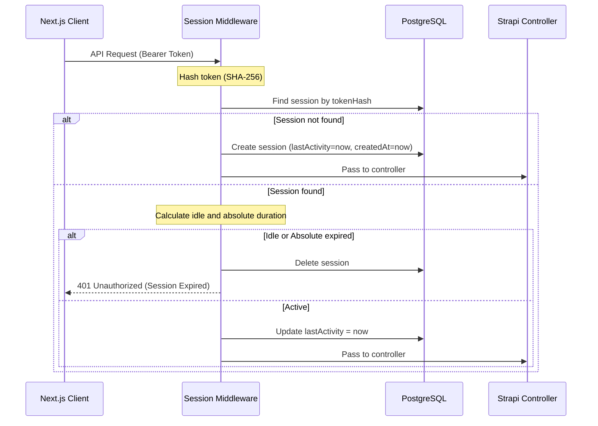

# Session Timeout Management — Implementation Specification

## 📊 Overview

### Purpose
To enforce secure session lifetimes and prevent unauthorized access on shared or unattended devices by automatically expiring idle and long-running sessions, satisfying OWASP Session Management guidelines.

### Key Principle
**Server-Side Verification with Client-Side Proactivity**: The server acts as the source of truth for session validity, tracking last activity and absolute lifetimes, while the client actively monitors user input and transitions to the login screen upon expiry to maximize user experience.

### User Experience
- **Client-Side Idle Monitoring**: If a user is active on the platform, their idle timer resets. If the user remains inactive for the configured idle period (e.g. 15 minutes), the application logs the user out and redirects them to the login page with a toast indicating the session expired.
- **Server-Side Expiry Enforcement**: If the user makes an API request after the idle timeout or absolute maximum session lifetime has passed (e.g. they woke up their computer after hours of sleep), the backend returns `401 Unauthorized`. The frontend API client interceptor intercepts this status, clears local session storage, and redirects the user to the login page with an appropriate warning toast.

---

## 🎯 Design Principles
- **Defense in Depth**: Rely on both client-side timers and server-side state checks.
- **Privacy & Security**: Store session tokens hashed on the server side using SHA-256 to mitigate database leaks.
- **Multi-Tab Sync**: Ensure that activity in one tab extends the session across all other open tabs in the same browser, and that logging out in one tab immediately logs out all other tabs.

---

## 📐 Architecture Design

### Data Flow / Logic Flow


### Database Schema / Data Structure
We will add a new content type: `api::user-session.user-session`.

```json
{
  "kind": "collectionType",
  "collectionName": "user_sessions",
  "info": {
    "displayName": "User Session",
    "singularName": "user-session",
    "pluralName": "user-sessions"
  },
  "attributes": {
    "tokenHash": {
      "type": "text",
      "required": true,
      "unique": true
    },
    "user": {
      "type": "relation",
      "relation": "manyToOne",
      "target": "plugin::users-permissions.user"
    },
    "lastActivity": {
      "type": "datetime",
      "required": true
    },
    "ipAddress": {
      "type": "string"
    },
    "userAgent": {
      "type": "string"
    }
  }
}
```

---

## ✅ Acceptance Criteria

### User Acceptance Criteria (User AC)
- [ ] Users are automatically logged out and redirected to `/login` if they are idle (no mouse moves, keypresses, clicks, scrolls, or touch inputs) for the configured idle timeout.
- [ ] Users are logged out and redirected to `/login` if the absolute maximum session lifetime has elapsed since they initially logged in.
- [ ] A success/info toast is shown on the login screen explaining that the session has expired.
- [ ] User activity in one tab extends the session in other tabs (for persistent sessions).
- [ ] Logging out in one tab immediately logs out other tabs.

### Technical Acceptance Criteria (Tech AC)
- [ ] The backend session tracking handles tokens securely by storing their SHA-256 hash.
- [ ] Public/auth routes (e.g., `/api/auth/local`, `/api/auth/verify-otp`, `/api/auth/registration-status`) bypass the session timeout middleware checks.
- [ ] Configuration parameters `SESSION_IDLE_TIMEOUT_MINUTES` and `SESSION_ABSOLUTE_TIMEOUT_MINUTES` are added with default fallback values (30 minutes and 1440 minutes respectively).
- [ ] A custom `POST /api/auth/logout` endpoint deletes the active session from the database.

---

## 🔧 Implementation Details

### Phase 1: Backend Session Tracking & Middleware
- [ ] Create the `user-session` content-type schema.
- [ ] Implement the `session-timeout` middleware to validate, track, and expire sessions.
- [ ] Add the `POST /api/auth/logout` controller and route.
- [ ] Add environment configuration variables to `.env.example`.

### Phase 2: Frontend Client-Side Activity Monitoring
- [ ] Integrate an activity monitor (`useSessionTimeout` hook or component) that resets an idle timer on mouse, keyboard, scroll, and touch events.
- [ ] Synchronize activity across tabs by updating a `lastActive` timestamp in Zustand/storage.
- [ ] Update the Axios response interceptor in `api-client.js` to catch `401 Unauthorized` errors with message "Session expired..." and trigger a logout.
