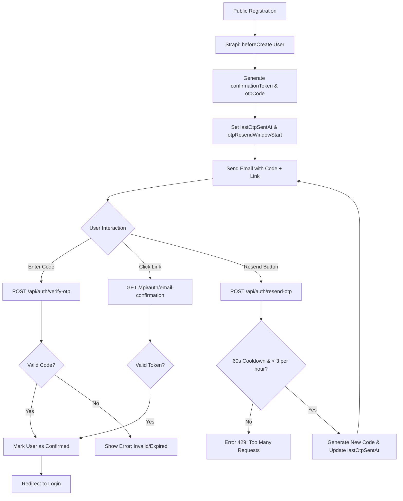

# OTP & Link-Based Email Verification — Implementation Specification

## 📊 Overview

### Purpose
To modernize the user registration process by providing a low-friction "One-Time Password" (OTP) verification method alongside the traditional "Verification Link." This allows users to confirm their identity immediately in the browser without necessarily leaving the platform to click a link in their email.

### Key Principle
**Dual-Path Verification Resilience**: Ensuring that both the OTP and the verification link remain valid until the user is confirmed, providing a seamless fallback if one method fails or is inaccessible.

### User Experience
1. **Sign Up**: User completes the registration form.
2. **Success Screen**: Instead of a generic "Check your email" redirect, the user stays on a page with a 6-digit input field.
3. **Verification Email**: User receives a branded email containing:
    - **A 6-digit code** (e.g., `123 456`).
    - **A verification link** (e.g., `Verify Email` button).
4. **Resend Capability**: If the email is not received, the user can click "Resend Code" after a **60-second cooldown**.
5. **Action**:
    - The user can type the code directly into the browser.
    - **OR** if they are on mobile or check email first, they can click the link.
6. **Login Redirect**: Upon successful verification via either method, the user is redirected to the login page to sign in.

---

## 🎯 Design Principles
- **Progressive Fallback**: The OTP is the primary interactive element on the post-registration screen, but the link remains the "golden path" for reliability.
- **Security-First**: OTPs must be cryptographically random and have a short TTL (Time-To-Live).
- **Proactive Rate Limiting**: Prevent abuse and email costs through persistent, database-backed cooldowns and hourly retry caps.
- **Session Consistency**: The frontend must handle the state transition smoothly when verification happens in a different tab (link click).

---

## 📐 Architecture Design

### Data Flow / Logic Flow


### Database Schema / Data Structure
**User (plugin::users-permissions.user) Additions:**
- `otpCode`: `String` (6-digit numeric string).
- `otpExpiration`: `DateTime` (ISO string, default: 1 hour from creation).
- `lastOtpSentAt`: `DateTime` (Timestamp of the last resend request).
- `otpResendCount`: `Integer` (Current number of resends in the active window, default: 0).
- `otpResendWindowStart`: `DateTime` (Start of the 1-hour rolling window for rate limiting).

---

## ✅ Acceptance Criteria

### User Acceptance Criteria (User AC)
- [ ] After registration, I am shown a screen asking for a 6-digit verification code.
- [ ] I receive an email containing both a numeric code and a verification button.
- [ ] If I don't receive the email, I can click "Resend Code" after waiting **60 seconds**.
- [ ] I can see a visual countdown timer on the resend button.
- [ ] If I attempt to resend more than **3 times in one hour**, I am notified that I must wait.
- [ ] If I enter the correct code, I am successfully verified and redirected to the login page.
- [ ] If I click the button in the email, my account is verified and I am redirected to the login page.

### Technical Acceptance Criteria (Tech AC)
- [ ] OTP must be generated as a string of 6 random digits.
- [ ] OTP must expire exactly 60 minutes after generation.
- [ ] Backend must return `429 Too Many Requests` if `resend-otp` is called before the 60s cooldown.
- [ ] Backend must return `429 Too Many Requests` if `otpResendCount` >= 3 within a 1-hour window.
- [ ] Verification via OTP must clear `otpCode`, `confirmationToken`, `otpResendCount`, and `lastOtpSentAt`.
- [ ] The `resend-otp` endpoint must only accept requests for unconfirmed users.

---

## 🔧 Implementation Details

### Phase 1: Backend Foundation
- [ ] Update `backend/src/index.js` User schema with required OTP and rate-limiting fields.
- [ ] Implement `beforeCreate` logic to initialize `lastOtpSentAt` and `otpResendWindowStart`.
- [ ] Update `bootstrap` email template logic to inject the code into the confirmation email.

### Phase 2: API & Controller
- [ ] Add `verifyOtp` function to `backend/src/api/auth/controllers/auth.js`.
- [ ] Add `resendOtp` function with rate-limiting logic to `backend/src/api/auth/controllers/auth.js`.
- [ ] Register routes `/auth/verify-otp` and `/auth/resend-otp` in `backend/src/api/auth/routes/auth.js`.

### Phase 3: Frontend Implementation
- [ ] Create `components/auth/otp-verification-form.tsx` using `shadcn/ui` OTP input.
- [ ] Implement `ResendOTPButton` with a 60s countdown timer and link it to `localStorage` for persistence.
- [ ] Implement polling or manual refresh to handle background verification if the user clicks the link in another tab.

---

## 📡 API Reference

### Verify OTP
- **Method**: `POST`
- **Path**: `/api/auth/verify-otp`
- **Request Body**:
  ```json
  {
    "email": "user@example.com",
    "otpCode": "123456"
  }
  ```
- **Response**:
    - `200 OK`: `{ "success": true, "message": "Email verified" }`
    - `400 Bad Request`: `{ "error": "Invalid or expired OTP" }`

### Resend OTP
- **Method**: `POST`
- **Path**: `/api/auth/resend-otp`
- **Request Body**:
  ```json
  {
    "email": "user@example.com"
  }
  ```
- **Response**:
    - `200 OK`: `{ "success": true, "message": "New OTP sent" }`
    - `429 Too Many Requests`: `{ "error": "Please wait 60 seconds before resending" }` or `{ "error": "Maximum resend attempts reached. Try again in 1 hour." }`

---

## ✅ Implementation Checklist
- [ ] Unit tests for OTP generation and rate-limiting logic.
- [ ] Integration tests for `verify-otp` and `resend-otp` endpoints.
- [ ] Email template verification across Outlook, Gmail, and Apple Mail.
- [ ] Security review: Ensure OTP cannot be brute-forced (account lockout after multiple failures).

---

## 📊 Example Scenarios

### Scenario 1: Successful OTP Verification
1. User sign up -> `otpCode` "556221" is generated.
2. User enters "556221" on the page.
3. Backend marks user as `confirmed: true`, `otpCode: null`.
4. User is redirected to `/auth/login`.

### Scenario 2: Verification Link Fallback
1. User sign up.
2. User ignores the browser screen and opens their phone.
3. User clicks "Verify Email" button in the email.
4. User is verified via standard Strapi flow.
5. The browser screen (if still open) can detect this via polling or a "Check Status" button.

### Scenario 3: Cooldown Enforcement
1. User clicks "Resend Code" -> New code sent.
2. User immediately clicks "Resend Code" again.
3. Frontend button is disabled with countdown "59s...".
4. If API is called via script, backend returns `429`.

### Scenario 4: Maximum Retries Reached
1. User resends code 3 times within 15 minutes.
2. User attempts a 4th resend.
3. Backend checks `otpResendCount` and returns `429` with "Maximum attempts reached".

---

## 🏗️ Architectural Decisions (ADRs)

### ADR-011: Numeric-Only OTP
- **Status**: Accepted
- **Context**: Choosing between alphanumeric and numeric-only codes for verification.
- **Decision**: Use a 6-digit numeric code.
- **Rationale**: Better accessibility on mobile devices (automatically triggers numeric keypad) and lower cognitive load for users.

### ADR-012: In-Database Rate Limiting for OTP Resend
- **Status**: Accepted
- **Context**: Need to enforce a 60s cooldown and hourly retry limit that persists across page refreshes and different devices.
- **Decision**: Use dedicated fields in the `User` schema (`lastOtpSentAt`, `otpResendCount`, `otpResendWindowStart`) rather than an in-memory cache like Redis.
- **Rationale**: Keeps the architecture simple (no extra infrastructure required) and ensures consistency across multiple server instances in a standard Strapi deployment.

---

## 🔮 Future Enhancements
- **Magic Link**: Auto-verify if the user opens the link on the same device.
