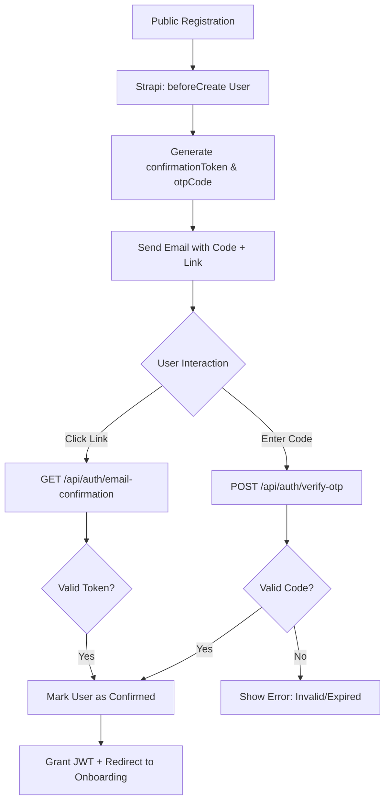

# OTP & Link-Based Email Verification — Implementation Specification

## 📊 Overview

### Purpose
To modernize the user registration process by providing a low-friction "One-Time Password" (OTP) verification method alongside the traditional "Verification Link." This allows users to confirm their identity immediately in the browser without necessarily leaving the platform to click a link in their email.

### Key Principle
**Dual-Path Verification Resilience**: Ensuring that both the OTP and the verification link remain valid until the user is confirmed, providing a seamless fallback if one method fails or is inaccessible.

### User Experience
1. **Sign Up**: User completes the registration form.
2. **Success Screen**: Instead of a generic "Check your email" redirect, the user stays on a page with a 6-digit input field.
3. **Verification Email**: User receives a branded email containing:
    - **A 6-digit code** (e.g., `123 456`).
    - **A verification link** (e.g., `Verify Email` button).
4. **Action**: 
    - The user can type the code directly into the browser.
    - **OR** if they are on mobile or check email first, they can click the link.
5. **Onboarding**: Upon successful verification via either method, the user is automatically logged in and enters the onboarding flow.

---

## 🎯 Design Principles
- **Progressive Fallback**: The OTP is the primary interactive element on the post-registration screen, but the link remains the "golden path" for reliability.
- **Security-First**: OTPs must be cryptographically random and have a short TTL (Time-To-Live).
- **Session Consistency**: The frontend must handle the state transition smoothly when verification happens in a different tab (link click).

---

## 📐 Architecture Design

### Data Flow / Logic Flow


### Database Schema / Data Structure
**User (plugin::users-permissions.user) Additions:**
- `otpCode`: `String` (6-digit numeric string).
- `otpExpiration`: `DateTime` (ISO string, default: 1 hour from creation).

---

## ✅ Acceptance Criteria

### User Acceptance Criteria (User AC)
- [ ] After registration, I am shown a screen asking for a 6-digit verification code.
- [ ] I receive an email containing both a numeric code and a verification button.
- [ ] If I enter the correct code, I am successfully verified and logged in.
- [ ] If I click the button in the email, my account is verified and I am logged in.
- [ ] I receive a clear error if I enter an incorrect or expired code.

### Technical Acceptance Criteria (Tech AC)
- [ ] OTP must be generated as a string of 6 random digits.
- [ ] OTP must expire exactly 60 minutes after generation.
- [ ] Verification via OTP must clear both `otpCode` and `confirmationToken` fields.
- [ ] A new endpoint `POST /api/auth/verify-otp` must be implemented.
- [ ] The existing authentication `bootstrap` must be updated to include the OTP in the email body.

---

## 🔧 Implementation Details

### Phase 1: Backend Foundation
- [ ] Update `backend/src/index.js` User schema with `otpCode` and `otpExpiration`.
- [ ] Implement `beforeCreate` logic in `index.js` to generate the code for local provider signups.
- [ ] Update `bootstrap` email template logic in `index.js` to inject the code into the confirmation email.

### Phase 2: API & Controller
- [ ] Add `verifyOtp` function to `backend/src/api/auth/controllers/auth.js`.
- [ ] Register the route `/auth/verify-otp` in `backend/src/api/auth/routes/auth.js`.
- [ ] Ensure the controller returns a valid JWT upon successful verification (as the user is not yet logged in during this phase).

### Phase 3: Frontend Implementation
- [ ] Create `components/auth/otp-verification-form.tsx` using `shadcn/ui` OTP input.
- [ ] Update registration success handler to redirect to `/auth/verify-email?email=...`.
- [ ] Implement polling or manual refresh to handle background verification if the user clicks the link in another tab.

---

## 📡 API Reference

### Verify OTP
- **Method**: `POST`
- **Path**: `/api/auth/verify-otp`
- **Request Body**:
  ```json
  {
    "email": "user@example.com",
    "otpCode": "123456"
  }
  ```
- **Response**:
    - `200 OK`: `{ "jwt": "...", "user": { ... } }`
    - `400 Bad Request`: `{ "error": "Invalid or expired OTP" }`

---

## ✅ Implementation Checklist
- [ ] Unit tests for OTP generation logic.
- [ ] Integration tests for `verify-otp` endpoint.
- [ ] Email template verification across Outlook, Gmail, and Apple Mail.
- [ ] Security review: Ensure OTP cannot be brute-forced (rate limiting).

---

## 📊 Example Scenarios

### Scenario 1: Successful OTP Verification
1. User sign up -> `otpCode` "556221" is generated.
2. User enters "556221" on the page.
3. Backend marks user as `confirmed: true`, `otpCode: null`.
4. User is redirected to `/onboarding`.

### Scenario 2: Verification Link Fallback
1. User sign up.
2. User ignores the browser screen and opens their phone.
3. User clicks "Verify Email" button in the email.
4. User is verified via standard Strapi flow.
5. The browser screen (if still open) can detect this via polling or a "Check Status" button.

---

## 🏗️ Architectural Decisions (ADRs)

### ADR-011: Numeric-Only OTP
- **Status**: Accepted
- **Context**: Choosing between alphanumeric and numeric-only codes for verification.
- **Decision**: Use a 6-digit numeric code.
- **Rationale**: Better accessibility on mobile devices (automatically triggers numeric keypad) and lower cognitive load for users.

---

## 🔮 Future Enhancements
- **Cooldown Timer**: Prevent resending OTP more than once every 60 seconds.
- **Magic Link**: Auto-verify if the user opens the link on the same device.
