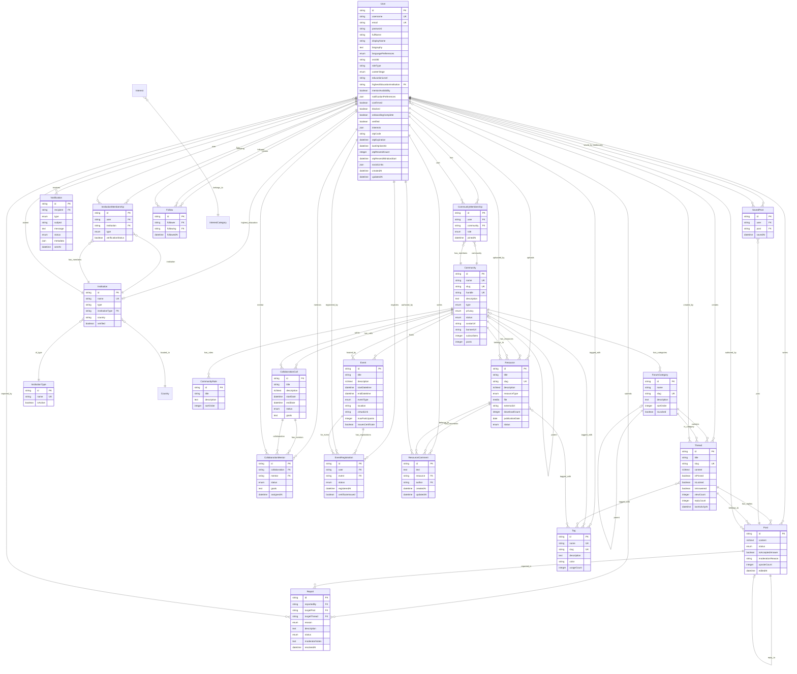
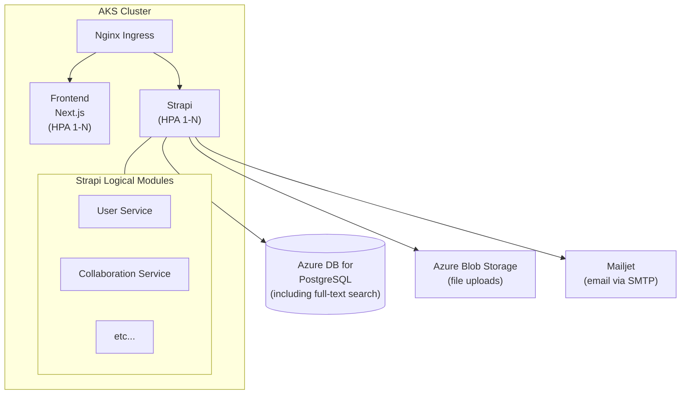
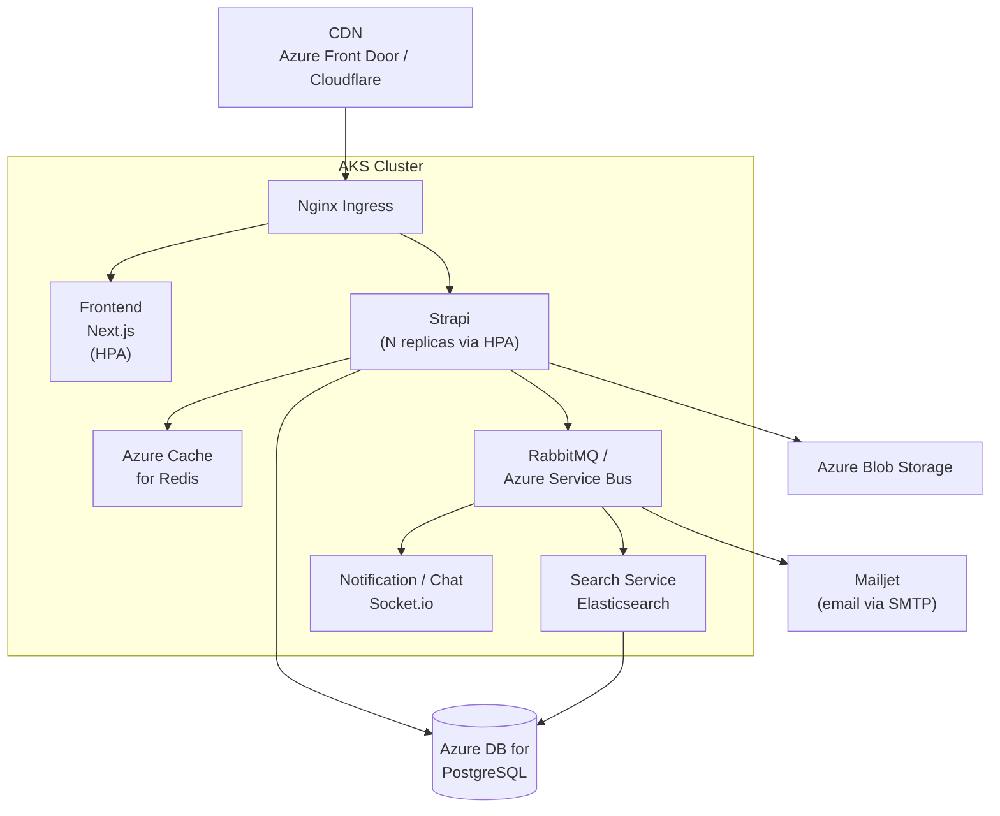
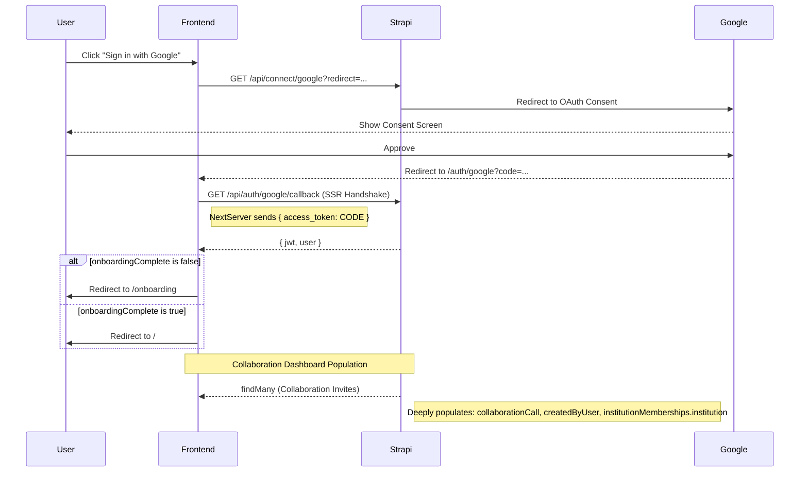

# Low-Level Design: Science for Africa Platform

Please note that this document outlines parts of the solution beyond the MVP delivery. This holistic view gives more context to the design of the MVP and indicates the likely evolution pathway.

## 1. Tech Stack

### 1.1 Frontend

| Technology | Version | Purpose |
|---|---|---|
| Next.js | 16 | Page Router, SSR/SSG framework |
| React | 19 | UI component library |
| Tailwind CSS | 4 | Utility-first styling |
| shadcn/ui | 4.1 | Accessible component primitives (via `@base-ui/react`) |
| Zustand | 5 | Lightweight client state management |
| react-hook-form + Zod | 4.x / 4.3 | Form handling and schema validation |
| axios | - | HTTP client for API calls |
| next-i18next | 15.4 | Internationalization framework for Next.js |
| i18next / react-i18next | 24 / 15 | i18n core and React bindings |
| Embla Carousel | - | Content carousels |
| Sonner | 2 | Toast notifications |
| Jest + React Testing Library | 30 / - | Unit and integration testing |

#### 1.1.1 Shared Components

To maintain DRY principles and UI consistency, common patterns are extracted into `@/components/shared/`:

| Component | Purpose |
|---|---|
| `LoadingState` | Centered spinner with optional message for tab/page initialization. |
| `EmptyState` | Standardized "No results" view with icon, title, description, and CTA button. |
| `VerificationBadge` | Subtle badge showing "Pending" status for unverified users/institutions. |
| `ResourceTable` | Shared table-based display for resources with status tracking and file actions. |


### 1.2 Backend

| Technology | Version | Purpose |
|---|---|---|
| Strapi | 5.33 | Headless CMS on Node.js 20+ |
| PostgreSQL | 16 | Primary data store (all environments) |
| users-permissions plugin | 5.33 | Authentication, JWT, registration |
| config-sync plugin | 3.2 | Version-controlled Strapi configuration |
| documentation plugin | 5.33 | Auto-generated OpenAPI 3.0.0 docs |
| `@strapi/provider-email-nodemailer` | 5.33 | Email delivery |
| `@strapi-community/strapi-provider-upload-google-cloud-storage` | 5 | Cloud file storage |
| Jest + Supertest | 30 / 7 | Backend API testing |
| `@strapi/utils` | - | Internal Strapi utilities |

#### 1.2.1 Backend Utilities

Common backend patterns are extracted into `src/utils/` to ensure consistency:

| Utility | Purpose |
|---|---|
| `url-helpers.js` | Centralized frontend URL resolution (`getFrontendUrl`) with environment variable priority. |


### 1.3 API Layer

Strapi can auto-generate both REST and GraphQL APIs from content-type schemas. The frontend will use a mix:

- **GraphQL API** — primary data fetching for content pages when nested queries are required (communities, threads, resources, events)
- **REST API** — authentication flows and simple single entity fetches (`/api/auth/local`, `/api/auth/local/register`, `/api/auth/forgot-password`, `/api/auth/reset-password`, `/api/auth/send-email-confirmation`, `/api/auth/email-confirmation`) and admin operations

#### Custom REST Endpoints

Beyond Strapi's auto-generated CRUD, we will create custom endpoints with hand-written controllers. These involve business logic, side effects, or cross-entity aggregation that Strapi does not provide out of the box, Examples include:

| Endpoint | Method | Justification |
|---|---|---|
| `/api/auth/me` | `GET` | **Custom Extension**: Returns the currently authenticated user with deep population of media, memberships, and collaboration involvement. Supports optional `membershipLimit` query parameter for optimized sidebar loading. |
| `/api/auth/mentees` | `GET` | **Custom Extension**: Returns collaborations where the current user is a Mentor, along with details of the mentees (Collaborators) and the collaboration status. |

| `/api/auth/me` | `PUT` | **Custom Extension**: Profile update with whitelisting and character limit validation for `biography`. |
| `/api/auth/verify-otp` | `POST` | **Custom Extension**: Verifies email using a 6-digit number. Confirms user and returns JWT. |
| `/api/auth/resend-otp` | `POST` | **Custom Extension**: Enforced 60s cooldown and 3/hr limit. Generates new code and sends dual-path email (Link + Code). |
| `/api/collaboration-invites/:id/accept` | `POST` | **Custom Extension**: Idempotent acceptance of a collaboration invite. Attaches current user as `invitedUser` if not already set. |
| `/api/collaboration-invites/:id/decline` | `POST` | **Custom Extension**: Marks a collaboration invitation as `Declined`. Prevents future acceptance and removes it from active dashboard views. |
| `/api/posts/:id/moderate` | `PUT` | Moderation action (approve/decline) — wraps status update + notification trigger to post author |
| `/api/communities/:id/join` | `POST` | Join community — side effects: increment memberCount, create CommunityMembership with `member` role, notify community admins |
| `/api/communities/:id/leave` | `POST` | Leave community — decrement memberCount, remove CommunityMembership |
| `/api/search` | `GET` | Cross-entity search aggregation (users, communities, threads, resources) before Elasticsearch is introduced |
| `/api/notifications/dispatch` | `POST` | Internal endpoint for lifecycle hooks to trigger email notifications via Strapi email plugin |

### 1.4 Email

Email delivery uses `@strapi/provider-email-nodemailer` with automatic environment detection:

```
SMTP_HOST + SMTP_USERNAME + SMTP_PASSWORD configured → Mailjet (production)
Otherwise → Mailpit (host: mailpit, port: 1025, no TLS/auth)
```

This is configured in `backend/config/plugins.js`. The fallback is automatic based on whether SMTP credentials are present.

**Production provider:** [Mailjet](https://www.mailjet.com/) via SMTP relay. Nodemailer connects to Mailjet's SMTP endpoint — no Mailjet-specific SDK required.

**Environment variables** (production):

| Variable | Example (Mailjet) |
|---|---|
| `SMTP_HOST` | `in-v3.mailjet.com` |
| `SMTP_PORT` | `587` |
| `SMTP_USERNAME` | Mailjet API key |
| `SMTP_PASSWORD` | Mailjet Secret key |
| `SMTP_FROM` | Verified sender address |

**Dev environment:** Mailpit runs as a Docker Compose service — SMTP on port 1025, web UI on port 8025 for inspecting sent emails.

### 1.5 Notifications

All notifications are email-only and dispatched synchronously via the Strapi email plugin. No real-time push or WebSocket notifications in MVP.

**Example Notification triggers:**

| Trigger | Recipient | Content |
|---|---|---|
| Email verification | New user | Clickable verification link AND a copyable OTP code (dual-path: user can click the link in email or paste OTP into verification page) |
| Password reset | User | Reset link with token |
| Post moderation result | Post author | Approval or decline with reason |
| Collaboration invite | Invitee | Branded email with call summary card and centered CTA button |
| Mentorship request | Potential mentor | Collaboration details with accept/decline link |
| New member joined | Community admins | Member name and community |

The email verification flow: after registration, the user lands on a verification page. Strapi sends an email containing both a clickable confirmation link and a plain OTP code. The user can either click the link (which redirects back to the app) or paste the OTP directly into the verification page — avoiding the need to open a new browser tab.

### 1.6 Infrastructure & Tooling

| Tool | Purpose |
|---|---|
| Docker & Docker Compose | Containerised development and mimic-prod environments |
| Nginx 1.26 (Alpine) | Reverse proxy — routes `/` → frontend:3000, `/cms/` → backend:1337 with path rewrite |
| GitHub Actions | CI/CD — build, push to container registry, Kubernetes rollout |
| Mailpit | Dev-only email testing (SMTP mock on port 1025, web inspector on port 8025) |
| PgAdmin 4 | Dev-only database inspection (port 5050) |

**Dev environment defaults:** When cloud credentials are not set, the backend falls back to local alternatives automatically — Mailpit for email (no `SMTP_*` vars), and Strapi's default local upload provider (`public/uploads/`) for file storage (no `GCS_SERVICE_ACCOUNT`).

## 2. Data Model



This section describes the domain entities, their purpose, and key design decisions.

All entities use Strapi's `documentId` as primary key and include automatic `createdAt` / `updatedAt` timestamps.

### 2.1 Entity Overview (this will be extended as we add more features)

| Entity | Purpose |
|---|---|
| **User** | Extended Strapi user: bio, orcidId, careerStage, highestEducationInstitution, mentorAvailability, notificationPreferences, socialLinks |
| **Institution** | Organisations (Academic / Research / NGO / Government / Private). Verified list. |
| **InstitutionType** | Relational categories for institutions with `isActive` protection. |
| **Country** | Relational countries with `isActive` protection. |
| **InstitutionMembership** | Explicit join table: User + Institution + role (member / owner) + verificationStatus |
| **Community** | Top-level communities and sub-communities. Self-referential `parent` field for hierarchy. Privacy, type, branding |
| **CommunityMembership** | Explicit join table: User + Community + role (admin / moderator / curator / member) |
| **CommunityRule** | Rules per community with sort order |
| **ForumCategory** | Organises threads within a community. Self-referential parent for nesting |
| **Thread** | Discussion topics: title, content, pinned/locked/answered flags, view/reply counts |
| **Post** | Replies within threads. Self-referential for nested replies. Moderation status (pending / approved / declined) |
| **CollaborationCall** | Time-bounded opportunities within a community. Active / Completed status |
| **CollaborationMentor** | Join table: User + CollaborationCall. Supports multiple mentors per collaboration with individual status and goals |
| **Resource** | Shared files/links (Publication, Training, Toolkit, Dataset) with download tracking |
| **Event** | Community events (Webinar / Workshop / In-person). Capacity limits, certificate issuance |
| **EventRegistration** | User + Event + status (registered / waitlisted / attended) |
| **Interest** | Scientific and professional interests (e.g., Grants Management, STI Policy). Soft-migrated via `isActive` flag. |
| **InterestCategory** | thematic and competency-based grouping for interests. Soft-migrated via `isActive` flag. |
| **InstitutionType** | Relational categories for institutions. Soft-migrated via `isActive` flag. |
| **Country** | Relational countries. Soft-migrated via `isActive` flag. |
| **IndividualRole** | Relational user roles. Soft-migrated via `isActive` flag. |
| **Tag** | Cross-entity taxonomy (expertise, region, topic) — applied to Resources, Threads, Users, Communities |
| **Report** | Content flagging for moderation (Spam / Harassment / Misinformation / Other) |
| **Notification** | Email notification log with delivery status |
| **ResourceComment** | User comments on resources |
| **SavedPost** | User bookmarks |
| **Follow** | User-to-user following |
| **LandingPage** | Single Type for the homepage with localized dynamic zone blocks. |

### 2.2 Key Design Decisions

**Community hierarchy via self-reference.** The `Community.parent` relation enables sub-communities without schema changes. A sub-community is simply a Community whose `parent` points to another Community. Future evolution: a `CommunityParent` join table will allow a sub-community to belong to multiple parent communities — this requires only a new content-type, not a schema migration on Community itself.

**CommunityMembership as explicit join table.** Strapi's default many-to-many relation doesn't support extra fields on the join. By modelling CommunityMembership as its own content-type with `user`, `community`, and `role` fields, we can assign granular roles (admin, moderator, curator, member) and track join timestamps — all queryable through Strapi's standard APIs.

**Post moderation via status enum.** Posts carry a `status` field (`pending | approved | declined`) rather than a separate moderation queue table. This keeps the data model flat and allows filtering by status in standard queries. The custom `/api/posts/:id/moderate` endpoint wraps the status update with a notification side effect.

**Tags are polymorphic.** A single `Tag` entity is related to Resources, Threads, Users, and Communities via separate Strapi relation fields. This avoids duplicating tag tables per entity while keeping each relation queryable.

**Notification as a log table.** The `Notification` entity records every email sent (type, subject, recipient, delivery status). This is for auditability — it does not drive delivery. Delivery is synchronous via the email plugin at the time of the triggering event.

**Institution as a standalone entity.** Rather than storing institution as a string on User, Institution is a first-class entity with type and country. This enables institution-level queries (e.g., "all users from University X") and admin verification workflows.

**InstitutionMembership as explicit join table.** Similar to communities, users are linked to institutions via a dedicated membership entity. This supports multi-institutional profiles and stores metadata like affiliation type (member/owner) and verification status, which were previously rigid fields on the User entity.

**Formalized Education.** Educational background is linked directly to the Institution collection via the `highestEducationInstitution` field, replacing unstructured string data.

**Resource Visibility & Moderation.** Resources only appear in public community lists when `status` is `approved`. Users can see their own `pending` or `declined` uploads in their profile. This is enforced at the controller layer by overwriting the core `find` and `findOne` methods to apply user-contextual filters.

**Soft Migration Strategy.** To evolve critical data (Interests, Countries, Institution Types, and Individual Roles) without breaking legacy user profiles, the platform implements a non-destructive soft migration strategy. Existing records are never deleted; instead, they are marked with an `isActive: false` flag if they are removed from the system constants. The onboarding flow, profile selection, and platform filters are restricted to `isActive: true` records. This ensures that historical data on user profiles (which may store these values as references or strings) remains intact and visible while only the new, approved data is available for future selections.

> [!IMPORTANT]
> **Permission Enforcement**: In Strapi v5, if a user role lacks `find` permission for a related content-type (e.g., `interest-category`), any attempt to filter by that relation will result in a `400 ValidationError: Invalid key`. This is a security feature to prevent leaking the existence of related schemas. The production seeder (`npm run seed:prod`) must be run to ensure these permissions are synchronized.

**Community Membership Synchronization Pattern.** To ensure data consistency between the primary `Community` entity (which tracks `members` for counts and listing) and the `CommunityMembership` collection (which drives the "My Communities" profile tab), the backend implements a dual-write pattern in the `join` and `leave` controllers.
- **Join**: Creates a `CommunityMembership` record AND links the user to the community's `members` relation.
- **Leave**: Deletes the `CommunityMembership` record (using a robust ID/Object manual filter to handle Strapi v5 variations) AND removes the user from the community's `members` relation.
This pattern prevents stale membership listings in the user profile even if the direct relation is somehow decoupled.

**Institutional Account Support & Payload Sanitization.** To support both Individual and Institutional accounts, the platform implements a strict payload sanitization strategy in the `api/auth/me` PUT controller.
- **Strapi v5 Document Service**: All profile updates use `strapi.documents("plugin::users-permissions.user").update` to ensure compatibility with v5's relational model (Document IDs).
- **Identifier Standardization**: Relational fields (e.g., `roleType`, `highestEducationInstitution`) are resolved to their `documentId` before saving, ensuring Strapi can correctly link the entities.
- **Cross-Type Purging**: To prevent "Invalid relations" errors and data contamination, the controller automatically purges fields that do not belong to the selected `userType`:
    - If `userType` is **institution**: Individual-specific fields (`roleType`, `highestEducationInstitution`, `educationLevel`, `educationTopic`) are removed from the payload.
    - If `userType` is **individual**: Institution-specific fields are cleaned up.
- **Empty Field Protection**: The controller explicitly removes any empty string identifiers (`""`) or null values from relational fields before they reach the database, preventing validation failures.

**Landing Page Block Architecture.** To support a highly dynamic and visually rich landing page, the system utilizes Strapi v5's Dynamic Zones.
- **Component-Driven Rendering**: Each UI section is a dedicated component in the `page` category (e.g., `Hero`, `AboutSection`, `BenefitsGrid`).
- **Idempotent Seeder**: The `syncLandingPage` utility in the production seeder ensures that the landing page and all its localized translations (`EN`, `FR`, `AR`, `SW`, `PT`) are synchronized across environments without duplicating the primary `documentId`.
- **Block Renderer**: The frontend implements a `BlockRenderer` pattern that maps backend component names to premium React components, ensuring 100% visual parity with the design system.
- **Full-Width Immersion**: The Hero section implements a "Layered Layout" standard where typography sits on a full-width white bar overlaying immersive, edge-to-edge imagery.


## 3. Deployment & Infrastructure

### 3.1 GCP Staging (Kubernetes)

Automated deployment on every push to `main` via GitHub Actions (`.github/workflows/deploy-test.yml`):

```
Push to main
  → build-push job:
      Docker build: nginx, frontend, backend images
      Docker push: → Google Container Registry (via Akvo composite-actions)
  → rollout job (depends on build-push):
      k8s-rollout: nginx-deployment, frontend-deployment, backend-deployment
      Namespace: science-of-africa-namespace
```

**Secrets required:**
- `GCLOUD_SERVICE_ACCOUNT_REGISTRY` — push to GCR
- `GCLOUD_SERVICE_ACCOUNT_K8S` — Kubernetes rollout
- `GH_PAT` — access to `akvo/composite-actions` repo

**Kubernetes deployments:**
1. **nginx** — reverse proxy, routes `/` and `/cms/`. Note: Nginx is configured to strip the `/cms/` prefix using a rewrite rule. Strapi must be configured with a **relative** `url: /cms` in `server.js` to handle this mismatch while correctly generating asset paths.
2. **frontend** — Next.js production build (Node 20 Alpine, port 3000)
3. **backend** — Strapi production build (Node 22 Alpine, port 1337)

**Data & storage:**
- **PostgreSQL** — runs as a containerised pod within the cluster (not a managed service). Configured via `DATABASE_*` env vars on the backend deployment
- **Google Cloud Storage** — file uploads via `@strapi-community/strapi-provider-upload-google-cloud-storage`, configured via `GCS_*` env vars on the backend deployment

**Critical Configuration Notes:**
- **Strapi Build-time URL**: Strapi's admin panel is a React application built during the Docker build phase. It **must** know its public base path (e.g., `/cms`) at build time to correctly resolve asset paths (JS/CSS). This is passed via the `BACKEND_URL` build argument in the Dockerfile. Failure to provide this will result in a blank white page in production as assets will attempt to load from the root `/` instead of the subpath.
- **Path Consistency**: The `BACKEND_URL` in Kubernetes secrets should be the full absolute URL, but Strapi's internal `url` configuration in `server.js` should be hardcoded to the relative path `/cms`. This ensures that Strapi ignores the prefix in incoming requests (supporting the Nginx rewrite) while still using it for relative asset resolution and link generation.

K8s manifests are managed within Akvo's infrastructure (via the `composite-actions` repo and cluster configuration), not stored in this application repo.

### 3.2 Azure Production (Kubernetes)

Production will run on Azure Kubernetes Service (AKS), mirroring the GCP staging pattern but replacing Akvo-specific tooling with Azure-native equivalents.

#### What changes from GCP staging

The GCP staging pipeline uses Akvo's private `composite-actions` repo for Docker builds, pushes to Google Container Registry, and K8s rollouts. These are Akvo-internal and tied to GCP service accounts. For Azure production:

| GCP Staging (Akvo) | Azure Production | Notes |
|---|---|---|
| Google Container Registry (GCR) | Azure Container Registry (ACR) | `az acr login` replaces `gcloud auth configure-docker` |
| `akvo/composite-actions/docker-build` | `docker/build-push-action` | Standard GitHub Action, no private repo dependency |
| `akvo/composite-actions/docker-push` | `docker/build-push-action` (with push: true) | Build + push in one step |
| `akvo/composite-actions/k8s-rollout` | `azure/k8s-deploy` | Official Azure GitHub Action for K8s deployments |
| `GCLOUD_SERVICE_ACCOUNT_REGISTRY` | `AZURE_CREDENTIALS` (service principal) | Single credential for ACR + AKS access |
| `GCLOUD_SERVICE_ACCOUNT_K8S` | (same service principal) | Azure service principal covers both registry and cluster |
| `GH_PAT` (composite-actions access) | Not needed | No private action repos required |

#### Azure infrastructure setup

**Prerequisites:**
1. **Azure Container Registry (ACR)** — stores Docker images for nginx, frontend, backend
2. **Azure Kubernetes Service (AKS)** — if an existing AKS cluster is available, deploy into a dedicated namespace; no need to provision a new cluster
3. **Azure Database for PostgreSQL Flexible Server** — managed PostgreSQL 16 (replaces in-cluster database container). Automated backups enabled with 7-day retention (default) and point-in-time restore (PITR); adjust retention period as needed
4. **Azure Blob Storage** — file uploads (swap `GCS_*` env vars for Azure equivalents, use a community Strapi Azure upload provider or mount as volume)
5. **DNS** — A-record pointing to AKS ingress controller external IP

**AKS cluster layout:**

```
Namespace: science-of-africa-namespace
├── nginx-deployment        (HPA min 1)   — reverse proxy
├── frontend-deployment     (HPA min 1)   — Next.js
├── backend-deployment      (HPA min 1)   — Strapi
├── nginx-service           (ClusterIP)
├── frontend-service        (ClusterIP)
├── backend-service         (ClusterIP)
├── ingress                 (NGINX Ingress Controller — TLS via cert-manager + Let's Encrypt)
├── configmap               (PUBLIC_URL, BACKEND_URL, EMAIL_CONFIRMATION_URL, etc.)
└── secret                  (SMTP creds, JWT keys, DB connection string, ACR pull secret)
```

**Pod resource requests and limits (initial — adjust based on observed usage via `kubectl top pods` or metrics-server):**

| Deployment | CPU Request | CPU Limit | Memory Request | Memory Limit |
|---|---|---|---|---|
| nginx | 100m | 200m | 64Mi | 128Mi |
| frontend (Next.js) | 500m | 1000m | 512Mi | 1Gi |
| backend (Strapi) | 500m | 1000m | 512Mi | 1Gi |

> **Note:** Set `NODE_OPTIONS=--max-old-space-size=768` on both frontend and backend deployments to align V8 heap limits with container memory limits and prevent OOMKills.


The three-deployment pattern (nginx, frontend, backend) matches GCP staging exactly. The only differences are infrastructure-level: managed database instead of a container, Azure Blob instead of GCS, and cert-manager for TLS.

**TLS:** Use the [NGINX Ingress Controller](https://kubernetes.github.io/ingress-nginx/) with [cert-manager](https://cert-manager.io/) for automatic Let's Encrypt certificates.

#### GitHub Actions production workflow

The production workflow will be a new file (e.g. `.github/workflows/deploy-prod.yml`) triggered on GitHub release publish, following the standard akvo pattern of release-based production deploys:

```
Release published
  → build-push job:
      Login to ACR (azure/docker-login action)
      Docker build + push: nginx, frontend, backend → ACR (tagged with release version)
  → deploy job (depends on build-push):
      Set AKS context (azure/aks-set-context action)
      kubectl set image: update each deployment to new image tag
      kubectl rollout status: wait for healthy rollout
```

**Secrets required:**
- `AZURE_CREDENTIALS` — service principal JSON (ACR push + AKS deploy)
- `ACR_LOGIN_SERVER` — e.g. `scienceforafrica.azurecr.io`

#### Setup steps

1. Create resource group, ACR, and managed PostgreSQL via Azure CLI or Terraform (use existing AKS cluster)
2. Attach ACR to AKS (`az aks update --attach-acr`)
3. Ensure NGINX Ingress Controller and cert-manager are available in the cluster
4. Apply K8s manifests: namespace, deployments, services, ingress, configmap, secret
5. Configure DNS A-record to point to the ingress external IP
6. Add `AZURE_CREDENTIALS` and `ACR_LOGIN_SERVER` to GitHub repo secrets
7. Create a GitHub release to trigger the first production deploy

## 4. Scaling Pathway

#### MVP — Phase 1 (current)



- HPA configured from day one (min 1 replica per deployment — nginx, frontend, backend)
- Managed PostgreSQL and Blob Storage external to the cluster
- No real-time WebSockets
- PostgreSQL full-text search (no dedicated search engine)
- Synchronous email dispatch via Mailjet
- Strapi monolith handles all domain logic (User, Collaboration, Content services are logical modules within Strapi, not separate processes)

#### Phase 2 — Evolution (when load demands it)

Since Phase 1 is already on AKS, scaling is incremental — increase replica counts and deploy additional services into the same cluster.



**What changes from Phase 1:**
- **Strapi horizontal scaling** — raise HPA max replicas and adjust CPU/memory thresholds as load increases. Strapi is stateless by design, so no code changes needed
- **Azure Cache for Redis** — API response caching and session cache, deployed as an Azure managed service
- **Elasticsearch** — advanced search and filtering, async indexing via message queue. Can run in-cluster or use Elastic Cloud
- **RabbitMQ / Azure Service Bus** — async processing: email dispatch, search indexing, notification fan-out
- **CDN** (Azure Front Door or Cloudflare) — static asset delivery and edge caching
- **Socket.io** — real-time events (notifications, chat — future), deployed as a new service in the cluster

**Key architectural property:** Since Phase 1 is already on K8s, Phase 2 only requires deploying additional services and scaling existing ones. No substantial migration or application code changes are needed but we still get significant scalability improvements.

## 5. Google OAuth Authentication

The platform supports seamless authentication via Google OAuth 2.0, integrated into the Strapi `users-permissions` plugin.

### 5.1 Authentication Flow



### 5.2 Implementation Details

- **Dynamic OAuth Sync**: Strapi `plugins.js` is supplemented by an `index.js` bootstrap script that synchronizes `users-permissions` Grant (Client ID/Secret) and Advanced (google_redirection) settings on every startup. This ensures reliability across Local and Production environments by force-aligning database state with Environment Variables.

**Environment-Aware Redirection:**
To prevent hardcoded `localhost` redirects in production or testing environments, the backend dynamically resolves the frontend callback URL using the following environment variable priority:
1. `FRONTEND_URL`
2. `PUBLIC_URL`
3. `NEXT_PUBLIC_FRONTEND_URL` (Next.js client-available variable)
4. `http://localhost:3000` (Local development fallback)

This resolution occurs during the `bootstrap` phase and is applied to the Strapi `grant` store configuration.

**Centralized URL Utility:**
To maintain consistency, all backend logic (including `plugins.js`, `index.js`, and custom controllers) uses the `getFrontendUrl()` utility from `src/utils/url-helpers.js`. This prevents desynchronization between OAuth callbacks, email links, and redirect settings.


**SSR Handshake:**
The frontend uses a Server-Side Rendering (SSR) handshake via `getServerSideProps` to exchange the Google `access_token` for a Strapi `jwt`. This ensures the session is established securely on the server before the initial page render.

- **Backend Configuration**: Automated via `src/index.js` bootstrap. The system synchronizes provider settings (Client ID, Secret, and Redirect URIs) using `GOOGLE_CLIENT_ID`, `GOOGLE_CLIENT_SECRET`, and `NEXT_PUBLIC_FRONTEND_URL`.
- **Frontend Integration**:
    - `SocialButton`: Custom branded component following Google's identity guidelines.
    - `getBackendApiUrl`: A centralized helper in `lib/url-helpers.js` that implements **Dynamic Backend Discovery (DBD)**. It automatically swaps the built-in `localhost` fallback for `${window.location.origin}/cms/api` when running on a public domain, ensuring Docker image portability without rebuilds.
    - `pages/auth/google.js`: Dedicated callback handler with "Smart Swap" logic for internal Docker networking via `getBackendApiUrl`.
- **Bypass Logic**: Social users are automatically marked as `confirmed: true`, bypassing the email verification step required for local registrations.
- **Session Persistence**: Social login sessions are automatically persistent (30 days), matching the "Remember Me" behavior of local login.


## 6. Globalization & Localization

The platform supports multi-language content (English as default, French for launch) using a full-stack localization strategy.

### 6.1 Architecture

- **Backend (Strapi)**: Uses the `@strapi/plugin-i18n` to enable localized fields and entries. Localized content is fetched via the `locale` query parameter.
- **Frontend (Next.js)**: Uses `next-i18next` for subpath routing (`/` for English, `/fr` for French) and translation management.

### 6.2 Data Model Changes

Specific content types have localization enabled:
- **Interest**, **InterestCategory**, **Institution**: Enabled for name/title and description fields. No new models were created; localization was strictly applied to the existing implementation.

### 6.3 Locale Awareness

- **API Client**: The `api-client.js` includes a request interceptor that automatically extracts the current locale from the URL subpath and appends it as a `locale` query parameter to all Strapi requests. It includes logic to prevent duplicate locale injection if the parameter is already present in the URL or manual params, and excludes public authentication endpoints for Strapi v5 compatibility.
- **UI Switcher**: A premium `LocaleSwitcher` component in the `Navbar` allows users to toggle languages. This triggers a client-side route change via `next/router` with the new locale.
- **Fallback Logic**: The frontend implements a "Fallback-to-Default" pattern via `fetchLocalized`. If a localized dataset (e.g., Institutions) is empty in a secondary locale (like French), the system automatically defaults to the English version to prevent empty UI states.
- **Automated Synchronization**: The system's `seeder.js` automatically clones core English data (Interests, Institutions) to available secondary locales during development seeding, ensuring translation parity across the platform.
- **Locale-Aware Uniqueness**: Integrity is enforced at the application layer via `lifecycles.js` to ensure names are unique **within** a specific locale, allowing the same name (e.g., "Oxford University") to exist in multiple language records (different locales) without conflict.

### 6.4 SEO

The platform follows Google's best practices for localized sites:
- **Centralized Metadata**: A reusable `Meta` component (`frontend/components/seo/Meta.js`) manages browser titles and SEO meta tags using `next/head`.
- **Title Pattern**: Standardized titles follow the pattern `[Page Name] | Science for Africa`.
- **Subpath routing**: Distinct URLs for each language.
- **HTML lang attribute**: Automatically updated by `next-i18next`.
- **SSR support**: Translations are loaded server-side using `getStaticProps` or `getServerSideProps`.

## 7. Community Membership Synchronization Pattern

To ensure strict data integrity and a seamless user experience, the platform implements a **"Bulletproof Dual-Layer Removal"** pattern for community membership management.

### 7.1 The Problem
In Strapi v5, many-to-many relations (like `members` on a Community) and dedicated join tables (like the `CommunityMembership` collection) can become desynchronized if not handled atomically. Simple deletion of one may leave orphaned data in the other, leading to "stale" UI states where a user appears to have left a community but still sees it in their "My Communities" dashboard after a refresh.

### 7.2 Implementation Strategy
The `api/community/leave` controller implements a multi-layered synchronization logic:

1.  **Relation Disconnection (Document Service)**: Uses the `strapi.documents` service to disconnect the user from the community's `members` field. This ensures the member count and community-level relations are updated.
2.  **Atomic Record Purge (Database Query)**: Uses the low-level `strapi.db.query` service to find and delete all records in the `CommunityMembership` collection matching the user and community.
3.  **Cross-ID Compatibility**: The deletion logic targets both numeric `id` and v5-specific `documentId` formats simultaneously using an `$or` filter. This prevents synchronization failures caused by ID format mismatches between different Strapi service layers.

### 7.3 Data Consistency Rule
Every "Join" action MUST create both the relation and the collection record. Every "Leave" action MUST delete both. This dual-write/dual-delete requirement is enforced at the controller level to maintain a "Single Source of Truth" across the relational model.

## 8. Onboarding Data Persistence

To balance user experience with data integrity, the onboarding flow utilizes a hybrid persistence strategy.

### 8.1 Multi-Stage Synchronization
While most onboarding data is held in local client state (`Zustand`) to ensure a fast, lag-free UI, certain milestones trigger backend synchronization before the final completion:

- **Milestone 1: Education (Step 3)**: Clicking "Confirm" triggers an immediate `updateUserProfile` call.
    - **Rationale**: The backend automatically creates new `Institution` records if the name provided doesn't exist. By syncing at Step 3, any new institution the user studied at is immediately added to the database.
    - **Impact**: When the user reaches Step 5 (Institutional Affiliation), they can search for and find the institution they just "created" in Step 3, ensuring data reuse and a consistent lookup experience.

- **Milestone 2: Completion (Step 5)**: The final submission sets the `onboardingComplete` flag.
    - **Rationale**: This is the atomic "Gatekeeper" flag. Only after this call returns successfully is the user's profile considered complete, unlocking dashboard access and platform interactions.

### 8.2 Partial Sync Robustness
The partial sync in Step 3 is designed to be **non-blocking**. If the API call fails (e.g., due to temporary network issues), the frontend logs the error but still allows the user to proceed to Step 4. This prioritizes the user's progress while accepting a minor risk that the institution might not be searchable in Step 5 if the sync failed.

## 9. Interest Management Security

To ensure data integrity and prevent accidental deletion of system-critical taxonomies, the `Interest` and `InterestCategory` models implement a two-tier protection system.

### 9.1 Protection Layers
1.  **Intentional Deactivation (`isActive`)**:
    - Both models include an `isActive` boolean flag (default: `true`).
    - The onboarding frontend explicitly filters out any interests or categories where `isActive` is `false`.
    - This allows administrators to "soft-delete" or temporarily hide interests without breaking historical data relations on existing user profiles.
2.  **Accident Prevention (Delete Blocking)**:
    - The `delete` core controller is overridden for both `api::interest.interest` and `api::interest-category.interest-category`.
    - Any attempt to delete a record via the API returns a **403 Forbidden** error.
    - Administrators must use the `isActive` flag for management.

### 9.2 Data Synchronization
The system seeder uses the Strapi v5 Document Service to maintain relational integrity between interests and their categories, ensuring consistent `documentId` linking across all environments.

## 10. Collaboration Security

The platform enforces membership-level security for collaboration spaces to ensure professional and focused project work.

### 10.1 Invitation-Based Membership
Participation in a collaboration space is gated by an invitation system (`api::collaboration-invite`).
- **Visitor**: Users who have not yet accepted an invitation. They have read-only access to the collaboration thread.
- **Member**: Users who have clicked "Accept" on a pending invitation. They gain permission to post messages and contribute content.
- **Creator**: The user who created the collaboration call. They have inherent membership permissions.

### 10.2 Chat Interaction Gating
Security is enforced at two levels:
1.  **Frontend (UI/UX)**: The `ChatComposer` is replaced by a "Join to post" banner for non-members, preventing interaction attempts before membership is confirmed.
2.  **Backend (API Guard)**: The `chat-message.create` controller explicitly verifies that the requester is either the `createdByUser` of the collaboration call or has an invitation with `inviteStatus: Accepted`. Requests from non-members are rejected with a `403 Forbidden` status.

## 11. Legal and Privacy Policy

The platform provides a centralized legal documentation page at `/privacy-policy`.

### 11.1 Architecture
- **Single Page**: All legal documents (Privacy Policy, Terms of Use, Community Guidelines) are hosted on a single, long-form scrollable page.
- **Localization**: Content is managed via `frontend/public/locales/{lang}/privacy-policy.json`.
- **SEO**: Metadata is managed via the `Meta` component with localized titles and descriptions.

### 11.2 Content Structure
The page is divided into three main logical sections, each with its own typography and visual identifiers:
1.  **Privacy Policy**: Covers data collection, lawful basis, principles, and user rights.
2.  **Terms of Use**: Covers registration, acceptable use, and governing law.
3.  **Community Guidelines**: Covers professional conduct and reporting.

## 12. Landing Page Architecture

The platform's entry point is a high-fidelity, block-based landing page designed for maximum flexibility and performance.

### 12.1 Content Modeling
The Landing Page is implemented as a **Single Type** in Strapi, utilizing a **Dynamic Zone** called `blocks`. This allows content editors to reorder sections, add new ones, or remove existing ones without developer intervention.

**Supported Blocks:**
- **Hero**: Visual entry point with title, description, link, and background image.
- **Secondary Heading**: Text-based section with tagline and main heading.
- **About Section**: Professional home introduction with checklist and image.
- **Explore Communities**: Dynamic call-to-action for the community ecosystem.
- **Action Banner**: Full-width visual surface (image only).
- **Benefits Grid**: 4-column grid of platform value propositions (Collaborate, etc.).
- **Identity Section**: Full-width image with centered identity overlay text.
- **Info Accordion**: Expandable FAQ-style section for capabilities and intent.
- **Newsletter Section**: Lead generation form with localized placeholders.

### 12.2 Rendering Strategy
The frontend utilizes a **BlockRenderer** pattern (`@/components/shared/BlockRenderer.js`).
1.  **Fetching**: Data is retrieved via the `fetchLandingPage` service in `getStaticProps`, ensuring the page is pre-rendered for SEO and performance.
2.  **Mapping**: The `BlockRenderer` maps the Strapi `__component` identifier to a corresponding React component in `frontend/components/landing/`.
3.  **Population**: Deep population is used to retrieve nested components like `checklist` (in Peer Section) and `benefits` (in Benefits Section).

### 12.3 Seeding and Localization
To ensure environment parity, the platform includes a `syncLandingPage` utility in `backend/src/utils/prod-seeder.js`.
- **Default State**: Automatically creates the default section structure from Figma for all 5 platform locales (EN, FR, AR, SW, PT).
- **Idempotency**: Uses `findFirst` and `create` to ensure the page is only initialized once, protecting manual edits in the Strapi admin panel.
- **Permissions**: Automatically grants `find` permissions to the `public` role for the Landing Page API.
## 13. Seeding & Data Management

The platform implements a robust seeding strategy to maintain taxonomy consistency across environments while protecting production data.

### 13.1 Seeding Strategy

The seeding logic is split into two layers:
1.  **Production Metadata (`seedProd`)**: Critical system metadata including Countries, Institution Types, and Individual Roles.
2.  **Development Data (`seed`)**: Sample data for testing including Interests, Institutions, Communities, Users, and Resources.

**Execution Contexts:**
- **Development (`NODE_ENV !== "production"`)**: Both seeders run **automatically** on server bootstrap.
- **Production (`NODE_ENV === "production"`)**: Automatic seeding is disabled. Seeding must be triggered manually.

### 13.2 Manual Seeding CLI

A dedicated NPM script is available for manually synchronizing production metadata:
- `npm run seed:prod` — Synchronizes critical production metadata (Countries, Institution Types, etc.).

> [!NOTE]
> There is no manual `seed:dev` command. Development sample data is synchronized **automatically** on every server bootstrap in non-production environments to ensure the workspace is always ready for testing.

### 13.3 Idempotent Upsert Pattern

To prevent data duplication and allow for safe re-runs, the seeders use an **Idempotent Upsert** pattern. Instead of checking for an empty table, the system checks for the existence of individual records (usually by `name` or `slug`).
- If the record exists: It is updated with the latest configuration from the seeder.
- If the record is missing: It is created.

### 13.4 Centralized Constants

Taxonomy masters and system constants are centralized in `src/utils/constants.js`. This ensures that the same data sets are used by both the seeders and any other system utilities (like migrations or permission hardening).

| Constant | Model |
|---|---|
| `COUNTRIES` | `api::country.country` |
| `INSTITUTION_TYPES` | `api::institution-type.institution-type` |
| `INDIVIDUAL_ROLES` | `api::individual-role.individual-role` |

This centralization simplifies maintenance when updating official lists (e.g., adding a new country or modifying an institution category).

## 14. ORCID Authentication

The platform supports ORCID iD verification and OAuth-based profile synchronization.

### 14.1 Environment Configuration

The ORCID integration requires the following environment variables, which must be configured in `compose.yml` and the server environment:

| Variable | Default | Purpose |
|---|---|---|
| `ORCID_CLIENT_ID` | - | Client ID from ORCID Developer Tools |
| `ORCID_CLIENT_SECRET` | - | Client Secret from ORCID Developer Tools |
| `ORCID_REDIRECT_URI` | - | Explicit redirect URI override (optional) |
| `ORCID_OAUTH_URL` | `https://orcid.org` | Base URL for OAuth flow (use `https://sandbox.orcid.org` for dev) |
| `ORCID_API_URL` | `https://pub.orcid.org` | Base URL for the ORCID Public API |

### 14.2 Integration Modes

1.  **Public API Validation**: Validates a 16-digit ORCID iD format and fetches public profile data (Name, Bio, Interests) via `pub.orcid.org`. This is used during onboarding to pre-populate profiles without requiring the user to sign in to ORCID.
2.  **OAuth Authentication**: A full "Sign in with ORCID" flow that exchanges an authorization code for an access token. This verifies ownership of the ORCID iD and sets the `verified: true` flag on the user record.
