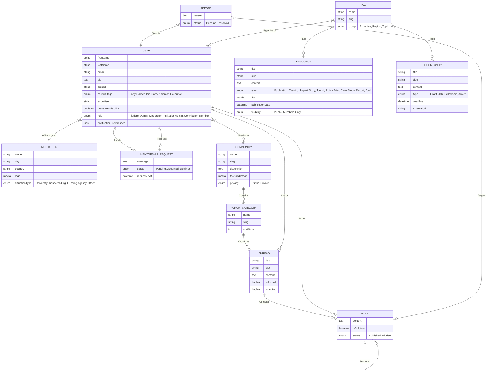
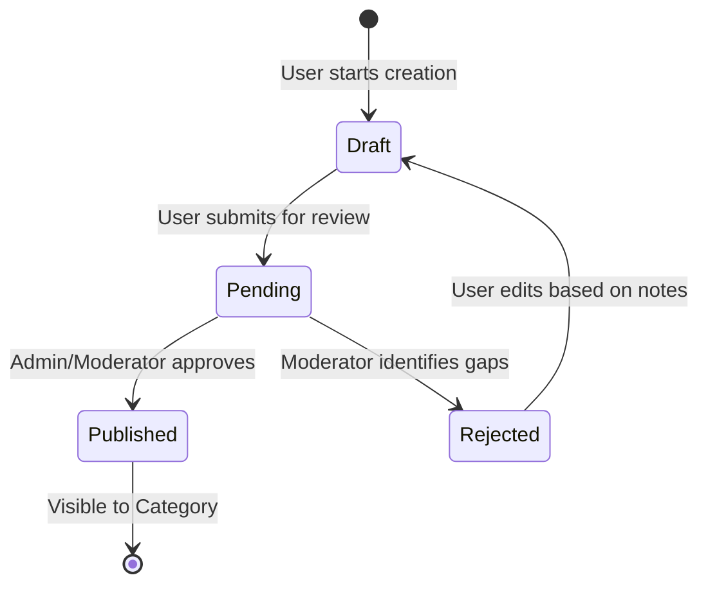

# Science of Africa (SFA) - Ultra-Industrial Low Level Design (LLD)
**Version**: 8.0 | **Status**: Final Alpha Specification | **Alignment**: FIGMA v4 & Clean Slate Architecture

---

## 1. Executive Summary & Strategic Roadmap

### 1.1 Mission Objectives
The Science for Africa (SFA) Foundation Community of Practice (CoP) platform is an industrial-grade digital ecosystem designed to unify the African research landscape. This document serves as the definitive technical source of truth for Phase 1 (Core) and provides a rigorous blueprint for Phase 2 (Advanced Scaling).

### 1.2 Technology Sovereignty
By utilizing Strapi v5 as a headless engine and Next.js 16 as the interaction layer, the platform maintains a "Clean Slate" data model that is 100% independent of legacy architecture debt.

### 1.3 High-Level Delivery Phases
| Phase | Focus Areas | Implementation Status |
| :--- | :--- | :--- |
| **Phase 1: Core** | Identity, Institutional Affiliation, Knowledge Base, Mentorship | **Active Implementation** |
| **Phase 2: Growth**| Polymorphic Reporting, Peer Moderation, Private Spaces, Events | **Planning / Roadmap** |

---

## 2. Quantitative User Research Baseline

### 2.1 Study Overview
The architecture is directly informed by a 2023 survey of 254 research professionals across 44 AU member states.

### 2.2 Critical Data Points
*   **Affiliation Density**: 71% of users are based in Universities, necessitating robust multi-tenant institutional management.
*   **Identity Priorities**: Verification (ORCID) scored **920/1000** on the critical priority index.
*   **Gap Identification**: 56% of respondents have no current CoP membership, defining a greenfield requirement for intuitive onboarding.

---

## 3. Tiered System Architecture

### 3.1 Two-Tier User Model
The system enforces a strict logical separation between internal administrators and external platform participants.

| Tier | Entity Table | UI Interface | Scope of Control |
| :--- | :--- | :--- | :--- |
| **System Admin** | `admin_users` | Strapi CMS (/admin) | Content Modeling, Infrastructure, Global Moderation |
| **Platform User** | `up_users` | Next.js Dashboard | Peer Collaboration, Resource Discovery, Inst. Management |

### 3.2 Decoupled Logic Layer
*   **API Engine**: Strapi v5 (Node.js v20) providing Document Service APIs.
*   **Design System**: Utility-first CSS via TailwindCSS v4 with SFA Custom Tokens.
*   **Persistence**: PostgreSQL 16 (Transactional) + Google Cloud Storage (Assets).

---

## 4. Exhaustive Data Model (Clean Slate v4)

### 4.1 Master Entity-Relationship Diagram (ERD)
The following ERD reflects the complete relational integrity of the SFA ecosystem.

> [!NOTE]
> This ERD is synced with [science-of-africa-erd.mmd](file:///Users/galihpratama/Sites/science-for-africa/docs/science-of-africa-erd.mmd) and [science-of-africa-erd.mjs](file:///Users/galihpratama/Sites/science-for-africa/docs/science-of-africa-erd.mjs).



### 4.2 Data Dictionary (Ultra-Granular)

#### `USER` (Extending `plugin::users-permissions.user`)
| Attribute | Type | Validation / Constraints | Default |
| :--- | :--- | :--- | :--- |
| `firstName` | string | Provided during registration | NULL |
| `lastName` | string | Provided during registration | NULL |
| `email` | string | Unique, valid email format | NULL |
| `bio` | text | Professional summary | NULL |
| `orcidId` | string | 19-digit pattern (e.g., 0000-000x-xxxx-xxxx) | NULL |
| `careerStage` | enumeration| ['Early-Career', 'Mid-Career', 'Senior', 'Executive'] | NULL |
| `expertise` | string | Comma-separated or tag-linked keywords | NULL |
| `mentorAvailability`| boolean | UI toggle for directory visibility | false |
| `role` | enumeration | ['Platform Admin', 'Moderator', 'Institution Admin', 'Contributor', 'Member'] | 'Member' |
| `notificationPreferences` | json | JSON object for email/web toggles | {} |
| `orcidVerified` | boolean | Set via backend lifecycle hook only | false |
| `onboardingStep` | integer | range: [0, 5] | 0 |
| `affiliationStatus`| enumeration| ['Pending', 'Approved', 'Rejected'] | 'Pending' |

#### `RESOURCE` (Document Registry)
| Attribute | Type | Validation / Constraints | Default |
| :--- | :--- | :--- | :--- |
| `title` | string | Unique, Max 255 chars | NULL |
| `slug` | string | URL-friendly unique identifier | NULL |
| `content` | text | MD Support enabled | NULL |
| `type` | enumeration| ['Publication', 'Training', 'Impact Story', 'Toolkit', 'Policy Brief', 'Case Study', 'Report', 'Tool'] | NULL |
| `file` | media | PDF, DOCX, MP4, JPEG | NULL |
| `publicationDate` | datetime | Manual override or upload date | NOW |
| `visibility` | enumeration| ['Public', 'Members Only'] | 'Public' |

#### `OPPORTUNITY` (Funding & Careers)
| Attribute | Type | Validation / Constraints | Default |
| :--- | :--- | :--- | :--- |
| `title` | string | Max 255 chars | NULL |
| `slug` | string | URL-friendly unique identifier | NULL |
| `content` | text | HTML/Markdown RichText | NULL |
| `type` | enumeration| ['Grant', 'Job', 'Fellowship', 'Award'] | NULL |
| `deadline` | datetime | Automatic expiration hook | NULL |
| `externalUrl` | string | Source URL for application | NULL |

#### `TAG` (Unified Taxonomy)
| Attribute | Type | Validation / Constraints | Default |
| :--- | :--- | :--- | :--- |
| `name` | string | Display name (e.g. "AI", "Genomics") | NULL |
| `slug` | string | URL-friendly unique identifier | NULL |
| `group` | enumeration| ['Expertise', 'Region', 'Topic'] | 'Topic' |

---

## 5. Core Logic & State Machines

### 5.1 ORCID Identity Lifecycle (US-005)
The system implements a "Proof-of-Existence" validation using the ORCID Public API v3.0.

*   **Trigger**: `afterCreate` or `afterUpdate` of a User entity where `orcidId` is present.
*   **Service**: `api::orcid.orcid`
*   **Mechanism**:
    1.  Next.js Frontend validates regex format.
    2.  Strapi Backend issues a `GET` request to `pub.orcid.org/v3.0/{orcidId}`.
    3.  On `200 OK`, `orcidVerified` is patched to `true`.
    4.  On `4xx/5xx`, `orcidVerified` is set to `false`, and an orange alert badge is rendered on the UI.

### 5.2 Resource Publishing Workflow (US-008)
Resources follow a moderated state machine to ensure quality and compliance.



---

## 6. Role-Based Access Control (RBAC) Specification

Defined programmatically in `backend/src/utils/permissions.js` via the `syncPermissions` bootstrap routine.

### 6.1 Authentication Token Strategy
*   **Provider**: Strapi `users-permissions`.
*   **Standard**: JWT (24h expiry).
*   **Header**: `Authorization: Bearer <jwt_token>`.

### 6.2 Permission Mapping Matrix
| Resource | Public | Member | Expert | Moderator |
| :--- | :--- | :--- | :--- | :--- |
| `api::resource` | `find, findOne` | `find, findOne`| `create` | `CRUD` |
| `api::community` | `find, findOne` | `find, findOne`| `find, findOne`| `CRUD` |
| `api::thread` | - | `create, find` | `create, find` | `CRUD` |
| `api::mentorship`| - | `create (req)` | `find, findOne` | - |
| `api::institution`| `find, findOne` | - | - | `update (own)`|

---

## 7. API Reference Object Shapes

### 7.1 Resource API: Response Shape
`GET /api/resources/:id`
```json
{
  "data": {
    "id": 12,
    "attributes": {
      "title": "African Data Ethics Framework",
      "category": "Toolkit",
      "reviewStatus": "Published",
      "author": { "data": { "id": 5, "attributes": { "username": "dr_smith" } } },
      "community": { "data": { "id": 1, "attributes": { "name": "Ethics in AI" } } }
    }
  }
}
```

### 7.2 Mentorship Request: Payload Shape
`POST /api/mentorship-requests` (Role: Member)
```json
{
  "data": {
    "message": "I would like guidance on my postdoc fellowship application.",
    "status": "Pending",
    "mentor": 45,
    "mentee": 12
  }
}
```

---

## 8. Development & Infrastructure Standards

### 8.1 Docker Ecosystem
*   **App Node**: `node:20-alpine`.
*   **Database**: `postgres:16-alpine`.
*   **Volume Strategy**: `/var/lib/postgresql/data` persisted for data integrity.

### 8.2 Design System Tokens (TailwindCSS v4)
Defined in `frontend/styles/globals.css`:

#### Core SFA Colors (Green Scale)
*   **50**: `#e6eeee` (Subtle backgrounds)
*   **500**: `#005850` (Primary Brand Color)
*   **600**: `#005049` (Primary Hover)
*   **900**: `#002522` (High-contrast text)

#### SFA Spacing Units (Figma Aligned)
*   `sfa-1`: 8px
*   `sfa-2`: 16px
*   `sfa-3`: 24px
*   `sfa-6`: 48px (Touch Target Standard)

---

## 9. Phase 2 Roadmap: Evolutionary Specifications

### 9.1 Polymorphic Reporting (US-009)
*   **Problem**: Content moderation needs a unified entry point for both Threads and Posts.
*   **Solution**: A single `REPORT` content type using Strapi's polymorphic relations or two nullable relational fields.
*   **Workflow**: User flags content -> `REPORT` created -> Moderator resolution clears the flag.

### 9.2 Institutional Governance (App Admin Dashboard)
*   **Logic**: Moving away from the Strapi Admin UI for institutional admins.
*   **Feature**: Next.js-based "Institution Portal" where admins can approve/reject affiliation requests via the `affiliationStatus` flag.

### 9.3 Fenced Communities (Privacy)
*   **Logic**: `isPrivate` toggle on the `COMMUNITY` entity.
*   **Enforcement**: Backend middleware check on the `Thread` and `Post` controllers to verify user-community relationship before returning results.

---

## 10. Appendix: Validation Protocols

### 10.1 Formatting Rules
1.  All slugs must be lowercase, hyphenated.
2.  Date fields must strictly follow ISO 8601 strings.
3.  Rich text fields support standard GFM (GitHub Flavored Markdown).

### 10.2 Error Object Standards
```json
{
  "error": {
    "status": 403,
    "name": "ForbiddenError",
    "message": "You do not have permission to moderate this resource.",
    "details": {}
  }
}
```
