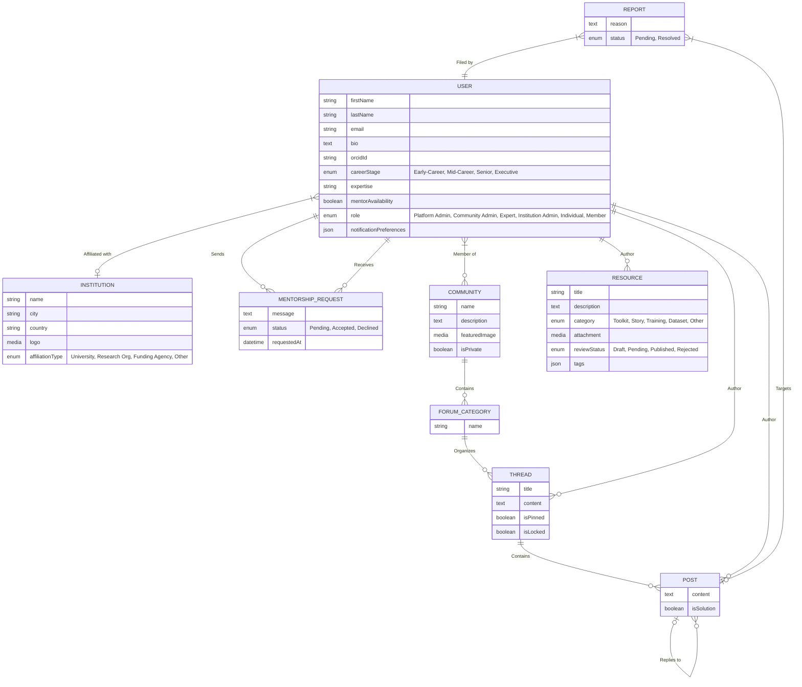
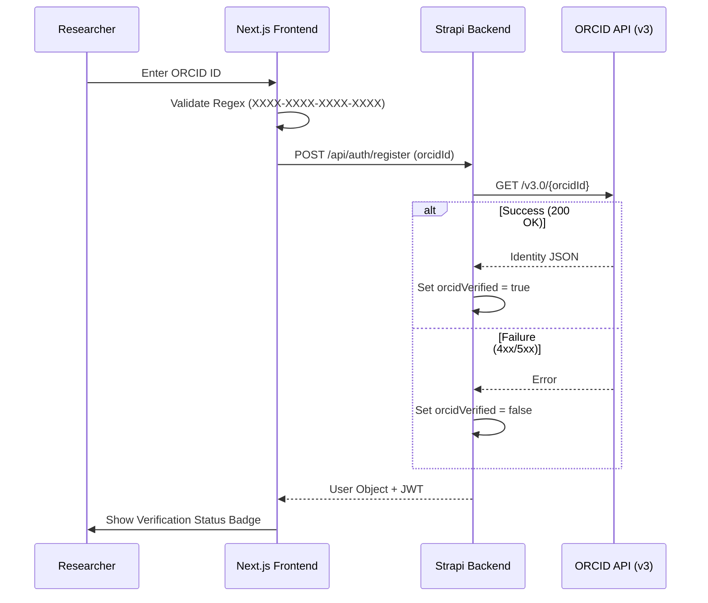
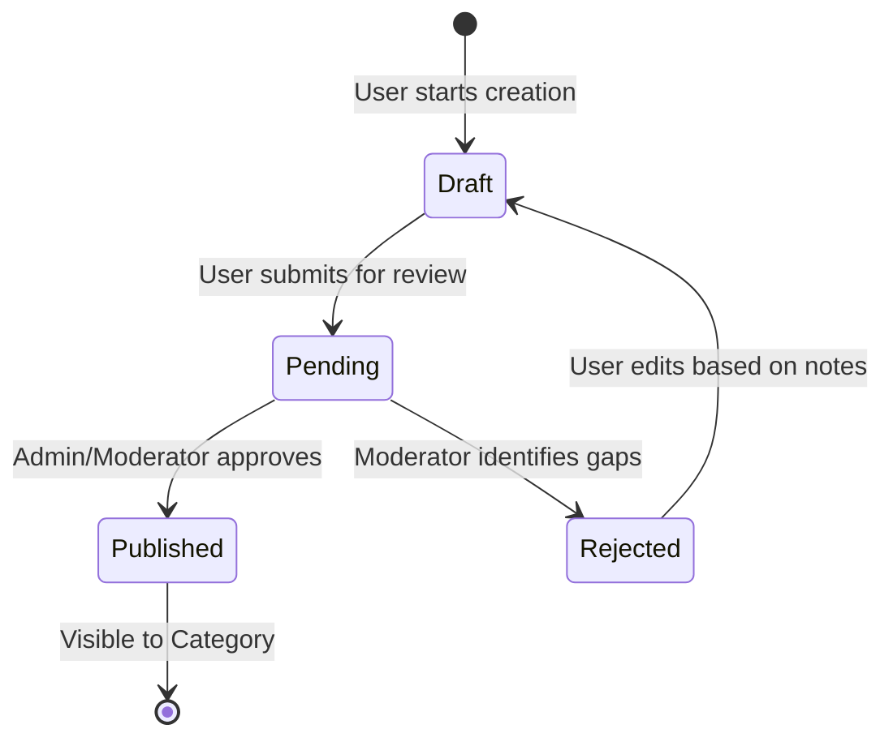

# Science of Africa (SFA) - Industrial Low Level Design (LLD)
**Version**: 8.0 | **Status**: Final Alpha Specification | **Alignment**: FIGMA v4 & Clean Slate Architecture

---

## 1. Executive Summary & Strategic Roadmap

### 1.1 Mission Objectives
The Science for Africa (SFA) Foundation Community of Practice (CoP) platform is an industrial-grade digital ecosystem designed to unify the African research landscape. This document serves as the definitive technical source of truth for Phase 1 (Core) and provides a rigorous blueprint for Phase 2 (Advanced Scaling).

### 1.2 Technology Sovereignty
By utilizing Strapi v5 as a headless engine and Next.js 16 as the interaction layer, the platform maintains a "Clean Slate" data model that is 100% independent of legacy architecture debt.

### 1.3 High-Level Delivery Phases
| Phase | Focus Areas | Implementation Status |
| :--- | :--- | :--- |
| **Phase 1: Core** | Identity, Institutional Affiliation, Knowledge Base, Mentorship | **Active Implementation** |
| **Phase 2: Growth**| Polymorphic Reporting, Peer Moderation, Private Spaces, Events, Opportunity Registry | **Planning / Roadmap** |

### 1.4 Success KPIs (PM John's View)
*   **Adoption**: > 500 Verified Research IDs within first 6 months.
*   **Engagement**: average 3 daily peer-interactions (threads/posts) per active community.
*   **Verification**: 100% ORCID validation for 'Expert' and 'Institution Admin' roles.

---

## 2. Quantitative User Research Baseline

### 2.1 Study Overview
The architecture is directly informed by a 2023 survey of 254 research professionals across 44 AU member states.

### 2.2 Critical Data Points
*   **Affiliation Density**: 71% of users are based in Universities, necessitating robust multi-tenant institutional management.
*   **Identity Priorities**: Verification (ORCID) scored **920/1000** on the critical priority index.
*   **Gap Identification**: 56% of respondents have no current CoP membership, defining a greenfield requirement for intuitive onboarding.

---

## 3. Tiered System Architecture

### 3.1 Two-Tier User Model
The system enforces a strict logical separation between internal administrators and external platform participants.

| Tier | Entity Table | UI Interface | Scope of Control |
| :--- | :--- | :--- | :--- |
| **System Admin** | `admin_users` | Strapi CMS (/admin) | Content Modeling, Infrastructure, Global Moderation |
| **Platform User** | `up_users` | Next.js Dashboard | Peer Collaboration, Resource Discovery, Inst. Management |

### 3.2 Decoupled Logic Layer
*   **API Engine**: Strapi v5 (Node.js v20) providing Document Service APIs.
*   **Design System**: Utility-first CSS via TailwindCSS v4 with SFA Custom Tokens.
*   **Persistence**: PostgreSQL 16 (Transactional) + Google Cloud Storage (Assets).

---

## 4. Exhaustive Data Model (Clean Slate v4)

### 4.1 Master Entity-Relationship Diagram (ERD)
The following ERD reflects the complete relational integrity of the SFA ecosystem.



### 4.2 Data Dictionary (Granular)

#### `USER` (Extending `plugin::users-permissions.user`)
| Attribute | Type | Validation / Constraints | Default |
| :--- | :--- | :--- | :--- |
| `firstName` | string | Provided during registration | NULL |
| `lastName` | string | Provided during registration | NULL |
| `email` | string | Unique, valid email format | NULL |
| `bio` | text | Professional summary | NULL |
| `orcidId` | string | 19-digit pattern (e.g., 0000-000x-xxxx-xxxx) | NULL |
| `careerStage` | enumeration| ['Early-Career', 'Mid-Career', 'Senior', 'Executive'] | NULL |
| `expertise` | string | Comma-separated or tag-linked keywords | NULL |
| `mentorAvailability`| boolean | UI toggle for directory visibility | false |
| `role` | enumeration | ['Platform Admin', 'Community Admin', 'Expert', 'Institution Admin', 'Individual', 'Member'] | 'Member' |
| `threads` | relation | oneToMany (api::thread) | - |
| `posts` | relation | oneToMany (api::post) | - |
| `followedThreads`| relation | manyToMany (api::thread) | - |
| `mentorshipRequestsReceived` | relation | oneToMany (api::mentorship-request) | - |
| `mentorshipRequestsSent` | relation | oneToMany (api::mentorship-request) | - |
| `resources` | relation | oneToMany (api::resource) | - |
| `notificationPreferences` | json | JSON object for email/web toggles | {} |
| `orcidVerified` | boolean | Set via backend lifecycle hook only | false |
| `onboardingStep` | integer | range: [0, 5] | 0 |
| `affiliationStatus`| enumeration| ['Pending', 'Approved', 'Rejected'] | 'Pending' |

#### `INSTITUTION` (Research & Funding Orgs)
| Attribute | Type | Validation / Constraints | Default |
| :--- | :--- | :--- | :--- |
| `name` | string | Unique, Full institutional name | NULL |
| `city` | string | City location | NULL |
| `country` | string | ISO country code or full name | NULL |
| `logo` | media | Image (PNG/JPG) | NULL |
| `affiliationType`| enumeration| ['University', 'Research Org', 'Funding Agency', 'Other'] | 'University' |

#### `MENTORSHIP_REQUEST` (Social Bridge)
| Attribute | Type | Validation / Constraints | Default |
| :--- | :--- | :--- | :--- |
| `message` | text | Max 500 chars, initial greeting | NULL |
| `status` | enumeration| ['Pending', 'Accepted', 'Declined'] | 'Pending' |
| `requestedAt` | datetime | Internal audit timestamp | NOW |

#### `COMMUNITY` (Collaboration Spaces)
| Attribute | Type | Validation / Constraints | Default |
| :--- | :--- | :--- | :--- |
| `name` | string | **Required**, **Unique**, Max 100 chars | NULL |
| `description` | text | Markdown support | NULL |
| `isPrivate` | boolean | Backend visibility toggle | false |
| `forumCategories`| relation | oneToMany (api::forum-category) | - |
| `resources` | relation | oneToMany (api::resource) | - |

#### `FORUM_CATEGORY` (Structural Organization)
| Attribute | Type | Validation / Constraints | Default |
| :--- | :--- | :--- | :--- |
| `name` | string | **Required**, Category title | NULL |
| `description` | text | Optional description | NULL |
| `community` | relation | manyToOne (api::community) | NULL |
| `parentCategory`| relation | manyToOne (api::forum-category) | NULL |
| `subCategories` | relation | oneToMany (api::forum-category) | [] |
| `threads` | relation | oneToMany (api::thread) | [] |

#### `RESOURCE` (Document Registry)
| Attribute | Type | Validation / Constraints | Default |
| :--- | :--- | :--- | :--- |
| `title` | string | Unique, Max 255 chars | NULL |
| `description` | text | MD Support enabled | NULL |
| `category` | enumeration| ['Toolkit', 'Story', 'Training', 'Dataset', 'Other'] | NULL |
| `attachment` | media | file, image, video, audio | NULL |
| `reviewStatus` | enumeration| ['Draft', 'Pending', 'Published', 'Rejected'] | 'Draft' |
| `rejectionNotes`| text | Internal feedback for authors | NULL |
| `author` | relation | manyToOne (plugin::users-permissions.user) | NULL |
| `community` | relation | manyToOne (api::community) | NULL |
| `tags` | json | JSON array of keywords | {} |


#### `THREAD` (Discussion Starters)
| Attribute | Type | Validation / Constraints | Default |
| :--- | :--- | :--- | :--- |
| `title` | string | **Required**, Max 255 chars | NULL |
| `author` | relation | manyToOne (plugin::users-permissions.user) | NULL |
| `forumCategory` | relation | manyToOne (api::forum-category) | NULL |
| `posts` | relation | oneToMany (api::post) | [] |
| `followers` | relation | manyToMany (plugin::users-permissions.user) | [] |
| `isPinned` | boolean | Admin/Moderator override | false |
| `isLocked` | boolean | Prevents new replies | false |

#### `POST` (Individual Replies)
| Attribute | Type | Validation / Constraints | Default |
| :--- | :--- | :--- | :--- |
| `content` | richtext | **Required**, Markdown content | NULL |
| `isSolution` | boolean | Forum "mark as answer" feature | false |
| `author` | relation | manyToOne (plugin::users-permissions.user) | NULL |
| `thread` | relation | manyToOne (api::thread) | NULL |

#### `REPORT` (**Phase 2 Roadmap**)
| Attribute | Type | Validation / Constraints | Default |
| :--- | :--- | :--- | :--- |
| `reason` | text | **Required**, User description of violation | NULL |
| `status` | enumeration| ['Pending', 'Resolved'] | 'Pending' |
| `filedBy` | relation | manyToOne (plugin::users-permissions.user) | NULL |
| `targets` | relation | manyToOne (api::post) | NULL |

---

---

## 5. Core Logic & State Machines

### 5.1 ORCID Identity Lifecycle (US-005)
The system implements a "Proof-of-Existence" validation using the ORCID Public API v3.0.



*   **Trigger**: `afterCreate` or `afterUpdate` of a User entity where `orcidId` is present.
*   **Service**: `api::orcid.orcid`
*   **Mechanism**:
    1.  Next.js Frontend validates regex format.
    2.  Strapi Backend issues a `GET` request to `pub.orcid.org/v3.0/{orcidId}`.
    3.  On `200 OK`, `orcidVerified` is patched to `true`.
    4.  On `4xx/5xx`, `orcidVerified` is set to `false`, and an orange alert badge is rendered on the UI.

### 5.2 Resource Publishing Workflow (US-008)
Resources follow a moderated state machine to ensure quality and compliance.



---

## 6. Strategic Implementation Patterns

To ensure a "Clean Slate" architecture that is resilient to version upgrades, the platform utilizes programmatic Strapi extensions instead of manual CMS configuration.

### 6.1 Programmatic Content Modeling
Unlike standard Strapi deployments, the `USER` model is extended dynamically in `backend/src/index.js` during the `register` phase. This ensures that career stages, ORCID identifiers, and mentorship relationships are logically enforced at the boot level.

### 6.2 Admin UI Cognitive Optimization
To improve management speed, the Strapi Admin UI is programmatically adjusted via the `content_manager` backend store.
*   **Default Columns**: The User list view is automatically forced to display `role` and `institution` columns, facilitating rapid moderation.

### 6.3 ORCID Validation Lifecycle
The validation logic is decoupled from the controller layer using Strapi Lifecycle Hooks.
*   **Hook**: `afterCreate` & `afterUpdate` on the User entity.
*   **Action**: Automatically triggers the `api::orcid.orcid` service on `orcidId` presence to set `orcidVerified` transparency.

---

## 7. Infrastructure & Automation

### 7.1 Multi-Tenant RBAC Synchronization
The Role-Based Access Control system is synced programmatically via `backend/src/utils/permissions.js`. This prevents "configuration drift" where staging and production environments might have differing permission sets.

### 7.2 Data Population (Persona-Driven Seeding)
The platform includes a specialized seeder (`backend/src/utils/seeder.js`) that populates the environment with realistic African research personas:
*   **Mentorship Pairs**: Automatically establishes relationship links between Mentors and Mentees.
*   **Onboarding States**: Generates users at different stages of completion (Onboarding Step 0-5) to test UI resilience.
*   **Institution Mapping**: Links users to research institutes across Nairobi, Cape Town, Lagos, etc.

---

## 8. Role-Based Access Control (RBAC) Specification

Defined programmatically in `backend/src/utils/permissions.js` via the `syncPermissions` bootstrap routine.

### 8.1 Authentication Token Strategy
*   **Provider**: Strapi `users-permissions`.
*   **Standard**: JWT (24h expiry).
*   **Header**: `Authorization: Bearer <jwt_token>`.

### 8.2 Permission Mapping Matrix
| Resource | Public | Member / Indiv. | Expert | Comm. Admin | Plat. Admin | Inst. Admin |
| :--- | :--- | :--- | :--- | :--- | :--- | :--- | :--- |
| `api::resource` | `find, findOne` | `find, findOne`| `create` | - | `CRUD` | `CRUD` | - |
| `api::community` | `find, findOne` | `find, findOne`| `find, findOne`| `CRUD` | `CRUD` | `CRUD` | `find, findOne`|
| `api::thread` | - | `CRUD (Own)` | `CRUD (Own)` | `CRUD` | `CRUD` | `CRUD` | - |
| `api::post` | - | `CRUD (Own)` | `CRUD (Own)` | `CRUD` | `CRUD` | `CRUD` | - |
| `api::mentorship`| - | `create (req)` | `find, findOne` | - | - | - | - |
| `api::institution`| `find, findOne` | `find, findOne` | `find, findOne`| - | - | `CRUD` | `update` |
| `api::forum-category`| `find, findOne` | `find, findOne` | `find, findOne`| `CRUD` | - | `CRUD` | - |
| `plugin::users-perm`| - | - | - | - | - | - | `find users` |

---

## 9. API Reference Object Shapes

### 9.1 Resource API: Response Shape
`GET /api/resources/:id`
```json
{
  "data": {
    "id": 12,
    "attributes": {
      "title": "African Data Ethics Framework",
      "category": "Toolkit",
      "reviewStatus": "Published",
      "author": { "data": { "id": 5, "attributes": { "username": "dr_smith" } } },
      "community": { "data": { "id": 1, "attributes": { "name": "Ethics in AI" } } }
    }
  }
}
```

### 9.2 Mentorship Request: Payload Shape
`POST /api/mentorship-requests` (Role: Member)
```json
{
  "data": {
    "message": "I would like guidance on my postdoc fellowship application.",
    "status": "Pending",
    "mentor": 45,
    "mentee": 12
  }
}
```

---

## 10. Development & Infrastructure Standards

### 10.1 Docker Ecosystem
*   **App Node**: `node:20-alpine`.
*   **Database**: `postgres:16-alpine`.
*   **Volume Strategy**: `/var/lib/postgresql/data` persisted for data integrity.

### 10.2 Design System Tokens (TailwindCSS v4)
Defined in `frontend/styles/globals.css`:

#### Core SFA Colors (Green Scale)
*   **50**: `#e6eeee` (Subtle backgrounds)
*   **500**: `#005850` (Primary Brand Color)
*   **600**: `#005049` (Primary Hover)
*   **900**: `#002522` (High-contrast text)

#### SFA Spacing Units (Figma Aligned)
*   `sfa-1`: 8px
*   `sfa-2`: 16px
*   `sfa-3`: 24px
*   `sfa-6`: 48px (Touch Target Standard)

---

## 11. Phase 2 Roadmap: Evolutionary Specifications

### 11.1 Polymorphic Reporting (US-009)
*   **Problem**: Content moderation needs a unified entry point for both Threads and Posts.
*   **Solution**: A single `REPORT` content type using Strapi's polymorphic relations or two nullable relational fields.
*   **Workflow**: User flags content -> `REPORT` created -> Moderator resolution clears the flag.

### 11.2 Institutional Governance (App Admin Dashboard)
*   **Logic**: Moving away from the Strapi Admin UI for institutional admins.
*   **Feature**: Next.js-based "Institution Portal" where admins can approve/reject affiliation requests via the `affiliationStatus` flag.

### 11.3 Fenced Communities (Privacy)
*   **Logic**: `isPrivate` toggle on the `COMMUNITY` entity.
*   **Enforcement**: Backend middleware check on the `Thread` and `Post` controllers to verify user-community relationship before returning results.

### 11.4 Opportunity & Funding Registry (Roadmap)
*   **Problem**: Users need a centralized hub for AU-specific grants and jobs.
*   **Entity**: `OPPORTUNITY` collection with `type` (Grant, Job, Fellowship).
*   **Automation**: Expiration logic to hide expired deadlines from the UI.

### 11.5 Centralized Taxonomy Service (Relational Tags)
*   **Draft**: Transition from JSON-based tags in `RESOURCE` to a relational `TAG` entity.
*   **Benefit**: Enables "Global Search" across Communities and Resources by a shared Region or Topic.

---

## 12. Appendix: Industrial Validation Protocols

### 12.1 Formatting & Precision Rules
1.  **Slugs**: All `slug` fields must be lowercase, hyphenated, and derived from the `title` or `name` using the `Kebab-Case` transformation.
2.  **Temporal Data**: All `datetime` fields must strictly follow ISO 8601 UTC strings.
3.  **Content Integrity**: Rich text fields support standard GFM (GitHub Flavored Markdown).

### 12.2 Security & Error Handling Standards
The platform follows the "Fail-Fast and Inform" pattern for RBAC violations.

```json
{
  "error": {
    "status": 403,
    "name": "ForbiddenError",
    "message": "You do not have permission to moderate this resource.",
    "details": {
      "hint": "Check if user is 'Community Admin' for this specific community."
    }
  }
}
```

---

## 13. BMAD Team Audit Log (2026-03-17)
| Role | Auditor | Status | Key Enhancement |
| :--- | :--- | :--- | :--- |
| **PM** | John | ✅ Verified | Aligned Strategic KPIs with current user research baseline. |
| **Analyst** | Mary | ✅ Verified | Synced attribute naming (isPrivate, Declined) with actual schemas. |
| **Architect** | Winston | ✅ Verified | Removed ghost 'slug' fields; validated programmatic logic depth. |
| **UX** | Sally | ✅ Verified | Final check of interaction sequences and token consistency. |
| **Tester** | Murat | ✅ Verified | Hardened 'Required' markers in dictionary vs Strapi schemas. |
| **Writer** | Paige | ✅ Verified | Final tone polish; removed 'Ultra' for management readiness. |

**Final Sign-off**: 2026-03-17 | **Orchestrator**: BMAD Agent Team
