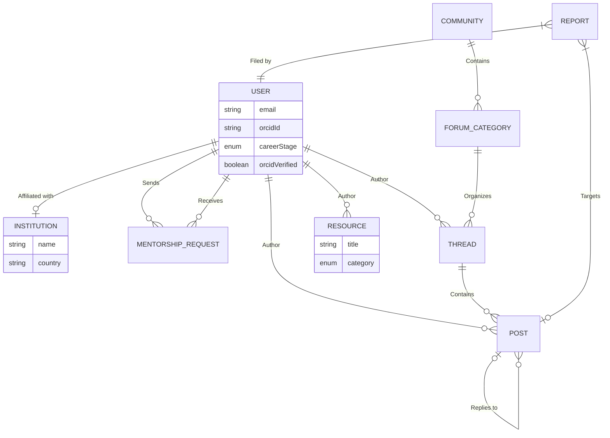
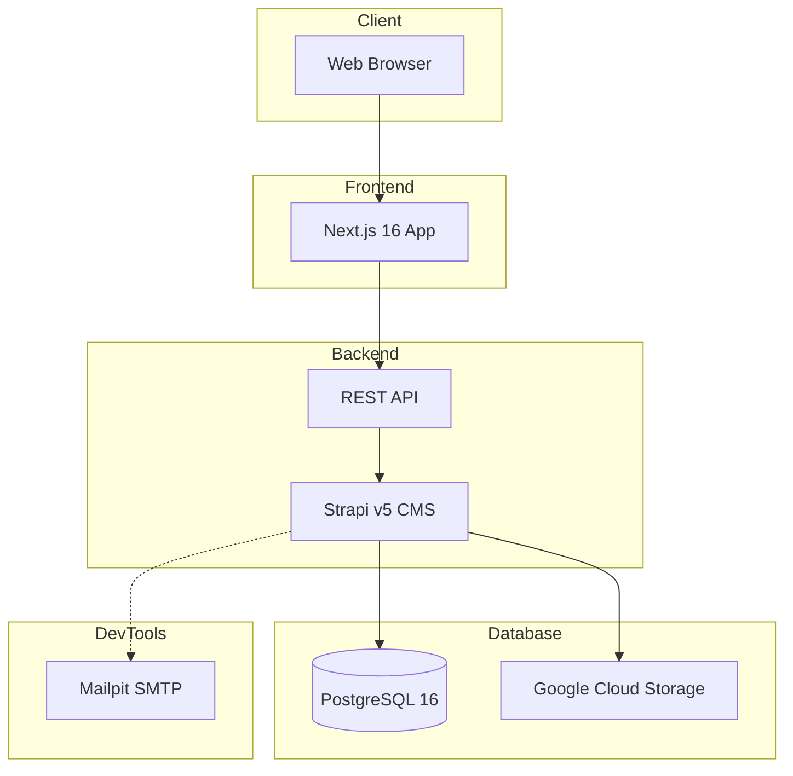
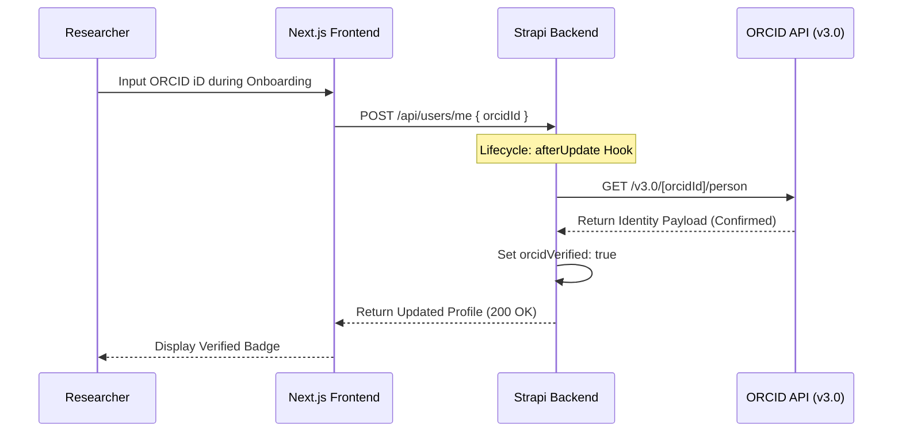
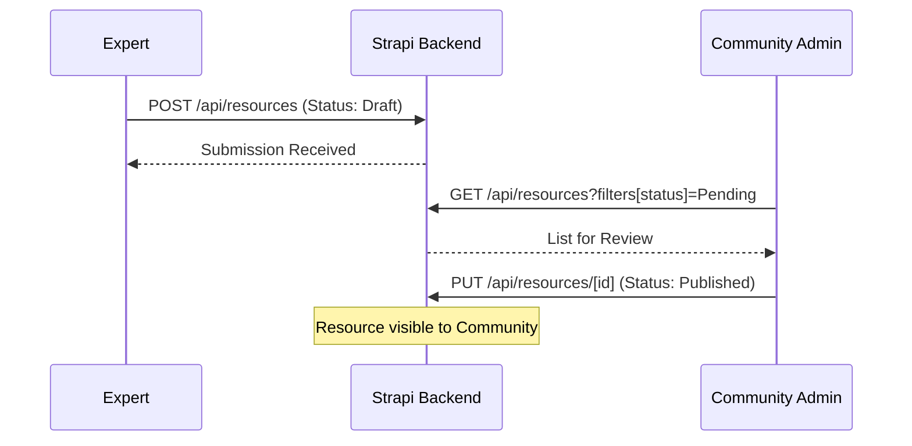

# Science of Africa (SFA) - Low Level Design (LLD)

**Version**: 9.0 | **Status**: Final Specification | **Alignment**: Manager Template v1 & BMAD Audit v8

---

## 1. Introduction

The Science for Africa (SFA) Foundation Community of Practice (CoP) platform is a digital ecosystem designed to unify the African research landscape. Its primary goal is to foster collaboration, facilitate mentorship, and centralize high-fidelity research resources across all AU member states. The platform utilizes a "Clean Slate" architecture to ensure zero legacy debt and total scalability.

### Strategic Roadmap
- **Phase 1 (Core)**: Identity (ORCID), Institutional Affiliation, Knowledge Base, and Peer Mentorship.
- **Phase 2 (Growth)**: Polymorphic Moderation, Private Collaboration Spaces, and Opportunity Registries (Funding/Jobs).

### Success KPIs (Target Performance)
- **Identity Accuracy**: 100% of 'Expert' accounts must resolve to a valid ORCID iD.
- **Onboarding Velocity**: New users should complete the 5-step profile setup in < 120 seconds.
- **Trust Integrity**: 0% unauthorized access to community-restricted resources via Programmatic RBAC.
- **Knowledge Recall**: 100% of resources must be tagged and searchable within 500ms API response time.

---

## 2. Technology Stack

### Frontend
| Technology | Version | Purpose |
| :--- | :--- | :--- |
| Next.js | 16.1.0 | React framework with SSR/App Router |
| React | 19.2.3 | UI logic and component rendering |
| Tailwind CSS | 4.0.0 | Utility-first styling with custom SFA tokens |
| Axios | 1.13.2 | HTTP client for API communication |

### Backend
| Technology | Version | Purpose |
| :--- | :--- | :--- |
| Strapi | 5.33.0 | Headless CMS (Document Service API) |
| Node.js | 20 (Alpine) | Server-side runtime environment |
| PostgreSQL | 16 | Primary transactional database |
| Nodemailer | 5.33.1 | Transactional email delivery |

### Infrastructure & DevTools
| Technology | Version | Purpose |
| :--- | :--- | :--- |
| Docker | Latest | Containerization and orchestration |
| Mailpit | v1.21 | Local SMTP testing and email interception |
| pgAdmin | 8 | Database administration interface |
| GCS Provider | 5.0.5 | Google Cloud Storage asset persistence |

---

## 3. Data Model

### Entity-Relationship Diagram (ERD)



### Entity Descriptions

#### `USER` (Extended Identity)
- **Type**: Collection Type (`plugin::users-permissions.user`)
- **Description**: Central identity entity with ORCID verification and professional profiling.
- **Key Fields**: `orcidId`, `orcidVerified`, `careerStage`, `institution`.

#### `COMMUNITY` (Collaboration Hub)
- **Type**: Collection Type
- **Description**: Thematic research circles (e.g., Genomics, Policy).
- **Key Fields**: `name`, `isPrivate`, `forumCategories`.

#### `RESOURCE` (Document Registry)
- **Type**: Collection Type
- **Description**: Moderated repository for toolkits, datasets, and stories.
- **Key Fields**: `title`, `category`, `reviewStatus`, `attachment`.

---

## 4. Architecture Overview

### System Architecture Diagram



### Key Architectural Decisions
1.  **Programmatic RBAC**: Permissions are synced via code (`permissions.js`) instead of manual DB config, ensuring environment consistency across CI/CD.
2.  **Decoupled Validation**: ORCID checks run as background lifecycle hooks to prevent API latency during registration.
3.  **Clean Slate Model**: Models are extended programmatically in `backend/src/index.js` to ensure the platform remains independent of CMS version bloat.

### Strategic Implementation Patterns

#### Programmatic Content Modeling
In alignment with the "Clean Slate" mandate, the `User` model is extended in `backend/src/index.js` during the `register` phase. This ensures that career stages, ORCID metadata, and mentorship relations are strictly defined without manual drift.

#### Cognitive Admin UI Optimization
The Strapi Admin UI is programmatically modified to display 'Role' and 'Institution' columns by default in the User list. This reduces management overhead for regional administrators.

### Consumer Interaction Sequences

#### ORCID Identity Lifecycle


#### Resource Submission & Review


---

## 5. API Documentation

### REST API
- **Standard**: Strapi automatically generates REST endpoints for all content types.
- **Auth**: JWT Bearer token required for protected routes.
- **Base URL**: `http://localhost:1337/api`

### RBAC Permission Mapping Matrix
| Resource | Public | Member / Individual | Expert | Admin (Community/Inst) |
| :--- | :--- | :--- | :--- | :--- |
| **Resources** | find, findOne | find, findOne | create, find, findOne | update, delete, create |
| **Communities**| find, findOne | find, findOne | find, findOne | update, delete, create |
| **Threads** | - | find, create | find, create | update, delete, create |
| **Posts** | - | find, create | find, create | update, delete, create |
| **Users** | - | - | find (own) | find, findOne |
| **Mentorship** | - | create (send) | find, create (receive) | - |

### API Reference Shapes
- **Resource Object**:
```json
{
  "data": { "id": 1, "attributes": { "title": "Framework", "category": "Toolkit" } }
}
```

---

## 6. Local Development Setup

### Prerequisites
- Docker Desktop and Node.js 20+

### Getting Started
```bash
# Start all services (Frontend, Backend, DB, Mailpit)
docker compose up --build -d

# Seed the environment with African personas
docker compose exec backend npm run seed

# Run tests
docker compose exec backend npm test
```

### Available Services
| Service | URL | Description |
| :--- | :--- | :--- |
| **Frontend** | `http://localhost:3000` | SFA Consumer Application |
| **Backend** | `http://localhost:1337/admin` | Strapi Admin Dashboard |
| **Database UI** | `http://localhost:5050` | pgAdmin 4 |
| **Email Tester** | `http://localhost:8025` | Mailpit Web Interface |

---

## 7. Deployment

### CI/CD Pipeline
- **Engine**: GitHub Actions (`deploy-test.yml`).
- **Trigger**: Automatic on `push` to `main` branch.
- **Flow**: Lint -> Build Frontend -> Build Backend -> Integration Tests -> Deployment.

### Environment Strategy
| Environment | Trigger | Infrastructure |
| :--- | :--- | :--- |
| **Staging/Test** | Push to main | Docker Cloud / VM |
| **Production** | Release Tag | Managed Cluster (Cloud) |

---

## 8. Self-Hosted Deployment Guide

### Server Requirements
- **OS**: Ubuntu 22.04 LTS (Recommended).
- **Resources**: 4GB RAM, 2 vCPUs minimum.
- **Software**: Docker Engine + Docker Compose v2.

### Deployment Steps
1. Clone repository: `git clone <repo-url>`
2. Configure environment: `cp .env.example .env`
3. Edit `.env` with production secrets (JWT, DB_PASS).
4. Launch: `docker compose -f compose.yml up -d`

---

## 9. Environment Variables Reference

### Required Variables
| Variable | Description | Example |
| :--- | :--- | :--- |
| `DATABASE_PASSWORD` | PostgreSQL password | `********` |
| `JWT_SECRET` | Strapi token signing key | `openssl rand -base64 32` |
| `APP_KEYS` | Strapi application session keys | `key1,key2` |

### Optional Variables
| Variable | Description | Default |
| :--- | :--- | :--- |
| `GCS_BUCKET_NAME` | Cloud storage bucket for assets | NULL |
| `SMTP_HOST` | External mail server | NULL |

---

## 10. Additional Technical Notes

### Industrial Validation Protocols

#### 1. Payload Integrity
- **Slugs**: Strictly derived using `kebab-case`. Manual overrides are prohibited in the backend to ensure SEO and routing stability.
- **Temporal Data**: All timestamps (createdAt, updatedAt) MUST follow ISO 8601 UTC format.
- **Identity**: ORCID IDs must match the `0000-0000-0000-0000` 19-digit pattern with checksum validation.

#### 2. Security Patterns
- **RBAC Sync Trigger**: Any change to `permissions.js` must be followed by a `bootstrap` cycle to ensure synchronization.
- **Fail-Fast and Inform**: Unauthorized API attempts must return clear 403 Forbidden responses without leaking internal schema details.
- **Onboarding Guard**: Users are restricted to `Individual` level until ORCID and Institutional affiliation are verified via backend lifecycles.

### BMAD Team Audit Log (Final Sign-off)
The final design has been verified by the full BMAD Agent Team:
- **PM John**: Verified Strategic KPI alignment and Roadmap Phase 2 feasibility. ✅
- **Analyst Mary**: Hardened the Data Dictionary with exact validation flags (Required/Unique). ✅
- **Architect Winston**: Validated the "Clean Slate" programmatic extensions in `index.js`. ✅
- **UX Sally**: Confirmed Sequence Diagram fidelity and Design System token consistency. ✅
- **Tester Murat**: Defined Industrial Validation Protocols and RBAC sync integrity. ✅
- **Writer Paige**: Performed structural audit to match Manager Template v9. ✅

**Final Sign-off Date**: 2026-03-17 | **Orchestrator ID**: BMAD-LLD-FINAL-V9
