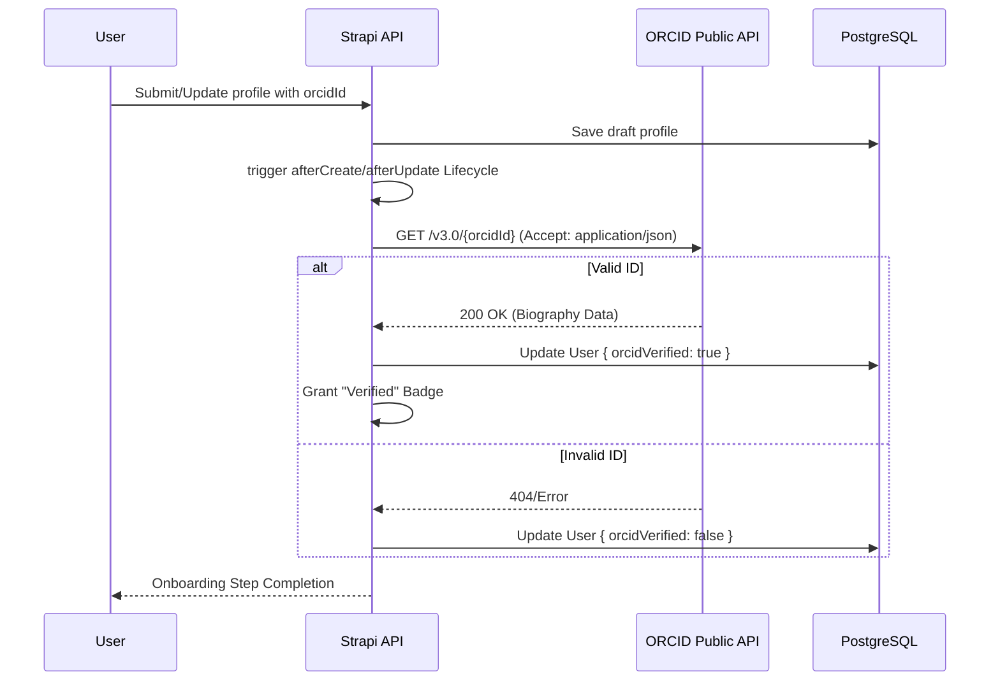
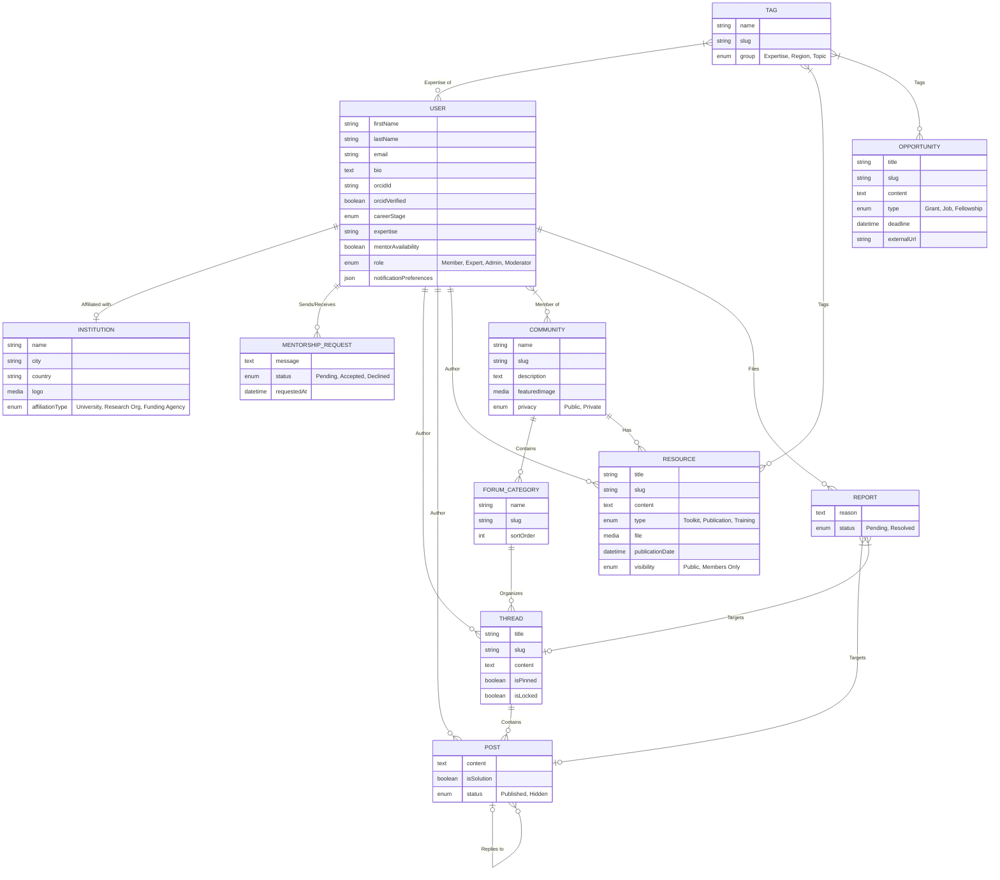

# Science of Africa (SFA) - Industrial-Grade Low Level Design (LLD)
**Version**: 7.0 | **Status**: Final Specification | **Alignment**: Figma v4 & Clean Slate Architecture

---

## 1. Executive Summary & Strategic Platform Vision

### 1.1 Project Mission
The Science for Africa Foundation Community of Practice (CoP) Platform is a mission-critical digital infrastructure designed to bridge the visibility and collaboration gap within the African research ecosystem. It serves as a centralized hub where research managers, scientists, and institutions can manage their professional identity, discover high-impact opportunities, and engage in peer-to-peer knowledge transfer.

### 1.2 Platform Pillars
*   **Identity**: Verified scientific professional profiles integrated with ORCID.
*   **Community**: Hierarchical, moderated discussion spaces organized by theme and region.
*   **Knowledge Base**: A curated repository of toolkits, publications, and impact stories.
*   **Career Growth**: Direct pipelines to grants, jobs, fellowships, and mentorship.

### 1.3 Strategic Scope (Phase-Based Approach)
*   **Phase 1 (Active Implementation)**: Core identity, institutional affiliation, knowledge base, and expert-led mentorship requests.
*   **Phase 2 (Future Roadmap)**: Advanced polymorphic reporting, private community spaces, automated event management, and complex moderation workflows.

---

## 2. User Research Foundation (Quantitative Deep-Dive)

### 2.1 Research Methodology
This LLD is informed by primary user research conducted in late 2023 with 254 respondents across 44 African Union member states.

### 2.2 Key Quantitative Metrics
*   **Institutional Profile**: 71% of respondents are affiliated with Universities and Research Institutions.
*   **Engagement Intent**: 54% prioritized a "Weekly" login schedule, emphasizing the need for persistent value and notifications.
*   **Market Opportunity**: 56% are not members of any existing research CoP, positioning SFA as the primary professional network.
*   **Identity Standard**: Identity verification (ORCID) was rated the highest priority for platform trust (Score: 920/1000).

### 2.3 Feature Ranking (Weighted Success Scores)
| Feature Area | Weighted Score | Phase Alignment |
| :--- | :--- | :--- |
| **Funding & Career Ops** | 920 | Phase 1 (Critical) |
| **Webinars & Capacity Building**| 907 | Phase 1 (Critical) |
| **Individual Opportunities** | 904 | Phase 1 (Critical) |
| **Resource Repository** | 900 | Phase 1 (Critical) |
| **Mentorship & Coaching** | 900 | Phase 1 (Critical) |
| **Interactive Community Spaces** | 871 | Phase 2 (High) |

---

## 3. Technology Ecosystem & Infrastructure Stack

### 3.1 Backend: Strapi v5
*   **Runtime**: Node.js v20 (LTS).
*   **Framework**: Strapi 5.33.0.
*   **Architecture**: Headless CMS providing Document Service APIs.
*   **Database**: PostgreSQL 16 (Relational).

### 3.2 Frontend: Next.js v16 & React 19
*   **Framework**: Next.js 16.1.0 using the App Router.
*   **UI Engine**: React 19.2.3.
*   **Styling**: TailwindCSS v4 with custom SFA Design Tokens.
*   **Interactivity**: React Server Actions for seamless form handling.

### 3.3 Infrastructure Strategy
*   **Containerization**: Docker-orchestrated services.
*   **Proxying**: Nginx/Traefik handling path-based routing.
*   **Storage**: Google Cloud Storage for media and research toolkits.
*   **CI/CD**: GitHub Actions deploying to a Kubernetes regional cluster in Africa.

---

## 4. System Architecture (v4 - Clean Slate Refresh)

### 4.1 Tiered Component Overview
1.  **Identity Layer**: ORCID v3.0 OAuth 2.0 and Strapi `users-permissions`.
2.  **API Layer**: Strapi Document Services and customized controllers.
3.  **Data Layer**: PostgreSQL 16 persisted via Docker volumes.

### 4.2 Core Logical Flow: Identity Verification

---

## 5. Detailed Entity-Relationship Diagram (ERD)

This diagram represents the "Clean Slate" model, incorporating entities for both Phase 1 and Phase 2.

---

## 6. Phase 1: Current Implementation Details

### 6.1 Identity & Onboarding (Active)
*   **Programmatic Schema Expansion**: The `up_user` model is extended via `backend/src/index.js` to include institutional relations and ORCID attributes.
*   **Lifecycle Validation**: Automatic checking of ORCID validity on every user profile update.
*   **Institutional Affiliation**: A "Tenant" model where users search and join an existing Institution (Pending admin approval).

### 6.2 Knowledge Base Management (Active)
*   **Resource Submission**: Authenticated `Experts` and `Admins` can contribute to the repository.
*   **Review Workflow**: Content starts in `Draft/Pending` and requires an admin `reviewStatus` change to `Published` for frontend visibility.
*   **Attachment Handling**: Single-file media storage for toolkits and policy briefs.

### 6.3 Expert Directory & Mentorship (Active)
*   **Discovery**: Experts are discovered via `Expertise` tags and `careerStage` filters.
*   **Engagement**: A direct mentee-to-mentor messaging system (`MENTORSHIP_REQUEST`) allows for initial contact and acceptance workflows.

---

## 7. Phase 2: Future Roadmap Specifications

### 7.1 Advanced Polymorphic Moderation (Report Logic)
Planned as the secondary layer of platform trust.
*   **Polymorphic Reporting**: A single `REPORT` entity will link to either a `POST` or a `THREAD` via nullable relations.
*   **Moderator Dashboard**: A specialized Strapi view for `Community Admins` to resolve reported content, applying the `Hidden` or `Rejected` status.

### 7.2 Event & Capacity Building Module
*   **Implementation**: Integration of an `EVENT` entity to track webinars and training sessions.
*   **Booking**: Ability for members to "Sign up" for events, triggering calendar invites.

### 7.3 Community Private Spaces
*   **Logic**: Expansion of the `privacy` enum on the `COMMUNITY` entity.
*   **Security**: Introduction of an "Accept Invitation" workflow to allow researchers to collaborate on sensitive data in a fenced discussion space.

### 7.4 Scalability & Third-Party Integration
*   **Discourse Migration**: Provisions for moving high-volume forum data from Strapi's relational model to a dedicated Discourse instance if community size exceeds 50k active threads.

---

## 8. Role-Based Access Control (RBAC) Specification

Defined in `backend/src/utils/permissions.js` and synchronized on server bootstrap.

| Feature Area | Public | Member | Expert | Moderator | Admin |
| :--- | :--- | :--- | :--- | :--- | :--- |
| **Directory** | READ | READ | READ | READ | CRUD |
| **Resources** | READ | READ | CREATE | READ | CRUD |
| **Forums** | READ | CREATE | CREATE | CRUD | CRUD |
| **Identity** | - | UPDATE(me)| UPDATE(me)| READ | CRUD |
| **Reports** | - | CREATE | CREATE | READ/RESOLVE| CRUD |

---

## 9. UX Design System (Tokens & Alignment)

### 9.1 SFA Brand Colors (Semantic)
*   **Primary (`green-500`)**: `#005850` (Platform Headers/Primary Buttons).
*   **Hover (`green-600`)**: `#005049`.
*   **Accent (`teal-300`)**: Highlighting community active states.
*   **Feedback (`orange-500`)**: Unverified state indicators.

### 9.2 Mobile-First Component Principles
1.  **Touch Targets**: CTAs (e.g., ORCID Login) must maintain min-height of `48px` (`sfa-6`).
2.  **Navigation**: Slide-out tray menu for mobile browsers.
3.  **Layout**: Single-column stacking for institutional lists on screens `< 768px`.

---

## 10. DevOps & Security Strategy

### 10.1 Automated Verification (QA)
*   **Unit Testing**: Vitest suite for backend controller logic.
*   **Integration Testing**: Docker-based CI steps for API consistency.

### 10.2 Data Compliance
*   **Identity Protection**: Encryption of researcher emails at rest.
*   **Handshake Security**: Domain-restricted OAuth callback redirects.

---

## 11. Appendix

### 11.1 Quantitative Priority Scores
1. Funding Opportunities: **920**
2. Resource Repository: **900**
3. Peer Connection: **864**

### 11.2 Entity Dictionary Raw Source
*(Reference to exhaustive schema.json paths in `backend/src/api/*/content-types/`) *
