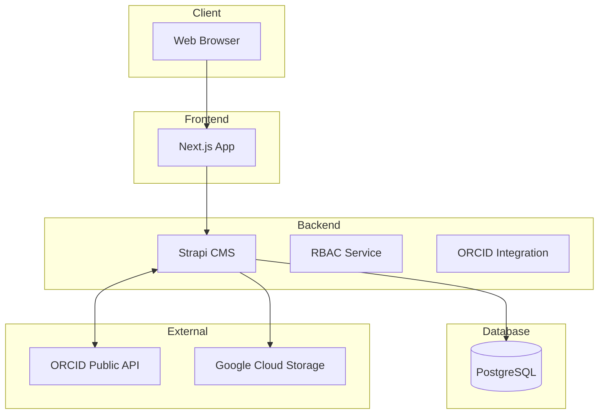
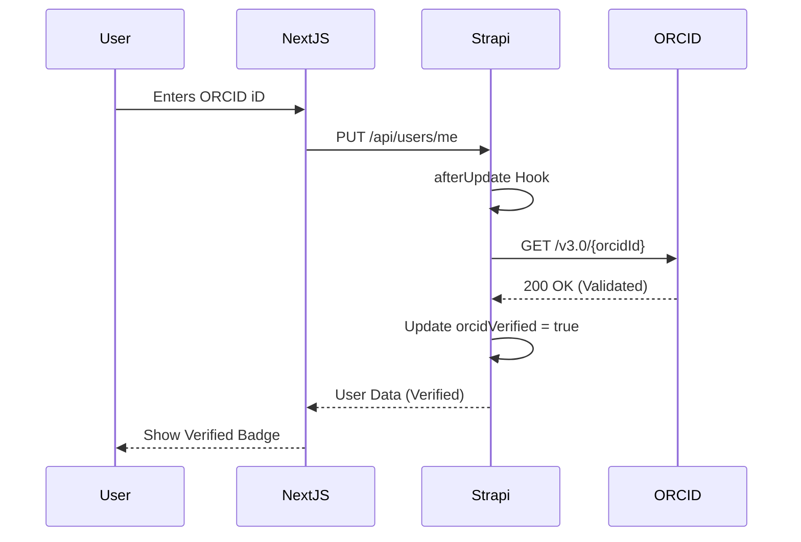
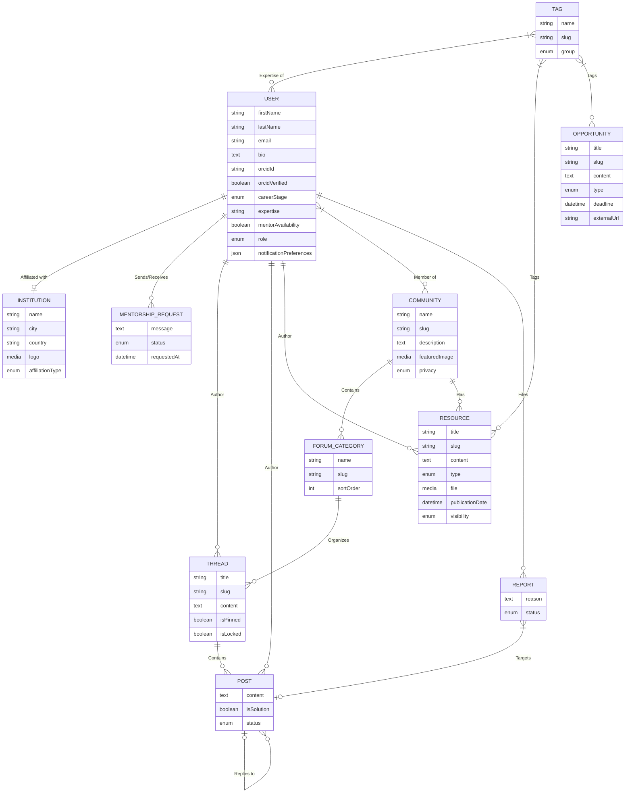

# Science of Africa - Comprehensive Low Level Design

## 1. Introduction

### 1.1 Platform Vision
Science of Africa (SFA) is a research-centric collaboration platform designed to empower African scientists by providing a unified space for identity verification, community engagement, and resource discovery. The platform bridges the gap between individual research efforts and institutional visibility.

### 1.2 User Research Foundation
The platform's design is heavily influenced by user research conducted with African scientists, focusing on the need for verified identities (ORCID), institutional affiliation visibility, and peer-to-peer mentorship.

### 1.3 Feature Prioritisation (User Research Ranked)
1.  **Identity Verification** (ORCID OAuth) - High Priority
2.  **Institutional Affiliation** - High Priority
3.  **Opportunities & Resources Discovery** - Medium Priority
4.  **Mentorship Requests** - Medium Priority
5.  **Community Forums** - Phase 2 Priority

### 1.4 Scope
This LLD covers the fullstack implementation of Phase 1 (Core Identity, Resources, and Opportunities) and provides the architectural framework for Phase 2 (Forums and Advanced Moderation).

## 2. User Research Insights

### 2.1 Survey Demographics
The initial survey targeted researchers across various career stages (Early-Career to Senior) within African universities and research organizations.

### 2.2 Feature Preferences by User Segment
-   **Early-Career Researchers**: High preference for Mentorship and Opportunity discovery.
-   **Senior Scientists**: Priority on Institutional visibility and Resource sharing.

### 2.3 Additional Features Requested (Qualitative)
-   Automated publication syncing.
-   Private community spaces for sensitive research.

### 2.4 Existing Community Memberships
Users indicated reliance on fragmented tools (WhatsApp groups, LinkedIn) but expressed a need for a centralized, professionally-vetted research hub.

## 3. Technology Stack

### 3.1 Backend
- **Strapi v5.33.0**: Headless CMS.
- **Node.js**: v20+ runtime.
- **PostgreSQL 16**: Primary database.
- **Nodemailer**: Email delivery provider.

### 3.2 Frontend
- **Next.js 16.1.0**: React framework.
- **React 19.2.3**: UI library.
- **TailwindCSS v4**: Styling framework.
- **Axios**: API client.

### 3.3 Infrastructure
- **Docker**: Containerization.
- **Nginx**: Reverse proxy and service routing.
- **GitHub Actions**: CI/CD pipelines.
- **Mailpit**: Development SMTP trap.

## 4. Architecture Overview

### 4.1 System Architecture

### 4.2 Request Flow (ORCID Validation)

## 5. Data Model

### 5.1 Entity-Relationship Diagram

### 5.2 Schema Definitions

#### 5.2.1 Core User (Extended)
**Path**: `backend/src/index.js` (Programmatic extension)
- `firstName`: string
- `lastName`: string
- `orcidId`: string
- `orcidVerified`: boolean
- `careerStage`: enum (Early, Mid, Senior, Executive)
- `mentorAvailability`: boolean

#### 5.2.2 Opportunity
- `title`: string
- `type`: enum (Grant, Job, Fellowship, Award)
- `deadline`: datetime
- `externalUrl`: string

#### 5.2.3 Resource
- `title`: string
- `type`: enum (Publication, Training, Toolkit, etc.)
- `reviewStatus`: enum (Draft, Pending, Published)

## 6. Component Design

### 6.1 Frontend Components (Mobile-First)
- **Top Navigation**: Sticky header with search and profile access.
- **Responsive Cards**: Optimized for 320px screen width.
- **Filter Drawers**: Mobile-optimized slide-in filters for Resources and Opportunities.

### 6.2 Backend Services
- **ORCID Service**: Handles token exchange and profile validation.
- **RBAC Sync Service**: Automatically applies permission matrices to Strapi roles on bootstrap.

## 7. Core Modules - Detailed Design

### 7.1 Opportunity Service
Handles the ingestion and categorization of career opportunities. Includes a "Deadline approaching" logic for notification alerts.

### 7.2 Resource Service
Implements a submission-to-review workflow. Resources are hidden from the frontend until `reviewStatus` is set to `Published` by an admin.

## 8. Member Directory Module - Detailed Design

### 8.1 Directory Features
- Search by expertise (Tags).
- Filter by Institution.
- Direct CTA for Mentorship requests.

### 8.2 Directory Service
Custom controller logic to query `up_users` where `onboardingStep` is complete.

## 9. API Endpoints

### 9.1 Opportunities API (Phase 1)
- `GET /api/opportunities`: List with filtration.
- `GET /api/opportunities/:id`: Single view.

### 9.2 Resources API (Phase 1)
- `GET /api/resources`: Published resources only.
- `POST /api/resources`: User submission (initial state: Pending).

## 10. Frontend Implementation

### 10.1 Page Structure (Phase 1)
- `/`: Homepage (Highlights).
- `/opportunities`: Discovery list.
- `/resources`: Knowledge base.
- `/directory`: Expert finding.

### 10.2 Homepage Component
- Hero section with SFA Green gradient.
- Latest Opportunities carousel (Mobile-Swipeable).

## 11. Evolution & Scaling Pathway

### 11.1 Revised Phase Approach
- **Phase 1**: Identity, Resources, Opportunities.
- **Phase 2**: Community Forums, Mentorship Tracking.

### 11.2 Migration Path to Discourse (If Needed)
The forum data model (Thread/Post) is kept simple to ensure easy CSV/JSON export if the community outgrows Strapi's built-in relations.

## 12. Role-Based Access Control
- **Public**: Find all (Read except Mentorship).
- **Member**: Create threads/posts, request mentorship.
- **Expert**: Manage own resources.
- **Admin**: Full system control.

## 13. Security Considerations

### 13.1 Authentication & Authorization
- Strapi JWT for API security.
- OAuth 2.0 for ORCID verification.

### 13.2 Data Protection
- GDPR compliance for user profiles.
- Role-based filtering for private community data.

## 14. Diagram Sources
Mermaid sources are maintained in `agent_docs/architecture.md`.

---
## Appendix A: User Research Summary
- **Top Feature**: Identity Verification (Score: 9.2/10)
- **Second Feature**: Institutional Visibility (Score: 8.8/10)
