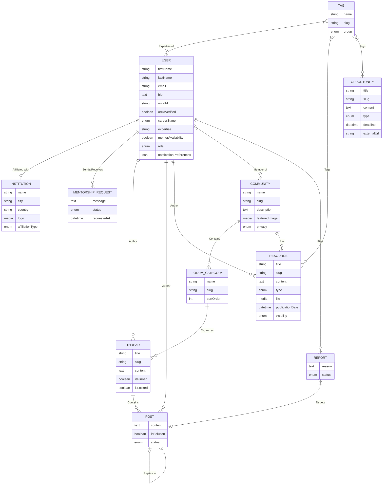
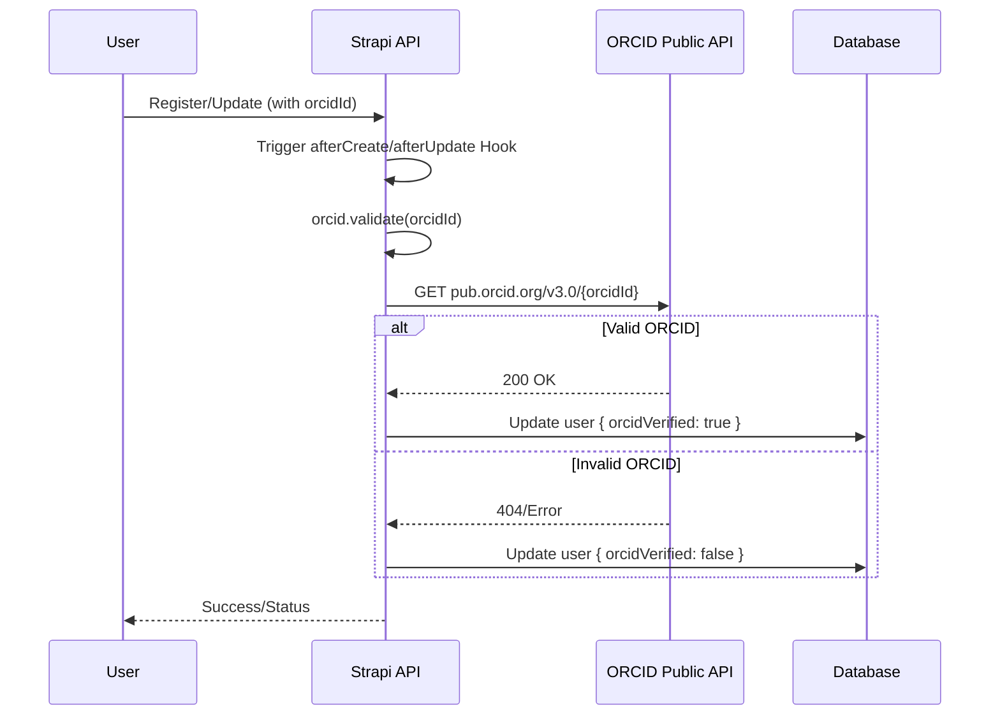
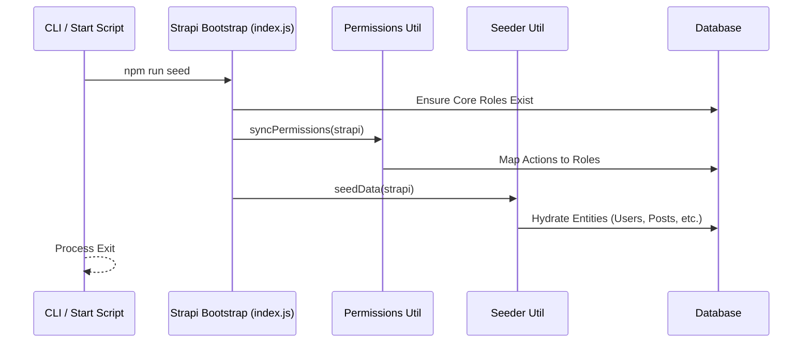

# Science of Africa - Detailed Low Level Design

## 1. Introduction

Science of Africa is a collaborative research platform built on a **Clean Slate Architecture**. This document provides a deep technical breakdown of the system components, data flows, and implementation details.

## 2. Technology Stack & Runtime Environment

| Category | Technology | Version | Purpose |
|----------|------------|---------|---------|
| **Frontend** | Next.js | 16.1.0 | SSR/SSG React Framework |
| | React | 19.2.3 | UI Library |
| | Axios | ^1.13.2 | HTTP Client for API interaction |
| | TailwindCSS | ^4 | Utility-first styling |
| **Backend** | Strapi | 5.33.0 | Headless CMS (Node.js) |
| | Node.js | >=20 | Infrastructure runtime |
| **Storage** | PostgreSQL | 16 | Relational database |
| | GCS | - | File blob storage (Nodemailer provider) |
| **DevOps** | Docker | - | Container orchestration |
| | Nginx | - | Reverse proxy & URI routing |

## 3. Detailed Data Model (ERD)

### 3.1 Entity-Relationship Diagram

## 4. Component Breakdown

### 4.1 Backend (Strapi)
- **`src/index.js`**: Core bootstrap logic. Handles:
    - **User Extensions**: Programmatically injects fields into `plugin::users-permissions.user`.
    - **RBAC Generation**: Automatically creates roles like `Expert`, `Institution Admin`, etc.
    - **Permission Sync**: Triggers the `syncPermissions` utility to map API actions to roles.
- **`src/api/orcid/services/orcid.js`**: Integration service for ORCID.
    - `validate(orcidId)`: Regex validation + HTTP request to `pub.orcid.org`.
- **`src/utils/permissions.js`**: Contains the mapping of roles to Strapi API actions.
- **`src/utils/seeder.js`**: Data hydration logic using `@faker-js/faker`.

### 4.2 Frontend (Next.js)
- **`pages/index.js`**: Main discovery landing page.
- **`lib/strapi.js`**: Axios-based client for interacting with the backend API.
- **`styles/globals.css`**: TailwindCSS configuration and global reset styles.

## 5. Sequence Flows

### 5.1 ORCID Validation Flow

### 5.2 Seeding & RBAC Sync Flow

## 6. Security and Access Control (RBAC)

The system uses a programmatic RBAC synchronization mechanism. Permissions are defined in `backend/src/utils/permissions.js` and applied during startup.

| Role | Access Level | Key Permissions |
|------|--------------|-----------------|
| **Public** | Read-Only | Find Communities, Resources, Institutions |
| **Member** | Contributor | Create Threads/Posts, Send Mentorship Requests |
| **Expert** | Verified Contributor | Create Resources, Receive Mentorship Requests |
| **Community Admin**| Moderator | Manage threads/posts within specific communities |
| **Platform Admin** | Superuser | Full CRUD on all entities and user management |

## 7. Local Development & Infrastructure

### 7.1 Docker Services
- **`frontend`**: Next.js 16 in development mode (HMR enabled).
- **`backend`**: Strapi 5 with `Dockerfile-dev` (Auto-reloading).
- **`db`**: PostgreSQL 16 with persistent volume `pg-data`.
- **`mailpit`**: SMTP trap for testing email flows (registration, confirmations).
- **`pgadmin`**: GUI for database management.

### 7.2 Nginx Configuration (Mimic-Prod)
| Path | Target | Purpose |
|------|--------|---------|
| `/` | Frontend:3000 | User application |
| `/cms` | Backend:1337 | Admin panel & API |

## 8. Deployment Strategy

The project utilizes a Kubernetes-first deployment strategy automated via GitHub Actions.

1. **Build Phase**: Parallel builds of Backend, Frontend, and Nginx images.
2. **Registry**: Pushed to Google Cloud Registry (GCR).
3. **Rollout**: `k8s-rollout` composite action updates deployments in the `science-of-africa-namespace`.

## 9. Environment Variables Reference

| Variable | scope | Example |
|----------|-------|---------|
| `JWT_SECRET` | Backend | `openssl rand -base64 32` |
| `DATABASE_URL` | Backend | `postgres://akvo:password@db:5432/strapi` |
| `SMTP_HOST` | Backend | `mailpit` |
| `NEXT_PUBLIC_BACKEND_URL` | Frontend | `http://localhost:1337` |

## 10. Summary of Architectural Logic

- **Lifecycle Hooks**: Heavy usage of Strapi lifecycles to ensure data integrity (e.g., ORCID validation).
- **Programmatic Configuration**: Minimizing manual Strapi Admin setup by automating role creation and permission mapping.
- **Seeding for TDD**: Ensuring a predictable data state for automated testing.
