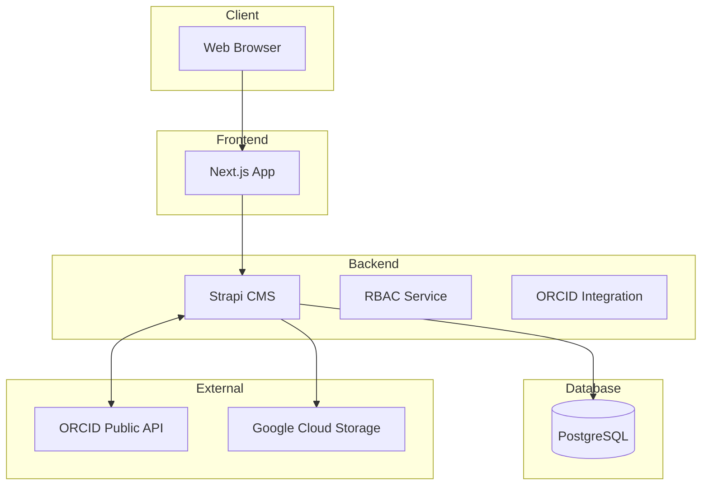
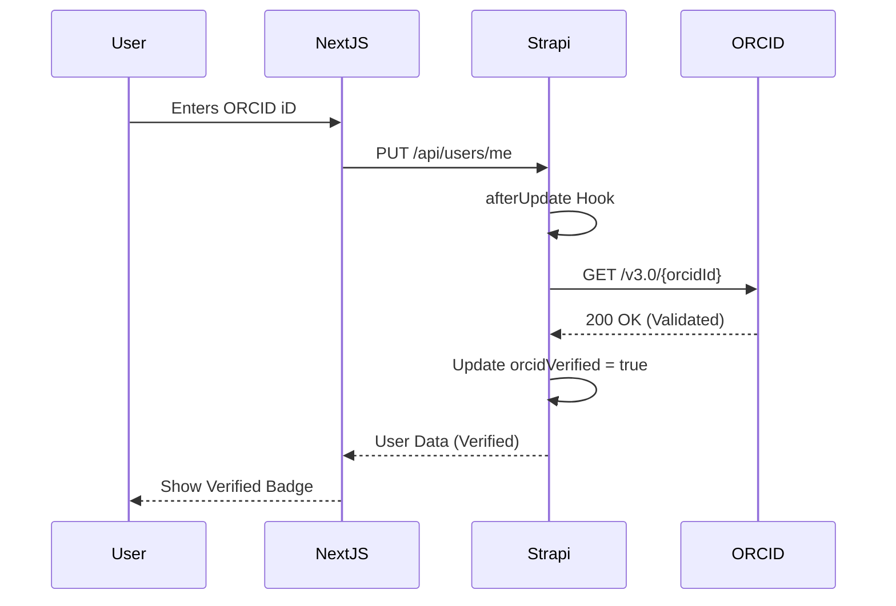
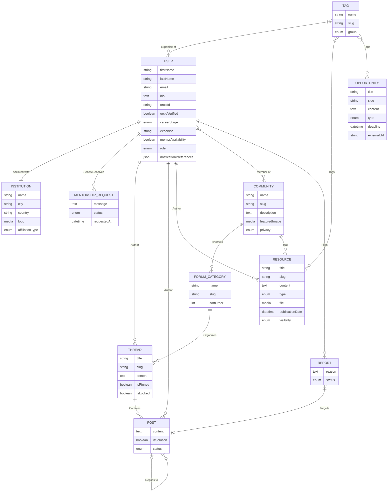

# Science of Africa - Comprehensive Low Level Design

## 1. Introduction

### 1.1 Platform Vision
The Science for Africa Foundation Community of Practice (CoP) Platform enables research managers to:
*   **Access funding and career opportunities** through a curated opportunities board.
*   **Build capacity** through training, webinars, and certification programmes.
*   **Share resources and best practices** through a searchable repository.
*   **Connect with peers** via member directory and networking features.
*   **Discuss common challenges** via moderated discussion forums.
*   **Access mentorship** through expert collaboration channels.

### 1.2 User Research Foundation
This LLD is informed by primary user research conducted in 2023:
*   **Total Respondents:** 254 from 44 countries across all African Union regions.
*   **Response Rate:** 98%.
*   **Institutional Representation:** 71% from universities and research institutions.
*   **Engagement Intent:** 54% plan to log in weekly, indicating strong engagement intent.
*   **Market Opportunity:** 56% are not currently part of any existing CoP, representing a greenfield opportunity.
*   **Key Insight:** Users prioritise access to **opportunities and resources** over discussion features for the initial phase.

### 1.3 Feature Prioritisation (User Research Ranked)
1.  **Identity Verification** (ORCID OAuth) - High Priority
2.  **Institutional Affiliation** - High Priority
3.  **Opportunities & Resources Discovery** - Medium Priority
4.  **Mentorship Requests** - Medium Priority
5.  **Community Forums** - Phase 2 Priority

### 1.4 Scope
This LLD covers the fullstack implementation of Phase 1 (Core Identity, Resources, and Opportunities) and provides the architectural framework for Phase 2 (Forums and Advanced Moderation).

## 2. User Research Insights

### 2.1 Survey Demographics
The survey targeted 254 researchers across 44 countries, with 71% representing universities and research institutions.

### 2.2 Feature Preferences by User Segment
-   **Early-Career Researchers**: High preference for Mentorship and Individual opportunities (Jobs, Scholarships).
-   **Senior Scientists**: Priority on Institutional visibility and Interactive virtual spaces.
-   **Female Researchers**: Stronger reported preference for individual development opportunities.

### 2.3 Additional Features Requested (Qualitative)
-   Automated publication syncing via ORCID.
-   Private community spaces for sensitive or thematic research.

### 2.4 Existing Community Memberships
56% of respondents are not currently part of any research community, highlighting the platform's role as a primary networking hub.

## 3. Technology Stack

### 3.1 Backend
- **Strapi v5.33.0**: Headless CMS.
- **Node.js**: v20+ runtime.
- **PostgreSQL 16**: Primary database.
- **Nodemailer**: Email delivery provider.

### 3.2 Frontend
- **Next.js 16.1.0**: React framework.
- **React 19.2.3**: UI library.
- **TailwindCSS v4**: Styling framework.
- **Axios**: API client.

### 3.3 Infrastructure
- **Docker**: Containerization.
- **Nginx**: Reverse proxy and service routing.
- **GitHub Actions**: CI/CD pipelines.
- **Mailpit**: Development SMTP trap.

## 4. Architecture Overview

### 4.1 System Architecture



### 4.2 Request Flow (ORCID Validation)



## 5. Data Model

### 5.1 Entity-Relationship Diagram



### 5.2 Schema Definitions

#### 5.2.1 Core User (Extended)
**Path**: `backend/src/index.js` (Programmatic extension)
- `firstName`: string
- `lastName`: string
- `orcidId`: string
- `orcidVerified`: boolean
- `careerStage`: enum (Early, Mid, Senior, Executive)
- `mentorAvailability`: boolean

#### 5.2.2 Opportunity
- `title`: string
- `type`: enum (Grant, Job, Fellowship, Award)
- `deadline`: datetime
- `externalUrl`: string

#### 5.2.3 Resource
- `title`: string
- `slug`: string
- `content`: text
- `resource_type`: enum (report, case_study, best_practice, template, toolkit, guideline, policy, regulatory, presentation, video)
- `reviewStatus`: enum (Draft, Pending, Published)
- `visibility`: enum (public, private)
- `uploaded_by`: relation (User)

## 6. Component Design

### 6.1 Frontend Components (Mobile-First)
- **Top Navigation**: Sticky header with search and profile access.
- **Responsive Cards**: Optimized for 320px screen width.
- **Filter Drawers**: Mobile-optimized slide-in filters for Resources and Opportunities.

### 6.2 Backend Services
- **ORCID Service**: Handles token exchange and profile validation.
- **RBAC Sync Service**: Automatically applies permission matrices to Strapi roles on bootstrap.

## 7. Resource Repository Module - Detailed Design

### 7.1 Resource Types
The platform supports the following resource categorisation:
| Type | Description | Examples |
| :--- | :--- | :--- |
| **report** | Research reports, studies | Annual reports, research findings |
| **case_study** | Implementation case studies | Best practices from institutions |
| **best_practice** | Documented best practices | Guidelines, methodologies |
| **template** | Reusable templates | Budget templates, proposal formats |
| **toolkit** | Comprehensive toolkits | Research management toolkits |
| **guideline** | Official guidelines | Funder guidelines, ethics guidelines |
| **policy** | Policy documents | Institutional policies |
| **regulatory** | Regulatory information | Compliance requirements |
| **presentation** | Slide decks | Conference presentations |
| **video** | Video content | Training videos, webinar recordings |

### 7.2 Resource Service (Implementation)
```javascript
// backend/src/api/resource/services/resource.js
module.exports = ({ strapi }) => ({
  async findByType(type, pagination = {}) {
    return strapi.documents('api::resource.resource').findMany({
      filters: {
        resource_type: type,
        visibility: 'public'
      },
      populate: ['tags', 'uploaded_by.profile', 'file'],
      sort: { createdAt: 'desc' },
      ...pagination
    })
  }
})
```

## 8. Member Directory Module - Detailed Design

### 8.1 Directory Features
Based on user research requesting "networking by thematic area":
| Feature | Implementation |
| :--- | :--- |
| **Search by expertise** | Filter on `expertise_areas` JSON field |
| **Filter by region** | Filter on `region` enum |
| **Filter by institution type** | Filter on `institution` with type tagging |
| **Filter by career stage** | Filter on `career_stage` enum |
| **Mentor availability** | Filter on `is_mentor_available` boolean |
| **Profile visibility** | Controlled by `is_public` boolean |

### 8.2 Directory Service (Implementation)
```javascript
// backend/src/api/user-profile/services/directory.js
module.exports = ({ strapi }) => ({
  async searchMembers(filters = {}, pagination = { page: 1, pageSize: 20 }) {
    const queryFilters = { is_public: true };
    
    if (filters.expertise) {
      queryFilters.expertise_areas = { $containsi: filters.expertise };
    }
    // ... additional filter logic
    
    return strapi.documents('api::profile.profile').findMany({
      filters: queryFilters,
      populate: ['user', 'expert_tags', 'institution'],
      ...pagination
    })
  }
})

## 9. API Endpoints

### 9.1 Opportunities API (Phase 1)
- `GET /api/opportunities`: List with filtration.
- `GET /api/opportunities/:id`: Single view.

### 9.2 Resources API (Phase 1)
- `GET /api/resources`: Published resources only.
- `POST /api/resources`: User submission (initial state: Pending).

### 9.3 Events API (Phase 1)
- `GET /api/events`: List upcoming webinars and training sessions.

### 9.4 Member Directory API (Phase 1)
| Method | Endpoint | Description | Auth |
| :--- | :--- | :--- | :--- |
| GET | `/api/members` | Search member directory | Member |
| GET | `/api/members/:username` | Get member profile | Member |
| GET | `/api/members/mentors` | List available mentors | Member |
| PUT | `/api/user-profiles/me` | Update own profile | Member |

### 9.5 Forums API (Phase 2)
- Deferred to Phase 2. To be documented upon commencement.

## 10. Frontend Implementation

### 10.1 Page Structure (Phase 1)
- `/`: Homepage (Highlights).
- `/opportunities`: Discovery list.
- `/resources`: Knowledge base.
- `/directory`: Expert finding.

### 10.2 Homepage Component
- Hero section with SFA Green gradient.
- Latest Opportunities carousel (Mobile-Swipeable).

## 11. Evolution & Scaling Pathway

### 11.1 Revised Phase Approach
- **Phase 1**: Identity, Resources, Opportunities.
- **Phase 2**: Community Forums, Mentorship Tracking.

### 11.2 Migration Path to Discourse (If Needed)
The forum data model (Thread/Post) is kept simple to ensure easy CSV/JSON export if the community outgrows Strapi's built-in relations.

## 12. Role-Based Access Control
- **Public**: Find all (Read except Mentorship).
- **Member**: Create threads/posts, request mentorship.
- **Expert**: Manage own resources.
- **Admin**: Full system control.

## 13. Security Considerations

### 13.1 Authentication & Authorization
- Strapi JWT for API security.
- OAuth 2.0 for ORCID verification.

### 13.2 Data Protection
- GDPR compliance for user profiles.
- Role-based filtering for private community data.

## 14. Diagram Sources
Mermaid sources are maintained in `agent_docs/architecture.md`.

---
## Appendix A: User Research Summary
**Survey Details:**
*   **Date:** June 2023
*   **Respondents:** 254
*   **Countries:** 44
*   **Response Rate:** 98%

**Top Feature Priorities (Score):**
1.  **Funding Opportunities:** 920
2.  **Webinars/Training:** 907
3.  **Individual Opportunities (Jobs, Scholarships):** 904
4.  **Resource Repository:** 900
5.  **Mentorship & Coaching:** 900
6.  **Interactive Virtual Space:** 871
7.  **Search Navigation:** 864
8.  **Collaborative Portal:** 857

**Key Segments:**
*   **Early Career:** Prioritise mentorship.
*   **Senior:** Prioritise interactive virtual space.
*   **Female:** Stronger preference for individual opportunities.
