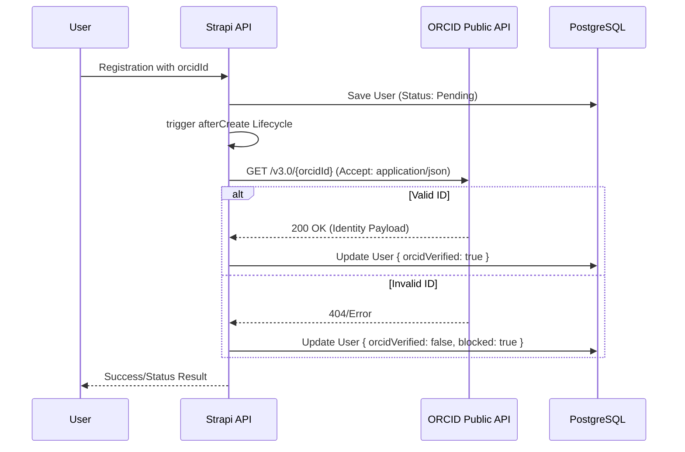
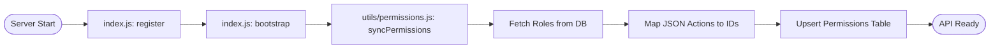

# Science of Africa - Comprehensive Low Level Design (v5.0)

## 1. Executive Summary & Platform Vision

### 1.1 Platform Vision
The Science for Africa Foundation Community of Practice (CoP) Platform is a strategic digital ecosystem designed to unify the African research landscape. By centralizing identity verification, institutional visibility, and resource discovery, the platform empowers individual research managers and organizations to collaborate effectively across borders.

**Core Value Propositions:**
*   **Verified Scientific Identity**: Integration with ORCID Public API v3.0 ensures all profiles are tethered to global research IDs.
*   **Institutional Transparency**: Highlighting affiliations to promote institutional capacity and trust.
*   **Knowledge Equity**: Centralized access to toolkits, reports, and best practices.
*   **Career Advancement**: Direct pipelines to funding, grants, and scholarships.

### 1.2 Strategic Scope (Phase-Based Alignment)
The current development iteration (Phase 1) focuses on the **Identity & Knowledge Foundation**.
*   **Phase 1 (Active)**: User Identity (ORCID), Institutional Directory, Resource Repository, Mentorship Logic.
*   **Phase 2 (Planned)**: Community forums, Advanced Moderation, Event Management.

---

## 2. User Research Deep-Dive

### 2.1 Quantitative Insights (Survey 2023)
The platform architecture is directly informed by a comprehensive survey of the African research community:
*   **Reach**: 254 Respondents across 44 African countries.
*   **Retention Potential**: 54% of respondents indicated an intent to log in weekly.
*   **Market Opportunity**: 56% are not members of any existing CoP, making SFA their primary research hub.
*   **Institutional Base**: 71% of users originate from Universities or Research Institutions.

### 2.2 Functional Priority Ranking
Features were ranked by weighted score (Max ~1000):
1.  **Funding Opportunities**: 920
2.  **Webinars & Training**: 907
3.  **Individual Opportunities**: 904
4.  **Resource Repository**: 900
5.  **Mentorship & Coaching**: 900

---

## 3. Technology Stack & Infrastructure

### 3.1 Backend Architecture (Strapi v5)
Strapi acts as the headless core, managing content, authentication, and RBAC via a customized PostgreSQL schema.
| Component | Technology | Version | Rationale |
| :--- | :--- | :--- | :--- |
| **CMS Engine** | Strapi | 5.33.0 | Modern plugin architecture, programmatic RBAC. |
| **Runtime** | Node.js | v20+ | LTS stability for intensive API operations. |
| **Database** | PostgreSQL | 16 | ACID compliance for sensitive mentorship/identity data. |
| **Caching** | Redis (Planned) | - | Performance for high-concurrency forum access. |

### 3.2 Frontend Architecture (Next.js v16)
The frontend utilizes Next.js for its hybrid SSR/SSG capabilities, ensuring high SEO for resource repository visibility.
| Component | Technology | Version | Rationale |
| :--- | :--- | :--- | :--- |
| **Framework** | Next.js | 16.1.0 | Fast refresh, App router optimization. |
| **State** | React 19 | 19.2.3 | Use of Server Actions for form submissions. |
| **Styling** | TailwindCSS | v4 | Utility-first design with SFA brand tokens. |

---

## 4. Detailed Architecture & Logic Flows

### 4.1 Request Flow: ORCID Lifecycle Hook
Identity verification happens automatically via Strapi database lifecycles.



### 4.2 Bootstrap Flow: Programmatic RBAC Sync
To ensure security is consistent across environments, permissions are defined in `src/utils/permissions.js` and applied during the `bootstrap` phase.



---

## 5. Exhaustive Data Dictionary

### 5.1 USER Entity (Extended)
**UID**: `plugin::users-permissions.user`
| Field | Type | Default | Description |
| :--- | :--- | :--- | :--- |
| `username` | string (unique) | - | User email |
| `email` | email (unique) | - | Verified contact email |
| `orcidId` | string | - | Unique researcher identifier |
| `orcidVerified` | boolean | false | Verified via ORCID public API |
| `careerStage` | enumeration | - | ['Early-Career', 'Mid-Career', 'Senior', 'Executive'] |
| `expertise` | string | - | Primary research field |
| `mentorAvailability`| boolean | false | Willingness to mentor peers |
| `institution` | relation | - | manyToOne -> api::institution.institution |
| `onboardingStep` | integer | 0 | Progress tracker for user setup |

### 5.2 INSTITUTION Entity
**UID**: `api::institution.institution`
| Field | Type | Description |
| :--- | :--- | :--- |
| `name` | string | Legal name of the organization |
| `city` | string | Location head office |
| `country` | string | Country (African Union member states) |
| `affiliationType` | enumeration | ['University', 'Research Org', 'Funding Agency'] |

### 5.3 RESOURCE Entity
**UID**: `api::resource.resource`
| Field | Type | Description |
| :--- | :--- | :--- |
| `title` | string | Resource header |
| `resource_type` | enumeration | ['report', 'case_study', 'toolkit', 'policy', 'video', etc.] |
| `reviewStatus` | enumeration | ['Draft', 'Pending', 'Published', 'Rejected'] |
| `author` | relation | oneToMany -> plugin::users-permissions.user |

---

## 6. Complete API Reference & RBAC

### 6.1 Role Access Matrix
The following matrix defines the programmatic mapping applied by `syncPermissions.js`.

| Feature Area | Endpoint | Public | Member | Expert | Admin |
| :--- | :--- | :--- | :--- | :--- | :--- |
| **Resources** | `GET /api/resources` | R | R | R | CRUD |
| **Communities** | `GET /api/communities`| R | R | R | CRUD |
| **Forums** | `POST /api/threads` | - | C | C | CRUD |
| **Identity** | `PUT /api/users/me` | - | U | U | CRUD |
| **Mentorship** | `POST /api/mentorship`| - | C | C | CRUD |

*(R=Read, C=Create, U=Update, CRUD=Full Access)*

---

## 7. UX Design System Alignment

### 7.1 Design Tokens (SFA Foundation)
The project utilizes a custom theme defined in `frontend/styles/globals.css`.
*   **Brand Primary**: `green-500` (`#005850`) - Core identity.
*   **Spacing Unit**: `sfa-` scale (e.g., `sfa-2` = 16px) for layout rhythm.
*   **Typography**: Inter (Body), Outfit (Headings) - chosen for readability across mobile devices.

### 7.2 Mobile-First Component Guidelines
1.  **Touch Targets**: All CTAs must maintain a min-height of `48px` (`sfa-6`).
2.  **Layout**: Single-column stacking for screens < 768px.
3.  **OAuth UX**: ORCID login must handle same-tab redirection to prevent session timeouts on mobile Safari/Chrome.

---

## 8. Infrastructure & CI/CD Strategy

### 8.1 Docker Container Orchestration
*   **Traefik/Nginx**: Handles path-based routing (`/` to Next.js, `/cms` to Strapi).
*   **Persistence**: PostgreSQL data stored in `pg-data` volume; Resource uploads stored in GCS via Strapi Provider.

### 8.2 Deployment Pipeline (GitHub Actions)
1.  **Lint & Test**: Run Vitest and Strapi unit tests.
2.  **Build**: Multi-stage Docker builds for backend and frontend.
3.  **Push**: Artifacts pushed to GCR.
4.  **Rollout**: `kubectl apply` to Science for Africa K8s cluster.

---

## 9. Forward-Looking Roadmap

### 9.1 Phase 2 Evolution
*   **Moderation Dashboard**: Custom Strapi views for resolving User Reports.
*   **Thematic Forums**: Integration of community-driven categorization logic.
*   **Discourse Migration**: Architectural provision for exporting Forum data to Discourse if scaling exceeds relational limits.

---

## 10. Appendix & Technical Notes

### 10.1 Survey Priority Scores (June 2023)
| Feature | Score | Priority |
| :--- | :--- | :--- |
| Funding Opportunities | **920** | Critical |
| Resource Repository | **900** | High |
| Mentorship | **900** | High |

### 10.2 Developer Quick-Start
```bash
# Clone and Boot
git clone ...
docker-compose up -d

# Seed Initial Data
docker exec -it soa-backend npm run seed
```
